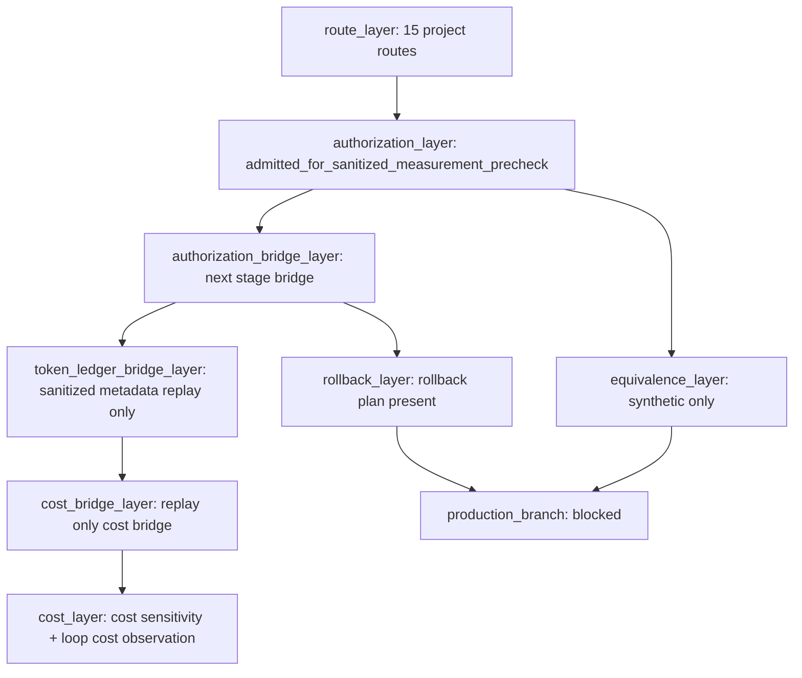

# Headroom LCX Graph

真实测量授权窗口请求已进入受控证据链，但当前仍是 `requested_not_granted`，因此不会打开 production branch.

Headroom 图谱当前已经固化为受控状态，但只覆盖授权前置、next-stage 桥接包、token ledger bridge、cost bridge、路由、成本、回滚和 synthetic equivalence。真实生产测量分支仍然 blocked。

## 图谱快照

| layer | current_state | interpretation |
|---|---|---|
| route_layer | 15_project_routes_controlled | 项目群路由已全量图谱化 |
| authorization_layer | admitted_for_sanitized_measurement_precheck | 只允许脱敏预检，不允许真实测量 |
| authorization_bridge_layer | next_stage_authorization_package_defined_precheck_only | next-stage 桥接包已入图，但不打开生产分支 |
| token_ledger_bridge_layer | metadata_replay_check_pass_no_measurement | 只读元数据 replay 层已入图，但不计算真实生产节省 |
| cost_bridge_layer | independent_production_token_free_loop_replay_ready | 成本桥接层已入图，但仍不产生真实生产 token 结论 |
| cost_layer | cost_sensitivity_and_loop_cost_observation | 成本图已可回放，但只基于受控证据 |
| rollback_layer | rollback_plan_present | 回滚图存在，但不构成生产放行 |
| equivalence_layer | synthetic_only | 真实业务等价性仍未证明 |
| production_branch | blocked | 生产测量分支仍关闭 |
| authorization_window_request | requested_not_granted | 真实测量授权窗口已请求但未授予 |

## 15 域路由清单

| project_id | allowed_modes | blocked_modes | requires_authorization | current_gate |
|---|---|---|---|---|
| GPCF | proxy_dry_run, sdk_dry_run, mcp_compress, mcp_stats, agent_wrap_dry_run | production_proxy, mcp_retrieve_without_waes_gate, cross_project_memory_as_fact, learn_apply_auto, output_shaper_acceptance, production_external_write | true | dry_run_only |
| KDS | sdk_dry_run, mcp_compress, mcp_stats | production_proxy, mcp_retrieve_without_waes_gate, cross_project_memory_as_fact, learn_apply_auto, output_shaper_acceptance, production_external_write | true | dry_run_only |
| Brain | sdk_dry_run, mcp_compress, mcp_stats | production_proxy, mcp_retrieve_without_waes_gate, cross_project_memory_as_fact, learn_apply_auto, output_shaper_acceptance, production_external_write | true | dry_run_only |
| WAES | sdk_dry_run, mcp_compress, mcp_stats | production_proxy, mcp_retrieve_without_waes_gate, cross_project_memory_as_fact, learn_apply_auto, output_shaper_acceptance, production_external_write | true | dry_run_only |
| GFIS | sdk_dry_run, mcp_compress, mcp_stats | production_proxy, mcp_retrieve_without_waes_gate, cross_project_memory_as_fact, learn_apply_auto, output_shaper_acceptance, production_external_write | true | dry_run_only |
| GPC | proxy_dry_run, sdk_dry_run, mcp_compress, mcp_stats | production_proxy, mcp_retrieve_without_waes_gate, cross_project_memory_as_fact, learn_apply_auto, output_shaper_acceptance, production_external_write | true | dry_run_only |
| PVAOS | sdk_dry_run, mcp_compress, mcp_stats | production_proxy, mcp_retrieve_without_waes_gate, cross_project_memory_as_fact, learn_apply_auto, output_shaper_acceptance, production_external_write | true | dry_run_only |
| Edge | sdk_dry_run, mcp_compress, mcp_stats | production_proxy, mcp_retrieve_without_waes_gate, cross_project_memory_as_fact, learn_apply_auto, output_shaper_acceptance, production_external_write | true | dry_run_only |
| PKC | sdk_dry_run, mcp_compress, mcp_stats | production_proxy, mcp_retrieve_without_waes_gate, cross_project_memory_as_fact, learn_apply_auto, output_shaper_acceptance, production_external_write | true | dry_run_only |
| XiaoC | proxy_dry_run, sdk_dry_run, mcp_compress, mcp_stats, agent_wrap_dry_run | production_proxy, mcp_retrieve_without_waes_gate, cross_project_memory_as_fact, learn_apply_auto, output_shaper_acceptance, production_external_write | true | dry_run_only |
| XGD | proxy_dry_run, sdk_dry_run, mcp_compress, mcp_stats, agent_wrap_dry_run | production_proxy, mcp_retrieve_without_waes_gate, cross_project_memory_as_fact, learn_apply_auto, output_shaper_acceptance, production_external_write | true | dry_run_only |
| XiaoG | sdk_dry_run, mcp_compress, mcp_stats | production_proxy, mcp_retrieve_without_waes_gate, cross_project_memory_as_fact, learn_apply_auto, output_shaper_acceptance, production_external_write | true | dry_run_only |
| MMC | sdk_dry_run, mcp_compress, mcp_stats | production_proxy, mcp_retrieve_without_waes_gate, cross_project_memory_as_fact, learn_apply_auto, output_shaper_acceptance, production_external_write | true | dry_run_only |
| Studio | proxy_dry_run, sdk_dry_run, mcp_compress, mcp_stats, agent_wrap_dry_run | production_proxy, mcp_retrieve_without_waes_gate, cross_project_memory_as_fact, learn_apply_auto, output_shaper_acceptance, production_external_write | true | dry_run_only |
| WAS | sdk_dry_run, mcp_compress, mcp_stats | production_proxy, mcp_retrieve_without_waes_gate, cross_project_memory_as_fact, learn_apply_auto, output_shaper_acceptance, production_external_write | true | dry_run_only |

## 当前覆盖

- 15 个项目/域路由已齐，且每条路由均保持 `requires_authorization=true`
- WAES/Harness 已进入脱敏测量前置裁决，但生产 token 测量仍为 false
- 成本图已经可回放，但只基于受控与脱敏证据
- 回滚图已指向回滚计划，但不构成生产放行
- 等价性图目前仍是 synthetic only，真实业务等价性未证明
- 授权窗口请求已被结构化，但未改变 `production_branch` 的 blocked 状态

## 不声明

- 不声明 production_ready
- 不声明 accepted
- 不声明 integrated
- 不声明真实生产 token 已测量
- 不声明真实业务等价性已证明
