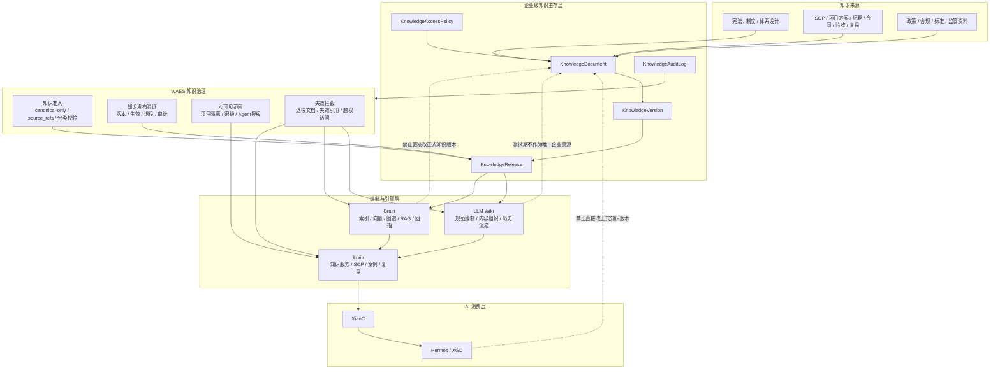

# GlobalCloud 绿色供应链体系企业级知识库主存层与LLM Wiki-Brain升级图

日期：2026-06-07
状态：专项架构图 v1
口径：只展开 KDS（企业级知识主存层）、`LLM Wiki`、`Brain`（知识引擎+服务层）、`WAES` 之间的分层与升级路径。

## 1. 知识底座升级图

## 2. 升级重点

### 2.1 企业级知识主存层必须补齐

1. 文档编号
2. 版本链
3. 发布审批
4. 权限与密级
5. 保留与归档
6. 审计日志

### 2.2 LLM Wiki 升级重点

1. 统一元数据
2. 版本绑定
3. 标准引用锚点
4. 发布态区分
5. 与主存层单向同步

### 2.3 Brain 升级重点

1. ingest 来源绑定
2. 切片回指
3. 项目与密级隔离
4. 失效知识清退
5. 查询与引用审计

## 3. 结论

测试结束后，`LLM Wiki` 与 `Brain` 可以在知识引擎层做唯一性选择；
企业级知识真源仍应稳定保留在知识主存层。
