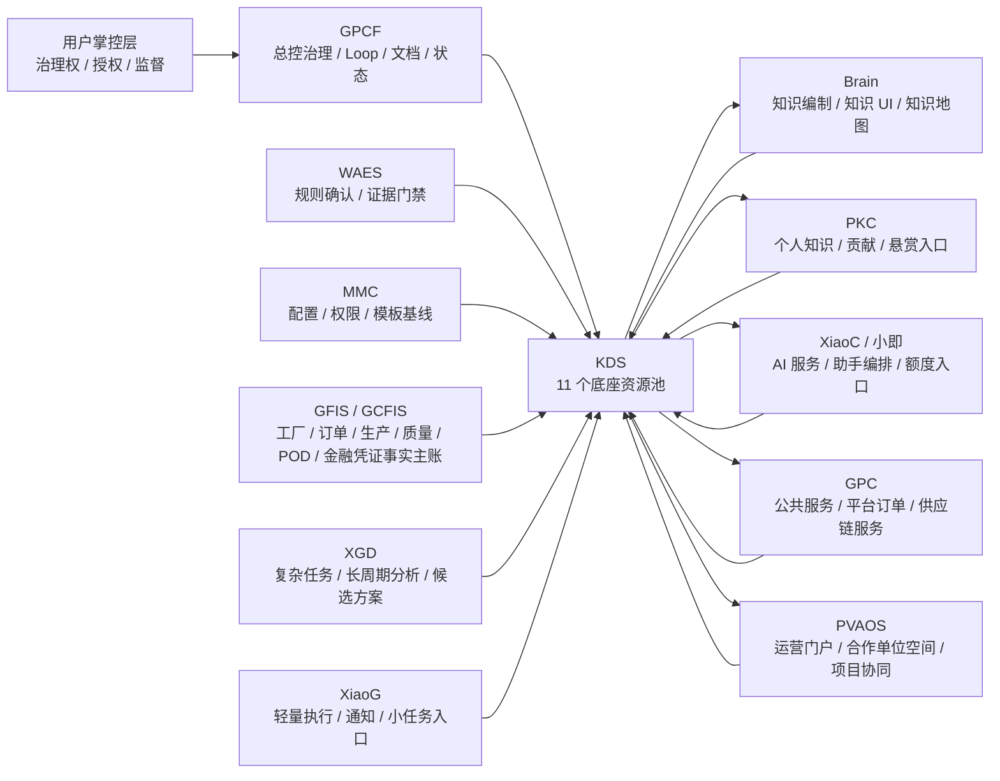

# GlobalCloud 项目群与分布式 KDS 关系总图

日期：2026-06-17
状态：v0.1 受控关系总图
适用范围：GlobalCloud 项目群、绿色供应链分布式知识系统、KDS 11 池、葛化物流试点、湖北磷材试点。

## 1. 定位

本文是新队列 `GPCF-KDS-DKS-014` 的主交付，用于把绿色供应链分布式知识系统纳入 LOOP 工程治理，并明确 12 个项目与分布式 KDS 的关系。

这里的分布式 KDS 不是单一数据库，也不是单一知识库页面，而是以 KDS 11 个底座资源池为事实基础数据底座，以增强治理账本承载积分、收益、额度、悬赏、争议、潜在产值、SOP 和贡献等治理对象，以 GPCF 为治理与 Loop 入口，以 WAES 为规则和证据门禁，以 GFIS / GCFIS、GPC、PVAOS 等业务系统为事实来源和业务确认载体，以 Brain、PKC、XiaoC / 小即、XGD、XiaoG 等为知识编制、个人贡献、AI 服务和任务入口的项目群级知识事实操作系统。

狭义 KDS 是知识主存与 11 个底座资源池项目；广义分布式 KDS 是横跨整个 GlobalCloud 项目群的知识事实操作系统。增强治理账本不得游离存在，所有增强账本对象必须至少挂接一个底座资源池，并保留来源、责任主体、确认状态、权限密级、Loop 证据和 WAES 门禁记录。

本文只定义关系、边界、对象流、治理路径和试点映射，不表示真实系统已经接入、真实资料已经入库、真实 AI 服务已经运行、真实业务事实已经确认或任何收益分配已经生效。

## 2. 总体关系图



## 3. 项目职责矩阵

| 项目 | 在分布式 KDS 中的定位 | 主要输入 | 主要输出 | 不得越界 |
|---|---|---|---|---|
| GPCF | 总控治理、Loop、文档控制、状态矩阵和审计入口 | 用户目标、项目群状态、Loop 记录、门禁结果 | 受控文档、Loop 反馈、风险清单、下一轮队列 | 不替代业务系统确认事实 |
| KDS | 知识主存、11 个底座资源池、对象注册、索引、可信级别、池间关系 | 候选事实、证据索引、知识对象、规则记录、增强账本对象 | 受控知识事实索引、底座资源池挂接、查询和治理基线 | 不把增强账本当成独立底座，不把候选事实直接写成确认事实 |
| WAES | 规则确认、证据门禁、密级边界、阻断和放行记录 | 规则、证据、密级、人工确认要求 | WAESBoundaryRecord、EvidenceGateRecord、RuleDecision | 不替代业务主账和财务确认 |
| GFIS / GCFIS | 工厂、订单、生产、质量、发货、POD、金融凭证业务事实主账 | 需求、订单、生产、质检、发货、签收、开票、到账 | 业务事实、业务状态、责任拆分、运行证据 | 不把 AI 建议直接执行为业务写入 |
| GPC | 公共服务、平台订单、供应链服务和对外服务入口 | 服务请求、平台订单、客户交互、渠道资源 | 服务记录、平台订单候选、外部服务结果 | 不替代 GFIS 工厂事实主账 |
| PVAOS | 合作单位运营门户、组织空间、项目协同和运营看板 | 合作单位信息、项目任务、运营记录、协同事项 | 组织空间、协同记录、运营状态、用户侧入口 | 不直接裁决积分和收益 |
| Brain | 知识编制、知识页面、知识地图、知识产品和知识 UI | KDS 受控知识对象、事实索引、可信来源 | 可读知识、结构化页面、知识地图、分析视图 | 不替代 KDS 事实底座 |
| PKC | 个人知识、贡献、悬赏、知识缺口和个人服务入口 | 个人提交、单位提交、知识缺口、悬赏提交 | ContributionCandidate、BountySubmission、个人知识记录 | 不绕过 KDS / WAES / 委员会确认 |
| XiaoC / 小即 | AI 服务统一提供、助手编排、额度入口和交互入口 | 脱敏知识、受控上下文、任务请求、额度规则 | 问答、SOP 建议、候选事实、候选积分、候选缺口 | 不直接确认业务事实、收益或积分 |
| XGD | 复杂任务、长周期分析、跨系统推理和候选方案生成 | 多源知识、项目上下文、证据索引、约束条件 | 分析报告、候选 SOP、候选事实、风险建议 | 不绕过人工确认和规则门禁 |
| XiaoG | 轻量执行、通知、提醒、小任务和低风险流程入口 | 任务、提醒、状态变化、待确认项 | 通知、待办、小任务记录、执行候选 | 不执行生产权限和高风险写入 |
| MMC | 配置、权限、模板、编号、参数和治理基线 | 组织、角色、权限、模板、编号规则、阈值 | 配置基线、权限矩阵、模板版本、治理参数 | 不成为业务事实来源 |

## 4. KDS 11 个底座资源池与增强治理账本

KDS 11 池指既有底座资源池：订单池、运力池、产能池、资金池、政策池、装备池、数据池、能源池、原料池、人才池、场景池。积分池、收益池、额度池、悬赏池、争议池、潜在产值池、SOP 账本、贡献账本等不是另起一套底座，而是挂接在底座资源池上的增强治理账本。

### 4.1 底座资源池

| 底座资源池 | 项目群级作用 | 绿色供应链试点用法 |
|---|---|---|
| 订单池 | 需求、订单、预运营期订单、平台订单和订单状态 | 葛化订单运行母版、湖北磷材销售订单线索 |
| 运力池 | 物流、运输、承运、发货、POD 和区域调度资源 | 葛化发货 / POD 证据、区域绿色供应链运力协同 |
| 产能池 | 工厂、产线、OEM 承接方、目标工厂、产能调度 | 葛化目标工厂与现代精工 OEM 承接方责任拆分 |
| 资金池 | 开票、到账、金融凭证、收益、额度和资金状态 | 按到账确认正式收入，统计和财务口按开票记录 |
| 政策池 | 政策、标准、权威网站、行业规范和合规要求 | 权威政策 / 标准网站进入更高可信级别 |
| 装备池 | 设备、产线、工艺装备、建设与运维资产 | 拓厂项目、新工厂复制模板和工厂运营资料 |
| 数据池 | 文档、会议、电话、邮件、第三方资料、网络搜索、LLM 分析结果 | 分布式知识系统的知识、证据、索引和模型输出归集 |
| 能源池 | 能源消耗、绿色能源、节能降碳和能源调度 | 绿色供应链运营指标和工厂能耗知识 |
| 原料池 | 原料、供应商、价格、库存、采购与行业原料信息 | 湖北磷材原料 / 行业知识库 |
| 人才池 | 人员、组织、角色、岗位、培训、专家与委员会成员 | 合作单位成员空间、专家贡献和委员会机制 |
| 场景池 | 业务场景、工厂复制场景、区域运营场景、AI 服务场景 | 葛化试点、湖北磷材拓厂、更多工厂复制 |

### 4.2 增强治理账本

| 增强账本 | 必须挂接的底座资源池 | 作用 |
|---|---|---|
| 积分池 / 贡献账本 | 数据池、人才池、场景池，按贡献内容挂接订单池 / 产能池 / 原料池等 | 知识、产值、渠道、治理、补证、纠错、悬赏等贡献候选与确认 |
| 收益池 | 资金池，并按收益来源挂接订单池 / 场景池 / 产能池等 | 到账、开票、收益分配依据和统一收益池 |
| 额度池 | 资金池、数据池、人才池、场景池 | 平台额度、自购额度、共享额度和使用计量；自购额度先自用 |
| 悬赏池 | 数据池、人才池、场景池，并按问题挂接相关资源池 | 知识缺口、证据缺口、悬赏发布、提交、验收和结算 |
| 争议池 | 人才池、数据池、资金池、场景池 | 委员会 DecisionRecord、争议、违规、扣分、备案 |
| 潜在产值池 | 订单池、资金池、场景池，必要时挂接产能池 / 原料池 / 运力池 | 潜在线索、未到账机会、辽宁远航链路、拓厂机会 |
| SOP 账本 | 场景池、数据池，并按 SOP 内容挂接订单池 / 产能池 / 运力池等 | 全局 SOP、分段 SOP、岗位 SOP、预运营期订单 SOP |
| 权限账本 | 人才池、数据池、场景池 | 组织、人员、密级、角色、可见范围、授权记录 |

## 5. 候选事实到确认事实流程

```text
SourceEvent
  -> KnowledgeOrFactCandidate
  -> KDSCandidateRegistration
  -> WAESRuleAndEvidenceGate
  -> HumanOrCommitteeDecision
  -> BusinessSystemConfirmation
  -> BaseResourcePoolLink
  -> EnhancedLedgerLink
  -> Brain / PKC / GPC / PVAOS / AIServiceConsumption
```

### 5.1 SourceEvent

来源可以是项目资料、交流、会议、电话、邮件、第三方文档、权威政策标准网站、高关联性网络搜索、LLM 分析结果、业务系统记录、合作单位提交和人工补证。

权威政策、标准、政府或行业网站可以进入更高可信级别，但仍需保留来源、时间、适用范围、版本和引用边界。

### 5.2 KnowledgeOrFactCandidate

AI 可以生成知识摘要、候选事实、SOP 建议、缺口建议、贡献候选、风险建议和业务系统输入建议。

候选输出必须标注：

| 字段 | 要求 |
|---|---|
| candidateId | 统一编号 |
| sourceRefs | 来源索引 |
| trustLevel | T0 / T1 / T2 / T3 |
| classificationLevel | DSR-L0 / DSR-L1 / DSR-L2 / DSR-L3 |
| baseResourcePools | 至少一个 KDS 底座资源池挂接 |
| enhancedLedgerLinks | 积分、收益、额度、悬赏、争议、潜在产值、SOP、贡献等增强账本挂接 |
| targetSystem | KDS / WAES / GFIS / GPC / PVAOS / Brain / PKC |
| humanConfirmationRequired | 默认 true |
| decisionOwner | 业务负责人、项目组、委员会或用户 |
| reversible | 是否允许撤销、扣除或回滚 |

### 5.3 WAESRuleAndEvidenceGate

WAES 只确认规则、证据、密级和门禁。规则以内的低风险事项可以只记录；超出规则、涉及重大收益、金融凭证、责任争议、敏感资料或跨单位分配时必须进入人工确认或委员会决策。

### 5.4 HumanOrCommitteeDecision

用户保留治理权，但不必亲自裁决每个事项。委员会机制负责积分、收益、悬赏、争议和违规裁决。一般事项可酌情溯源扣除；重大违规可按事实比例或全部扣除，并保留备案。

### 5.5 BusinessSystemConfirmation

GFIS / GCFIS、GPC、PVAOS 等业务系统按自身流程确认业务事实。KDS 记录事实索引、证据索引和确认状态，不替代业务系统本身。

## 6. AI 服务和额度边界

AI 服务由平台统一提供。合作单位未来可以自购额度、贡献额度、共享额度；其中自购额度先自用，不进入统一收益池。平台提供或共享额度可以在额度池增强账本中登记来源、使用对象、使用场景、成本、余额和贡献关系，并挂接资金池、数据池、人才池或场景池。

AI 输出分为五类：

| 类型 | 示例 | 是否可自动生效 |
|---|---|---|
| 知识问答 | 基于受控知识回答建设、运营、订单、行业问题 | 否 |
| 使用助手 | 给出 GFIS / GPC / PVAOS 操作建议 | 否 |
| 文档验收 | 对资料包结构、缺口、密级、证据提出验收建议 | 否 |
| SOP 建议 | 给出全局 SOP、分段 SOP、岗位 SOP、预运营期订单 SOP 候选 | 否 |
| 候选事实 | 向 GFIS 或其他业务系统提出可录入候选事实 | 否 |

所有 AI 输出必须能够追溯来源、规则、模型、时间、使用额度、输出版本和人工确认状态。

## 7. 绿色供应链试点映射

### 7.1 葛化物流试点

葛化物流作为 GFIS 深度试点和订单运行母版来源。第一阶段重点：

1. GFIS 知识问答助手。
2. GFIS 使用助手。
3. GFIS 文档验收助手。
4. AI 基于知识库向 GFIS 或其他业务系统输入候选事实，驱动 SOP 形成。
5. 建立预运营期订单母版，覆盖需求来源、OEM 承接方、目标工厂、责任拆分、质量、发货、POD、金融凭证和转量产。

葛化首批资料包纳入新队列 `GPCF-KDS-DKS-018`，包括建设资料、工厂运营资料、订单资料、辽宁远航链路、现代精工 OEM 过渡资料、质量 / 发货 / POD 资料和金融凭证门禁资料。

### 7.2 湖北磷材试点

湖北磷材作为第二条并行线，第一阶段不做 GFIS 深度，而是建立：

1. 拓厂项目知识库。
2. 原料 / 行业 / 订单知识库。
3. 新工厂复制模板。
4. 可复用的预运营期订单和新工厂建设期到运营期转换模型。

湖北磷材纳入新队列 `GPCF-KDS-DKS-019`，重点服务更多类似葛化物流的工厂建设与区域绿色供应链运营单位复制。

## 8. 积分池和收益池原则

1. 初始阶段知识和产值权重更大，后续可按阶段调整权重。
2. 不同积分权重可有不同兑换系数，系数可随整体体系、市场情况或项目类型调整。
3. 有实际收入的贡献可列入产值；无实际收入的贡献只能列入知识或潜在产值。
4. 正式收入按到账确认；统计和财务口可按开票统计。
5. 合作单位自购 AI 额度不进入统一收益池。
6. 潜在产值可以积累为参考指标，但不得等同正式收入。
7. 知识缺口积分机制可以由系统、合作单位、人员或单位发起，允许用积分进行悬赏、交易、验收和争议处理。
8. 合作单位可以看到自己的贡献和收益候选明细；他方明细需被邀请、被授权或参与悬赏后才可见。

## 9. 委员会和用户治理权

| 事项 | 机制 |
|---|---|
| 规则制定 | 用户掌握治理权，委员会形成规则草案和执行细则 |
| 积分裁决 | 委员会多数决 |
| 收益分配 | 委员会决策，用户保留治理和监督权 |
| 第三方池子 | 可建立，作为后续给第三方服务的池子 |
| 合作单位内部分配 | 项目组内部分配，可备案 |
| 争议处理 | 进入争议池增强账本，形成 DecisionRecord，并挂接相关底座资源池 |
| 违规扣除 | 一般酌情溯源扣除，重大按事实比例或全部扣除 |
| 备案 | 重大规则、重大分配、重大扣除、跨单位争议必须备案 |

## 10. 新执行队列

| 队列 | 主题 | 状态 |
|---|---|---|
| `GPCF-KDS-DKS-014` | 项目群与分布式 KDS 关系总图 | 本文 |
| `GPCF-KDS-DKS-015` | Brain-KDS 知识编制与知识 UI 边界清单 | 下一轮 |
| `GPCF-KDS-DKS-016` | PKC-KDS 个人知识与贡献入口清单 | 待执行 |
| `GPCF-KDS-DKS-017` | KDS 11 池与增强治理账本项目群级映射 | 待执行 |
| `GPCF-KDS-DKS-018` | 葛化 GFIS 资料包入库验收与 AI 助手试运行任务书 | 待执行，已有输入材料 |
| `GPCF-KDS-DKS-019` | 湖北磷材拓厂与新工厂复制试点任务书 | 待执行 |
| `GPCF-KDS-DKS-020` | 积分池、收益池、额度池、悬赏池、争议池联动规则 | 待执行 |

## 11. Definition of Done

本轮满足以下条件时，DKS-014 才算完成：

1. 项目群 12 个项目在分布式 KDS 中的定位、输入、输出和越界边界已明确。
2. KDS 11 个底座资源池已明确，增强治理账本必须挂接到底座资源池的原则已明确。
3. AI 候选输出到 WAES、人工确认、委员会和业务系统确认的路径已明确。
4. 葛化和湖北磷材两条试点线已映射到后续队列。
5. 文档进入 README、文档控制台账、KDS 开发空间同步台账和 `.kds` 本地镜像。
6. 污染检查、KDS TOKEN 检查和 Loop 文档门禁通过。

## 12. 待确认事项

1. Brain 与 KDS 的知识 UI 边界、知识页面类型和知识产品形态。
2. PKC 的个人贡献入口、单位贡献入口、悬赏入口和用户可见范围。
3. KDS 11 个底座资源池及增强治理账本中各类对象的正式字段、编号、状态机和审计字段。
4. 葛化 DKS-018 是否以现有资料包任务书为标准母版继续深化。
5. 湖北磷材 DKS-019 的拓厂知识对象、原料行业对象和新工厂复制模板颗粒度。
