# GC-Knowledge Fabric 核心对象关系与最小字段契约

## 1. 定位

本文件定义 GC-Knowledge Fabric P0/P1 的核心对象关系链，避免 KDS、WAES、KWE、Harness、Brain/PKC、GFIS/GPC API 与台账对象各自成表但业务链路断裂。

本文件只定义对象关系、最小字段和 no-write 校验边界，不创建正式事实，不执行真实写回，不结算收益、积分、额度或悬赏。

## 2. 最小对象关系链

```mermaid
flowchart LR
  SourceRecord["SourceRecord 来源记录"] --> EvidenceRecord["EvidenceRecord 证据记录"]
  EvidenceRecord --> KnowledgeObject["KnowledgeObject 知识对象"]
  KnowledgeObject --> FactCandidate["FactCandidate 候选事实"]
  KnowledgeObject --> SOPCandidate["SOPCandidate 候选 SOP"]
  KnowledgeObject --> GapRecord["GapRecord 缺口"]
  FactCandidate --> WAESGateResult["WAESGateResult 门禁结果"]
  SOPCandidate --> WAESGateResult
  GapRecord --> KWEWorkItem["KWE WorkItem 工单"]
  WAESGateResult --> KWEWorkItem
  KWEWorkItem --> ConfirmationRecord["ConfirmationRecord 确认记录"]
  KWEWorkItem --> DecisionRecord["DecisionRecord 决策记录"]
  ConfirmationRecord --> WritebackCandidate["WritebackCandidate 写回候选"]
  DecisionRecord --> ContributionRecord["ContributionRecord 贡献记录"]
  ContributionRecord --> RevenueRecord["RevenueRecord 收益记录"]
  WritebackCandidate --> HarnessEvidenceRecord["HarnessEvidenceRecord 治理证据"]
  RevenueRecord --> HarnessEvidenceRecord
  HarnessEvidenceRecord --> LOOPRecord["LOOPRecord 闭环记录"]
```

## 3. 关系类型

| 关系 | 来源对象 | 目标对象 | 必需字段 | 说明 |
|---|---|---|---|---|
| `source_provides_evidence` | SourceRecord | EvidenceRecord | sourceRef、evidenceRef、sourceTrustLevel | 来源产生证据 |
| `evidence_supports_object` | EvidenceRecord | KnowledgeObject | evidenceRef、objectId、supportScope | 证据支撑知识对象 |
| `object_generates_candidate` | KnowledgeObject | FactCandidate/SOPCandidate/GapRecord | objectId、candidateId、generatedBy | 对象生成候选或缺口 |
| `candidate_checked_by_gate` | FactCandidate/SOPCandidate/WritebackCandidate | WAESGateResult | candidateId、gateResultId、gateType | 候选经过门禁 |
| `gate_opens_work_item` | WAESGateResult | KWEWorkItem | gateResultId、workItemId、requiredActions | 门禁触发流程 |
| `work_item_produces_confirmation` | KWEWorkItem | ConfirmationRecord/DecisionRecord | workItemId、reviewer、decision | 流程产生确认或决策 |
| `confirmation_enables_writeback_candidate` | ConfirmationRecord | WritebackCandidate | confirmationRef、writebackCandidateId、targetSystem | 确认后才可形成写回候选 |
| `decision_records_contribution` | DecisionRecord | ContributionRecord | decisionRef、contributorId、contributionType | 决策记录贡献 |
| `contribution_links_revenue` | ContributionRecord | RevenueRecord | contributionRef、revenueRef、basis | 贡献关联收益 |
| `governance_evidence_closes_loop` | HarnessEvidenceRecord | LOOPRecord | evidenceRef、loopId、statusDelta | 治理证据进入 LOOP |

## 4. 最小字段契约

每条对象关系至少必须包含：

- `id`：关系唯一编号。
- `tenantId`：租户隔离。
- `relationType`：关系类型。
- `fromType` / `fromId`：来源对象类型与编号。
- `toType` / `toId`：目标对象类型与编号。
- `requiredRefs`：该关系成立必须绑定的 source、evidence、gate、work item、confirmation 或 decision refs。
- `poolRefs`：涉及 KDS 十一池时必须记录。
- `createdBy`：关系登记者。
- `createdAt`：关系登记时间。
- `noWrite`：本地契约校验时必须为 true。

## 5. 硬边界

1. 没有 SourceRecord 的 EvidenceRecord 不能支撑正式事实。
2. 没有 EvidenceRecord 的 KnowledgeObject 不能提升到 `evidence_ready`。
3. FactCandidate、SOPCandidate 和 WritebackCandidate 必须有 WAES gate 关系。
4. WritebackCandidate 必须来源于 ConfirmationRecord 或 DecisionRecord，不能由 AI 直接生成正式写回。
5. ContributionRecord 只能进入候选台账；收益确认仍需 RevenueRecord basis 与委员会/授权确认。
6. RevenueRecord 未满足到账、开票、合同或机会口径前，不能成为正式收益分配依据。
7. HarnessEvidenceRecord 只记录治理证据，不存普通业务正文。
8. LOOPRecord 只能引用 evidence、gap、candidate、decision、risk 和 next actions，不能自动提升业务状态。

## 6. P0/P1 验收条件

- OKF 中有核心对象关系 policy。
- Shared Types 中有关系类型、关系端点、关系记录和 no-write 断言。
- Validator 能检查 10 条最小关系链、必需字段、关键 hard boundaries 和写入计数为 0。
- 覆盖矩阵纳入对象关系 policy、type、fixture 和 validator。
