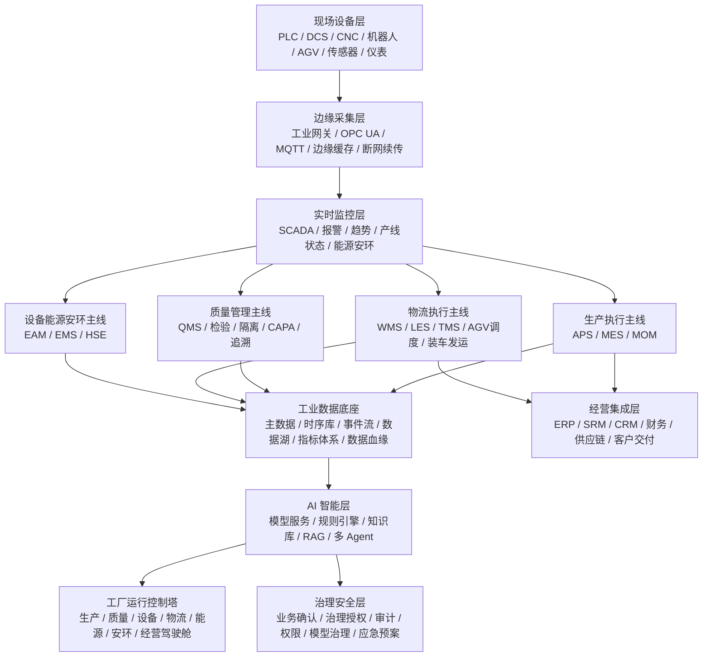

# AI 驱动工厂信息化系统完整方案 V3.1

当前口径：本方案作为 **GlobalCloud 绿色供应链体系** 的生产与执行层/工厂执行子域基础稿保留，不再作为总体系名称。总体系主架构采用治理与监控层、运营与协同层、生产与执行层。WAES 只负责规则、监控、治理、证据、状态和 AI 授权，不参与工单、质量、库存、发货、签收等具体事务审批。

当前阅读口径：本文件只解释 `GFIS` 及其工厂执行子域，不负责解释绿色供应链平台主线；平台主线以 `GPC` 相关文档为准，宪法约束以 `WAES` 治理模型为准。

## 版本说明

本方案按“边界更硬、架构更清、运行逻辑更像真实工厂”的方向整合形成 V3.1，不再大幅扩展功能，重点强化 AI 授权边界、生产/物流/质量/设备能源安环并列主线、WMS/LES/TMS 物流分层，以及一期真实闭环验收。

## 一、总体定位

AI 驱动工厂信息化系统，是以工业数据平台为基础，以生产执行、物流执行、质量管理、设备能源安环和经营集成为核心执行体系，以 AI Agent、规则引擎、知识库和模型服务为智能支撑，覆盖订单、计划、采购、来料、仓储、物流、生产、质量、设备、能源、安全环保、交付和经营管理全过程的工厂运行操作系统。

系统建设目标不是简单上线 MES、WMS、QMS、EAM 等模块，而是形成可持续运转的工厂级闭环：

1. 订单可计划。
2. 物料可齐套。
3. 物流可调度。
4. 生产可执行。
5. 质量可拦截。
6. 设备可预测。
7. 能耗可优化。
8. 安环可管控。
9. 异常可闭环。
10. 交付可追踪。
11. 数据可追溯。
12. AI 可辅助决策。

## 二、核心建设原则

AI 不替代工业控制系统，不直接接管安全关键动作。

PLC、DCS、SCADA、安全联锁、急停、设备保护、环保排放、危险作业控制等，必须由确定性工业控制系统、硬规则和授权人员负责。

AI 主要承担：

1. 预测。
2. 识别。
3. 优化。
4. 归因。
5. 建议。
6. 摘要。
7. 复盘。
8. 知识复用。

AI 授权边界建议分为五级：

| 等级 | AI 作用 | 执行方式 |
|---|---|---|
| L1 | 查询、报表、知识问答 | 可自动执行 |
| L2 | 异常识别、风险预警 | 可自动提醒 |
| L3 | 排产、补料、维修、质检建议 | 人工确认 |
| L4 | 工艺参数、停线、质量放行、交付承诺调整建议 | 事务审批在 GFIS/GPC，治理授权在 WAES/Harness |
| L5 | 急停、安全联锁、设备保护、环保排放控制 | AI 不得接管 |

## 二点一、纳入 GlobalCloud 绿色供应链体系的四流口径

本 V3.1 方案是生产与执行层/工厂执行子域基础稿，纳入总体系后必须按四流校验：

| 四流 | 工厂执行子域对应内容 | 边界 |
|---|---|---|
| 治理流 | WAES 对 GFIS 的规则、指标、证据、AI 授权和状态监控 | WAES 不审批工单、质量、库存、发货、维修验收 |
| 业务流 | GFIS 的工厂订单、工单、质量、库存、批次、LES、EAM、发货出库 | 业务事实在 GFIS 内形成 |
| 数据流 | GFIS Connector、Outbox、事件、EvidenceRecord、Trace、Metric | 不共享 GFIS 主账数据库 |
| AI 服务流 | 生产、质量、物流、设备建议和复盘草案 | AI 不直接写 GFIS 主账，不接管 L5 安全关键控制 |

GFIS 与 Edge 的关系以 [GlobalCloud绿色供应链体系Edge接入与安全模型.md](/Users/lujunxiang/Documents/GlobalCloud智慧工厂/GlobalCloud绿色供应链体系Edge接入与安全模型.md) 为准；GFIS 对外连接以 [GlobalCloud绿色供应链体系连接器合同.md](/Users/lujunxiang/Documents/GlobalCloud智慧工厂/GlobalCloud绿色供应链体系连接器合同.md) 为准。

## 三、总体架构

V3.1 将生产、质量、物流、设备能源安环设为并列执行主线，避免把物流压缩成 WMS 的下级功能。



该架构的运行逻辑是：

1. **生产主线**负责订单、计划、工单、报工和产出。
2. **物流主线**负责来料、仓储、备料、配送、转运、发货和签收。
3. **质量主线**负责检验、隔离、放行、追溯和 CAPA。
4. **设备能源安环主线**负责设备可用、能源成本、安全环保和应急。
5. **数据智能主线**负责统一采集、治理、分析、预测、优化和复盘。

## 四、物流系统边界

V3.1 明确将物流拆分为 WMS、LES、TMS 三个层级。

| 系统 | 主要边界 | 解决的问题 |
|---|---|---|
| WMS 仓储管理系统 | 仓内库存、库位、批次、条码/RFID、上架、拣货、盘点、移库、冻结、解冻 | 货在哪里，库存准不准 |
| LES 物流执行系统 | 厂内物流、线边配送、工序转运、AGV/叉车/人工任务、补料、退料、换线清料、异常改派 | 货怎么在厂内流动，是否按时送到线边 |
| TMS 运输管理系统 | 到货预约、车辆排队、装车计划、运输跟踪、客户签收、回单管理、运输异常 | 货怎么进厂、怎么出厂、是否按时交付客户 |

三者不是替代关系，而是协同关系：

1. WMS 管库存真实性。
2. LES 管厂内流动效率。
3. TMS 管厂外运输交付。
4. MES 提出生产需求。
5. APS 依据物流能力调整计划。
6. QMS 决定物料是否可用、成品是否可发。
7. EAM 保障 AGV、叉车、输送线、月台设备可用。
8. AI Agent 提供齐套风险、配送瓶颈和交付风险分析。

只有 WMS、LES、TMS 与 MES、APS、QMS、EAM 深度联动，才能形成真正的工厂物流闭环。

## 五、核心系统组成

### 1. ERP 与经营系统

负责销售订单、采购、财务、成本、供应商、客户、合同、发票和经营分析。

ERP 是经营入口，APS、MES、WMS、LES、TMS、QMS 等系统围绕订单、采购、库存、成本和交付数据运行。

### 2. APS 高级排产

APS 负责把订单转化为可执行的生产计划。V3.1 中 APS 必须引入物流反向约束，不能只看设备产能。

排产前应检查：

1. 原材料是否在途或已到厂。
2. 来料是否完成质检放行。
3. 仓库是否具备拣货能力。
4. 线边配送资源是否可用。
5. AGV、叉车、人工配送是否存在瓶颈。
6. 工序间转运是否会造成拥堵。
7. 成品仓是否具备入库空间。
8. 发货车辆和月台资源是否匹配。
9. 客户交付窗口是否可满足。
10. 逆向物流是否占用关键仓储和配送资源。

当物流能力不足时，APS 应提示风险，并生成替代方案，例如调整生产顺序、提前备料、错峰配送、拆分工单、调整发货批次或触发外部运输资源补充。

### 3. MES/MOM 生产执行

MES 负责工单、工序、报工、在制品、批次、节拍、异常和返工返修。

MES 与物流系统的联动关系：

1. 工单开工前触发齐套检查。
2. 工单下达后触发备料任务。
3. 工序流转时触发半成品转运。
4. 生产消耗后自动扣减线边库存。
5. 换线时触发清料与退料。
6. 返工返修时触发逆向流转。

### 4. QMS 质量管理

QMS 负责来料检验、首件、巡检、过程检验、终检、不合格品、CAPA、客诉和质量追溯。

QMS 对物流具有强约束：

1. 来料未检不得入合格库。
2. 质检未放行不得发料上线。
3. 不合格品必须自动隔离。
4. 批次质量状态影响库存可用性和发货资格。
5. 退货、返修、退供必须进入逆向物流闭环。

### 5. WMS 仓储管理

WMS 负责仓库内实物和库存账：

1. 库位管理。
2. 批次管理。
3. 条码/RFID。
4. FIFO/FEFO。
5. 上架。
6. 移库。
7. 拣货。
8. 盘点。
9. 冻结/解冻。
10. 呆滞料预警。
11. 库存账实一致。

### 6. LES 物流执行

LES 负责厂内物流执行：

1. 工单备料。
2. 线边配送。
3. 生产补料。
4. 工序间转运。
5. 半成品周转。
6. 换线清料。
7. 退料。
8. AGV 任务。
9. 叉车任务。
10. 人工配送任务。
11. 拥堵监控。
12. 超时升级。
13. 异常改派。

### 7. TMS 运输管理

TMS 负责厂外运输协同：

1. 供应商到货预约。
2. 门岗登记。
3. 月台排队。
4. 车辆调度。
5. 装车计划。
6. 装车复核。
7. 出库扫码。
8. 运输跟踪。
9. 客户签收。
10. 回单管理。
11. 发货异常闭环。
12. 退货运输。

### 8. EAM/TPM 设备管理

EAM 负责设备台账、点检、保养、维修、备件、OEE、故障履历和预测性维护。

V3.1 中，AGV、叉车、输送线、月台设备也应纳入设备管理。物流设备故障必须影响 APS、LES 和 TMS 的调度判断。

### 9. EMS 能源管理

EMS 负责电、水、气、蒸汽、压缩空气、碳排、分项计量、单位产品能耗和峰谷优化。

能源优化应同时考虑生产与物流，例如 AGV/叉车充电、冷链仓储、高能耗工序、夜间发运和峰谷电价。

### 10. HSE 安环管理

HSE 负责隐患、危险源、作业许可、环保排放、安全巡检、事故事件和应急预案。

物流相关 HSE 场景包括：

1. 危化品运输。
2. 危险品库位。
3. 叉车安全。
4. 装卸安全。
5. 通道拥堵。
6. 月台作业风险。
7. 高风险作业票。
8. 环保排放物转运。

## 六、物流完整运行设计

物流是工厂运行的第二条主线，应覆盖从供应商到客户的完整链路。

### 1. 供应物流

1. 采购订单。
2. 供应商 ASN。
3. 到货预约。
4. 门岗登记。
5. 月台排队。
6. 卸货。
7. 收货扫码。
8. 来料质检。
9. 合格入库。
10. 不合格退供。

### 2. 仓储物流

1. 库位管理。
2. 批次管理。
3. 条码/RFID。
4. FIFO/FEFO。
5. 上架。
6. 移库。
7. 拣货。
8. 盘点。
9. 冻结/解冻。
10. 呆滞料预警。

### 3. 生产物流

1. 按工单备料。
2. BOM 齐套检查。
3. 拣货任务。
4. 线边配送。
5. 生产领料。
6. 自动扣料。
7. 补料申请。
8. 换线清料。
9. 退料。
10. 半成品转运。

### 4. 厂内运输调度

1. 任务派发。
2. 路径规划。
3. 优先级队列。
4. AGV 调度。
5. 叉车调度。
6. 人工配送。
7. 拥堵监控。
8. 超时升级。
9. 任务回执。
10. 异常改派。

### 5. 成品物流

1. 成品入库。
2. 发货计划。
3. 波次拣货。
4. 装车复核。
5. 出库扫码。
6. 车辆调度。
7. 运输跟踪。
8. 客户签收。
9. 回单管理。
10. 交付异常闭环。

### 6. 逆向物流

1. 客户退货。
2. 返修品接收。
3. 不合格品退供。
4. 报废流转。
5. 包材回收。
6. 质量追溯。
7. 成本归集。
8. 责任分析。

## 七、物流控制塔

工厂运行控制塔中应单独设置物流控制塔，作为物流运行的集中监控和调度中心。

物流控制塔重点监控：

1. 供应商到货计划。
2. ASN 到货偏差。
3. 门岗与月台排队。
4. 收货与质检进度。
5. 仓库上架、拣货、移库进度。
6. 工单齐套状态。
7. 线边配送任务状态。
8. AGV、叉车、人工配送资源负荷。
9. 工序间转运任务。
10. 成品入库进度。
11. 发货计划与装车进度。
12. 车辆调度与运输在途状态。
13. 客户签收与回单完整性。
14. 退货、返修、退供和包材回收状态。
15. 物流异常、超时任务和缺料停线风险。

物流控制塔的核心价值，是把看不见的物料流变成可监控、可预警、可调度、可追责的运行体系。

## 八、物流异常闭环机制

物流异常应纳入工厂统一异常闭环，不得只作为仓库或运输部门的局部问题处理。

典型物流异常包括：

1. 供应商未按预约到货。
2. 到货数量与 ASN 不一致。
3. 来料质检未及时完成。
4. 合格库存不足。
5. 拣货错误。
6. 线边配送超时。
7. AGV 或叉车任务失败。
8. 工序转运堵塞。
9. 成品装车错误。
10. 发货延迟。
11. 客户签收异常。
12. 退货返修未闭环。
13. 包材回收丢失。
14. 批次追溯断点。

每一类物流异常都必须具备：

1. 异常识别。
2. 自动分级。
3. 责任归属。
4. 工单派发。
5. 升级机制。
6. 处理记录。
7. 影响分析。
8. 复盘改进。

## 九、AI Agent 体系

V3.1 建议设置 8 类专业 Agent。

| Agent | 主要职责 |
|---|---|
| 生产调度 Agent | 延误分析、瓶颈识别、插单影响、重排建议 |
| 物流调度 Agent | 齐套预测、补料建议、路径优化、装车风险、发货延迟预测 |
| 质量分析 Agent | 缺陷识别、良率归因、批次风险、CAPA 建议 |
| 设备维护 Agent | 故障预测、维修步骤、备件需求、停机影响 |
| 仓储库存 Agent | 库存异常、呆滞料、安全库存、消耗分析 |
| 能源优化 Agent | 异常用能、峰谷优化、单位能耗分析 |
| 安环风险 Agent | 隐患趋势、作业风险、环保异常分析 |
| 经营驾驶舱 Agent | 日报、周报、交付风险、经营指标解释 |

物流调度 Agent 是一期 AI 应用重点之一，职责包括：

1. 预测工单齐套风险。
2. 识别缺料停线风险。
3. 推荐备料和补料任务。
4. 优化线边配送顺序。
5. 识别 AGV、叉车和人工配送瓶颈。
6. 分析月台排队和装车延误原因。
7. 预测发货延迟风险。
8. 推荐运输计划调整方案。
9. 识别批次、客户、车辆、装车不一致风险。
10. 生成物流日报和交付风险摘要。

物流调度 Agent 不直接控制 AGV、叉车、装车和发运动作，只向 LES、WMS、TMS 和调度人员提供预警、建议和方案。涉及发货变更、车辆调整、批次替换、质量放行和客户交付承诺的动作，必须由授权人员确认。

## 十、确保工厂正常运转的关键机制

V3.1 建议形成 13 个关键机制：

1. **计划机制**：订单、MPS、MRP、APS、插单重排、计划达成。
2. **物料机制**：BOM、齐套、批次、替代料、库存、质检状态。
3. **物流机制**：到货、上架、拣货、配送、转运、装车、签收。
4. **生产机制**：工单、工序、报工、在制品、节拍、返工返修。
5. **质量机制**：检验、隔离、放行、CAPA、客诉、防逃逸。
6. **设备机制**：点检、保养、维修、备件、OEE、预测维护。
7. **能源机制**：分项计量、单位能耗、峰谷优化、异常用能。
8. **安环机制**：危险源、作业票、环保、安全巡检、应急预案。
9. **异常机制**：识别、分级、派单、升级、处理、复盘。
10. **人员机制**：岗位、技能、班次、权限、培训、操作授权。
11. **数据机制**：主数据、指标、血缘、质量、权限、审计。
12. **AI 机制**：模型版本、置信度、人工确认、漂移监控、回滚。
13. **韧性机制**：离线作业、断网续传、人工接管、灾备恢复。

## 十一、一期最小可落地版本

一期目标不是功能大而全，而是跑通一条真实闭环：

```text
订单 -> 排产 -> 采购/库存 -> 齐套检查 -> 工单 -> 备料 -> 线边配送 -> 生产报工 -> 质量检验 -> 成品入库 -> 装车发货 -> 签收回单 -> 异常复盘
```

一期必建模块：

1. ERP 订单接口。
2. APS 基础排产。
3. MES 工单与报工。
4. WMS 库存与条码。
5. LES 线边配送与厂内物流任务。
6. TMS 装车发运与签收回单。
7. QMS 基础检验。
8. 设备状态采集。
9. 异常工单。
10. 批次追溯。
11. 基础驾驶舱。
12. 主数据管理。
13. AI 异常分析与物流齐套分析。

一期必须验收的真实场景：

1. 一张订单能完整走完生产和发货。
2. 一批原料能追溯到供应商、工单、成品和客户。
3. 一次缺料能自动预警并触发补料。
4. 一次线边配送能创建、执行、确认和关闭。
5. 一次质量异常能隔离、处理、复盘。
6. 一次设备异常能建单、维修、关闭。
7. 一次装车能校验订单、客户、批次、数量和车辆。
8. 一次客户签收和回单能闭环。
9. 一份生产与物流日报能自动生成。

## 十二、分阶段实施路径

### 第一阶段：业务与物流闭环

重点建设 MES、WMS、LES、TMS、QMS、条码追溯、异常工单、基础看板。

目标：订单能生产、物料能配送、质量能拦截、成品能发货、回单能闭环。

### 第二阶段：数据底座与指标治理

重点建设主数据、时序库、事件流、数据湖、指标体系、数据质量和权限审计。

目标：生产、质量、设备、物流、库存、能源数据统一可信。

### 第三阶段：AI 辅助决策

重点建设异常归因、物流齐套预测、预测维护、视觉质检、能耗异常识别和管理摘要。

目标：AI 先做预警、分析和建议。

### 第四阶段：智能优化

重点建设智能排产、物流路径优化、库存优化、良率优化、能耗优化、多 Agent 协同。

目标：从“看得见、管得住”升级为“能预测、能优化”。

### 第五阶段：持续运营治理

重点建设模型治理、知识库运营、流程复盘、指标改进、灾备演练和 AI 效果评估。

目标：系统长期稳定运行，AI 能力持续迭代。

## 十三、关键验收指标

### 业务指标

1. 订单准交率。
2. 计划达成率。
3. 工单及时报工率。
4. 生产周期。
5. 交付周期。

### 物流指标

1. 物料齐套率。
2. 线边配送准时率。
3. 拣货准确率。
4. 装车准确率。
5. 库存账实一致率。
6. 批次追溯完整率。
7. 物流任务关闭率。
8. 缺料停线次数。
9. 发货准时率。
10. 签收回单完整率。
11. 月台等待时长。
12. AGV/叉车任务准时率。

### 质量指标

1. 检验覆盖率。
2. 不合格品闭环率。
3. 一次合格率。
4. 客诉闭环率。
5. 质量问题重复发生率。

### 设备指标

1. OEE。
2. 非计划停机时长。
3. 保养计划执行率。
4. MTTR。
5. MTBF。

### 数据与 AI 指标

1. 主数据完整率。
2. 接口成功率。
3. 数据延迟。
4. AI 建议采纳率。
5. AI 建议准确率。
6. AI 预警提前量。
7. 模型版本可追溯率。
8. 人工确认覆盖率。

## 十四、建设结论

V3.1 方案应按照 **三条主线、四类闭环、一个控制塔** 建设。

三条主线是：

1. **生产主线**：订单、排产、工单、报工、质量、入库。
2. **物流主线**：来料、仓储、备料、配送、转运、装车、发运、签收、逆向。
3. **数据智能主线**：采集、治理、分析、预测、优化、复盘。

四类闭环是：

1. **订单到交付闭环**：从销售订单到客户签收。
2. **物料到生产闭环**：从采购来料到线边消耗。
3. **质量到追溯闭环**：从来料检验到客户质量反馈。
4. **异常到复盘闭环**：从异常识别到整改验证。

一个控制塔是：

**工厂运行控制塔**，统一监控生产、质量、设备、物流、能源、安环和经营指标。

其中，物流控制塔是工厂运行控制塔的重要组成部分。没有物流闭环，生产计划无法稳定执行，质量追溯无法闭合，库存数据无法可信，客户交付无法保障。

因此，V3.1 的核心判断是：物流必须作为工厂运行操作系统的核心主线之一，与 WMS、LES、TMS、APS、MES、QMS、EAM 和 AI Agent 深度联动，形成真正意义上的工厂级协同。
