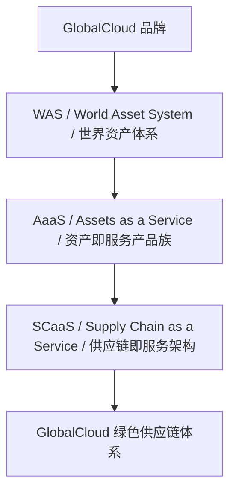
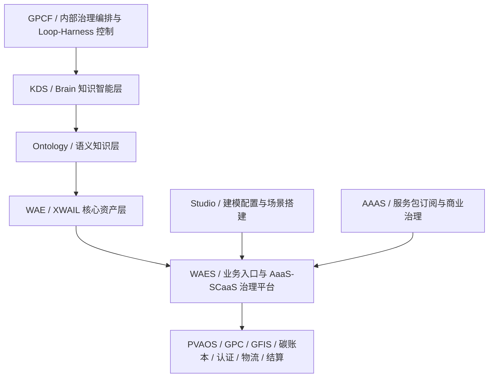

# GlobalCloud 世界资产体系正式命名与产品系统架构总纲

## 1. 目的

本文沉淀本轮问答确认的 `GlobalCloud 世界资产体系` 命名、产品层级、系统层级、项目群映射和演进边界。本文不声明业务上线、客户交付完成或状态升级，只作为后续 PDF V1.2、项目文档和架构图的统一口径。

## 2. 正式命名

| 名称 | 英文 | 中文 | 定位 |
|---|---|---|---|
| GlobalCloud | GlobalCloud | GlobalCloud | 品牌 |
| WAS | World Asset System | 世界资产体系 | GlobalCloud 品牌下的产品体系总称 |
| Ontology | Ontology | 语义本体 | WAS 的语义知识层，定义概念、关系、词表、约束和推理规则 |
| XWAIL | eXtensible World Asset Information Language | 可扩展世界资产信息建模语言 | WAS 的主规范建模语言和机器契约 |
| WAE | World Asset Engine | 世界资产引擎 | 资产主账、模型注册、事件、关系、策略、证据、计量和运行底座 |
| WAES | World Asset Explorer | 世界资产浏览器 | 基于 WAE 的业务实现、统一入口、运营工作台和 AaaS/SCaaS 治理平台 |
| AaaS | Assets as a Service | 资产即服务 | WAS 的商业交付模式与产品族 |
| SCaaS | Supply Chain as a Service | 供应链即服务 | AaaS 在供应链行业的行业化架构 |
| GlobalCloud 绿色供应链体系 | GlobalCloud Green Supply Chain System | GlobalCloud 绿色供应链体系 | SCaaS 的对外场景名称和当前唯一切入口 |

旧口径统一作废：`WAE = 浏览器/入口`、`WAES = 主账/引擎`。新口径固定为：`WAE = 引擎`，`WAES = 浏览器 + AaaS/SCaaS 治理平台`。

## 3. 一句话定义

```text
GlobalCloud 绿色供应链体系，是 GlobalCloud WAS 世界资产体系在供应链行业的 AaaS 场景实现。
```

链路定义：

```text
WAS 定义体系，Ontology 定义语义，XWAIL 定义契约，WAE 负责运行，WAES 负责治理与发布，AaaS/SCaaS 服务化运营资产世界。
```

三者协同关系：

```text
WAS
定义资产世界的顶层语义、产品体系和治理框架
  ↓
Ontology
沉淀概念、词表、关系、语义规则和推理结构
  ↔
XWAIL
把资产、关系、流程、状态、策略、证据写成机器契约
  ↓
WAE / WAES
注册、运行、治理、发布和服务化运营
```

## 4. 产品架构



产品视角下，`GlobalCloud 绿色供应链体系` 可对客户包装为整体解决方案；标准版整体交付，企业版模块化组合。客户购买入口以 AaaS 服务包为主，而不是购买底层系统源码或单体软件。

## 5. 系统架构



系统视角下，`GlobalCloud 绿色供应链体系` 不是单一系统，而是一组基于 WAE/WAES 和 AaaS 机制组装的供应链场景系统群。

## 5.1 WAS / Ontology / XWAIL 边界

| 项 | WAS | Ontology | XWAIL |
|---|---|---|---|
| 核心定位 | 顶层体系与资产世界观 | 语义本体、概念关系、知识图谱基础 | 规范性建模语言与机器契约 |
| 回答问题 | 什么是资产，资产如何分类、流动、演化、治理 | 概念之间是什么关系，机器如何理解资产语义 | 如何把资产写成可验证、可交换、可运行的模型 |
| 主要价值 | 保证方向一致 | 保证语义一致 | 保证模型一致 |
| 运行边界 | 不直接运行 | 支持推理和解释，可信推理可受控写入 | 可进入 WAE/WAES 运行 |

Ontology 是 WAS 的语义知识层，不是独立顶层体系，不替代 XWAIL，也不替代 GFIS、GPC、PVAOS 等真实业务事实源。

可信推理结果可以写入 WAE，但必须通过 WAES 策略授权、来源证据、置信阈值、审计记录和回滚机制。Brain 只能读取正式 Ontology、XWAIL、WAE 数据，不能绕过 WAES 修改正式模型。

## 6. 项目群映射

主项目归属固定为：`WAS世界资产体系` 是 WAS 的主项目，`GlobalCloud XWAIL` 是 XWAIL 的主项目，`GlobalCloud AaaS` 是 AaaS 的主项目。当前本地目录名仍为 `GlobalCloud AAAS`，在正式产品命名中解释为 `GlobalCloud AaaS`。

| 项目 | 体系定位 | 客户侧呈现 |
|---|---|---|
| WAS世界资产体系 | WAS 主项目；负责 WAS 理论、标准、总体规划和术语基线 | 产品体系背景 |
| GlobalCloud XWAIL | XWAIL 主项目；负责 Schema、Profile、Validator、Templates、Examples、Migration、Conformance Test | 技术标准和契约 |
| GlobalCloud WAES | World Asset Explorer；资产、场景、治理、运行视图和 AaaS/SCaaS 治理平台 | 客户和运营方主要控制台 |
| WAE | WAES 内部核心引擎层；资产主账、模型注册、事件、关系、策略、证据、计量 | 通常不单独呈现 |
| GlobalCloud AaaS（本地目录：GlobalCloud AAAS） | AaaS 主项目；负责 AaaS 产品族、服务包、订阅、商业交付和通用订阅治理 | 服务包和商业套餐 |
| GlobalCloud PVAOS | 供应链价值联盟运营平台；联盟成员、权益、结算、订阅、商业协作 | 平台方、联盟方、供应商 |
| GlobalCloud GPC | 供应链公共协同入口；订单、企业、供需、物流、交易协同 | 与 PVAOS 可合并为协同入口 |
| GlobalCloud GFIS | 工厂执行与绿色事实源；生产、工艺、能耗、排放、质量、设备证据 | 工厂/制造企业执行侧入口 |
| GlobalCloud Brain | 企业知识治理、高级智能工作台、问答、分析和建议 | 可独立购买，也可被各系统调用 |
| GlobalCloud KDS | 内部知识与文档源 | 不直接对外 |
| GlobalCloud Studio | 低代码、配置、建模、场景搭建工具；也会成为独立产品 | 可对外成为建模与配置产品 |
| GlobalCloud MMC | 内部项目群/多模块管理控制中枢 | 不进入客户侧产品图 |
| GlobalCoud GPCF | 内部治理编排、文档、Loop、Harness 控制仓库 | 不进入客户侧产品图 |
| GlobalCloud PKC | 迁移合并至 Studio 的知识产品配置历史能力 | 不再作为独立架构节点 |
| GlobalCloud SOP | 合并至 WAES 的流程编排、作业标准、任务治理、证据闭环模块 | 通过 WAES 对接 |
| GlobalCloud XGD / XiaoC / XiaoG | 智能终端、助手、交互入口或专项应用能力 | 逐步合并进入 Studio |

## 7. 跨系统业务能力

`碳账本、结算价值流、物流仓储、合规认证` 是跨系统业务能力，不固定在单一项目内。原则为：

```text
事实源分布，账本统一，治理集中，场景组装。
```

其中 GFIS 产生工厂绿色事实，GPC 产生供应链协同事实并包含虚拟工厂概念，PVAOS 产生联盟运营事实，WAE 形成统一资产账本和碳账本，WAES 负责治理、展示、发布与服务包运行治理。

## 8. 演进路线

| 类别 | 项目/能力 | 处理方式 |
|---|---|---|
| 保留主干 | WAS、XWAIL、WAE、WAES、AAAS、SCaaS | 作为世界资产体系和绿色供应链体系主线 |
| 场景主干 | GFIS、GPC、PVAOS、Brain、Studio | 进入 GlobalCloud 绿色供应链体系 |
| 内部治理 | KDS、GPCF、MMC | 进入内部治理/研发运维图，不进入客户侧产品图 |
| 合并演进 | PKC、XGD、XiaoC、XiaoG | 逐步合并进入 Studio |
| 模块合并 | SOP | 合并进入 WAES 流程编排与证据闭环模块 |

## 9. 图件输出要求

后续正式输出至少包含四张图：

1. 产品体系图：`GlobalCloud -> WAS -> AaaS -> SCaaS / GlobalCloud 绿色供应链体系`
2. 系统架构图：`GPCF -> KDS/Brain -> WAE/XWAIL -> WAES -> PVAOS/GPC/GFIS/跨系统能力`
3. 项目群映射图：现有项目到产品、系统、场景、治理的映射
4. 演进路线图：保留、合并、候选、废弃

## 10. 边界

- 不把 WAES 写成 WAE 同义词。
- 不把 WAE 写成普通前端或浏览器。
- 不把 GlobalCloud 绿色供应链体系写成脱离 WAS 的独立顶层体系。
- 不把 Ontology 写成独立于 WAS 的另一套顶层体系。
- 不把 Ontology 推理结果绕过 WAES 直接写入正式主账。
- 不把 KDS 写成客户侧产品或 Brain 替代物。
- 不把 GPCF/MMC 写成客户侧产品模块。
- 不把文档确认写成业务系统完成。
