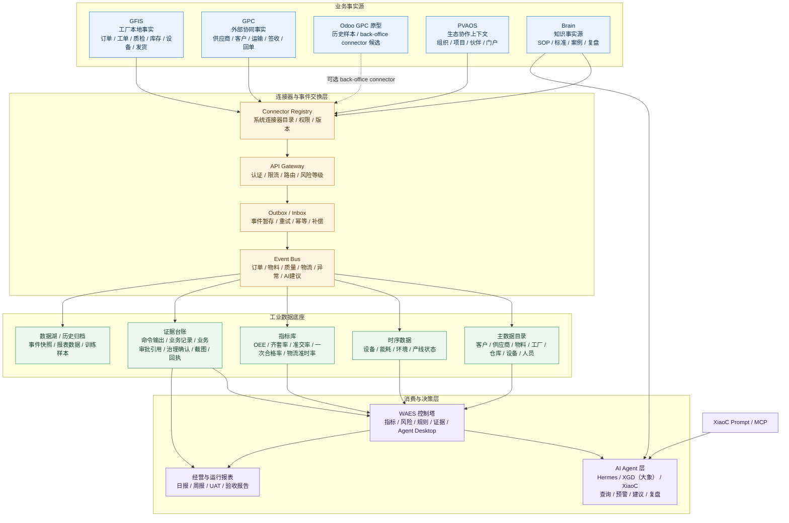
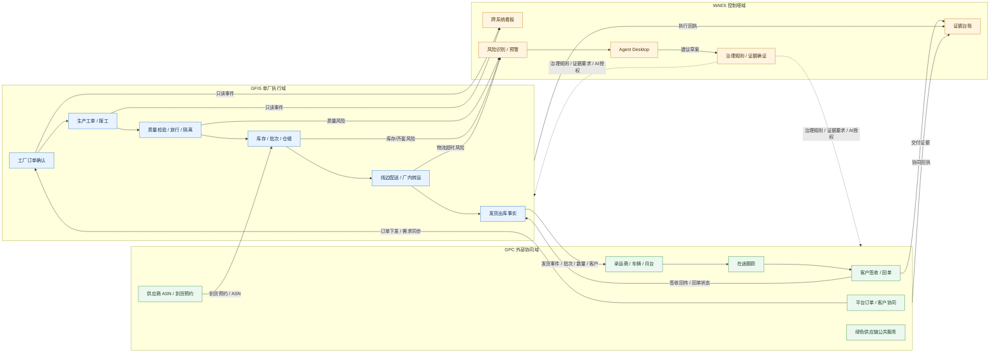
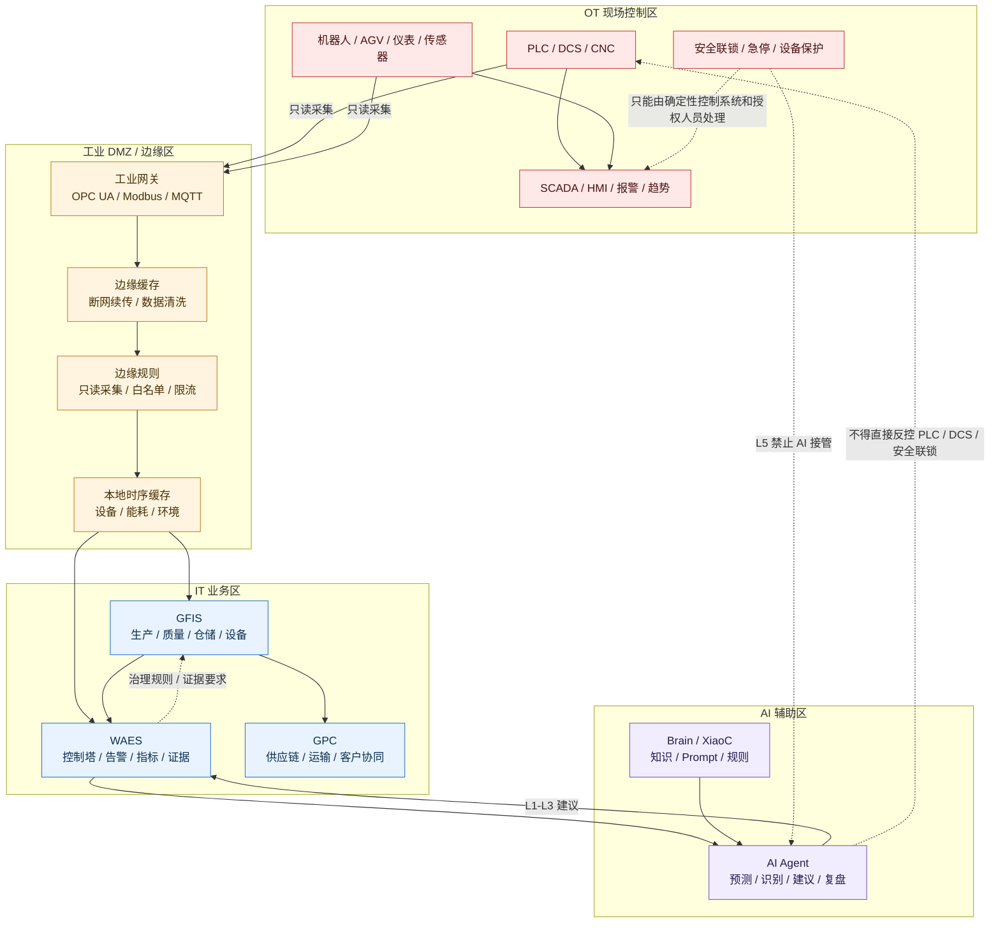
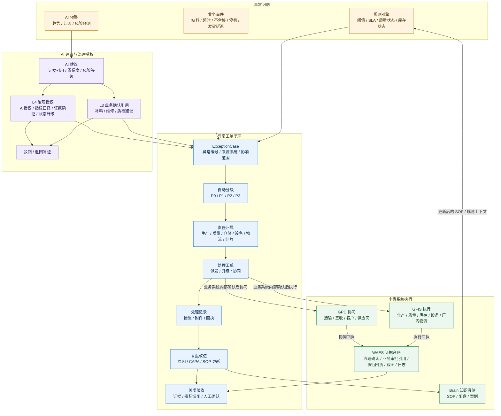

# GlobalCloud 智慧工厂专项架构图集

日期：2026-06-07
当前口径：本图集已纳入 **GlobalCloud 绿色供应链体系**，原“智慧工厂”仅指生产与执行层/工厂执行子域。主架构采用治理与监控层、运营与协同层、生产与执行层。
用途：补齐项目群总览图未展开的关键实施架构，包括统一数据与事件、GFIS-GPC-WAES 集成边界、OT/IT 安全与边缘采集、异常闭环与 AI 治理授权。

四流优化口径：本图集的所有图都必须按治理流、业务流、数据流、AI 服务流进行解释。连接器、SOP、AI 服务、数据治理、多厂协同和 Edge 安全的落地细节分别以专项模型文档为准。

当前阅读口径：

1. 绿色供应链平台业务主线看 `GPC`。
2. 治理、证据、状态和 AI 授权看 `WAES`。
3. 工厂执行和现场事实看 `GFIS + Edge`。
4. 宪法内容主要体现为边界、门禁、证据和授权纪律。

## 1. 统一数据与事件架构图

关键补充：

1. 项目之间不直接共享业务数据库。
2. 业务事实必须从主责系统通过连接器、API、Outbox/Inbox 和事件总线进入数据底座。
3. WAES 读取指标和证据，不直接伪造 GFIS/GPC 事实。
4. AI Agent 只能消费数据和生成建议；具体业务写入必须进入 GFIS/GPC 主责系统确认，WAES 只做治理授权、证据确证和状态审计。

四流补充：

1. 数据事件架构必须增加 schema、数据质量、DLQ、重放、血缘和租户隔离。
2. 连接器上线、降级、恢复和下线必须进入 `ConnectorLifecycleRecord`。
3. AI 读取数据必须通过 `AgentToolGrant` 和 `EvidenceCitation` 约束。
4. Edge 设备信号是遥测事实，不是业务主账事实。

## 2. GFIS-GPC-WAES 集成边界图

边界规则：

1. GFIS 主责工厂本地事实：工单、质量、库存、厂内物流、发货出库。
2. GPC 主责外部协同事实：预约、车辆、在途、签收、回单、公共服务；Odoo GPC 仅作为历史原型或可选 back-office connector。
3. WAES 主责风险、治理规则、证据和控制塔，不成为业务主账，不承办具体事务审批。
4. 具体事务处理必须回到 GFIS/GPC，由主责系统生成业务确认和执行回执；WAES 只引用这些结果。

## 3. OT/IT 安全与边缘采集架构图

安全规则：

1. AI 不直接接管 PLC、DCS、急停、安全联锁、设备保护和环保排放控制。
2. OT 到 IT 默认只读采集，必须通过工业网关、DMZ、缓存和白名单。
3. GFIS 可以接收设备状态和能耗数据，但控制指令必须遵守现场控制系统和授权人员边界。
4. 断网时 GFIS 本地优先运行；恢复后由边缘缓存补传，不让云端不可用影响现场连续生产。

## 4. 异常闭环与 AI 治理授权图

闭环要求：

1. 每个异常必须有来源系统和来源记录，不能只有口头描述。
2. AI 建议必须带证据引用、风险等级和置信度。
3. L3 建议需要 GFIS/GPC 业务确认引用，L4 治理事项需要 WAES/Harness 治理授权。
4. 执行结果必须由 GFIS/GPC 主责系统返回回执。
5. 关闭异常必须有证据台账和复盘结论。
6. 复盘结论进入 Brain 后，才能成为后续 SOP 或 RAG 上下文候选。
