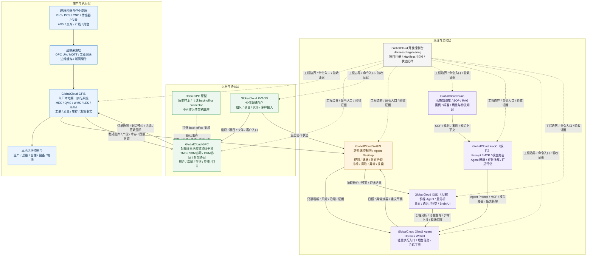
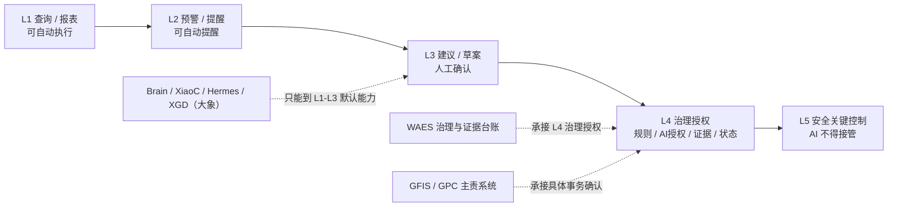

# GlobalCloud 绿色供应链体系项目群架构图

日期：2026-06-07
口径：基于当前项目群定位，表达三层主架构、数据/事件流、AI 辅助边界和工程治理关系。原“智慧工厂”归入生产与执行层/工厂执行子域。

当前阅读口径：

1. 平台主线系统看 `GPC`。
2. `WAES` 是治理平面，不是业务主账。
3. `GFIS` 是工厂事实平面。
4. 宪法内容以治理门禁方式进入图中，不单独形成业务平台。

专项实施架构见：[GlobalCloud智慧工厂专项架构图集.md](/Users/lujunxiang/Documents/GlobalCloud智慧工厂/GlobalCloud智慧工厂专项架构图集.md)

## 读图口径

1. **GFIS 是单厂执行事实源**：生产、质量、库存、设备、发货等最终业务事实归 GFIS。
2. **GPC 是跨企业协同平台**：供应商、客户、运输、签收、公共服务和绿色供应链协同归 GPC；Odoo GPC 仅保留为历史原型或可选 back-office connector。
3. **WAES 是治理与监控中枢和证据平面**：聚合指标、风险、治理规则、证据，不审批具体事务，不直接改写生产主账。
4. **Brain/XiaoC（蚁后）/Hermes/XGD（大象） 是 AI 支撑层**：Brain 提供知识，XiaoC 负责能力生产、模型路由、任务拆解和汇总，Hermes/XGD 承载长程 Agent、重分析和多端交互。
5. **Harness 是工程治理底座**：约束所有项目的边界、命令、验证、人工确认和状态纪律。
6. **四流是横向校验口径**：治理流约束业务流，业务流产生数据流，数据流支撑治理流，AI 服务流消费数据流并受治理流约束。
7. **连接器、SOP、AI、数据治理、多厂协同和 Edge 安全已有专项合同/模型**：项目群图只表达关系，落地细节以专项文档为准。

## 授权边界

