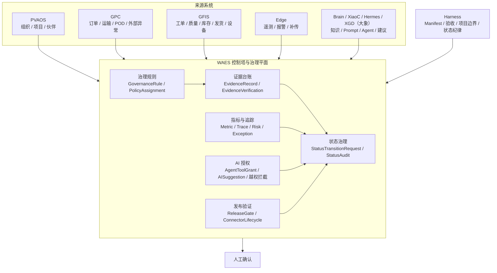

# GlobalCloud 绿色供应链体系 WAES 控制塔治理架构图

日期：2026-06-07
状态：WAES 控制塔治理架构图 v1
口径：只看治理、证据、状态、授权和控制塔视图。

## 1. WAES 治理总图

## 2. WAES 主责

1. 项目发起、模板启用、发布验证。
2. 治理规则、指标口径、状态升级。
3. 证据捕获、确证、驳回、归档。
4. 控制塔监控、异常聚合、风险视图。
5. AI 授权、工具权限、越权拦截。

## 3. WAES 不做什么

1. 不审批工单。
2. 不审批质量放行。
3. 不审批库存调整。
4. 不审批发货。
5. 不审批签收。
6. 不直接写 `GFIS` 或 `GPC` 业务主账。
