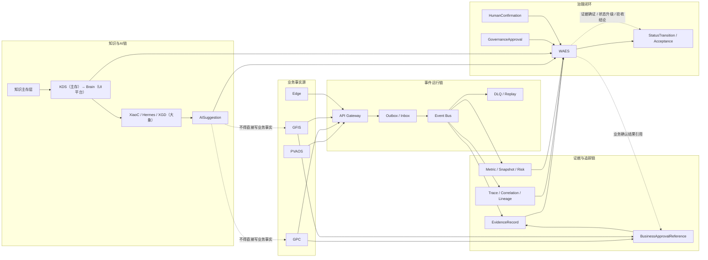

# GlobalCloud 绿色供应链体系全链路事件与证据闭环图

日期：2026-06-07
状态：专项架构图 v1
口径：只展开业务事实、事件流、证据流、知识引用和治理确认如何形成闭环。

## 1. 全链路事件与证据闭环图

## 2. 闭环说明

### 2.1 业务闭环

1. 业务事实由 `PVAOS / GPC / GFIS / Edge` 产生。
2. 事实通过 `API Gateway -> Outbox/Inbox -> Event Bus` 发布。
3. 业务确认仍在 `GPC` 或 `GFIS` 内部完成。

### 2.2 证据闭环

1. 事件、日志、回执、截图、业务确认引用进入 `EvidenceRecord`。
2. `WAES` 只做证据确证，不替代业务审批。

### 2.3 AI 闭环

1. AI 从知识引擎层读取已发布知识。
2. AI 形成 `AISuggestion`。
3. `WAES` 检查授权、证据和引用。
4. 需要业务动作时，回到 `GFIS / GPC` 内部流程。

### 2.4 状态闭环

1. `WAES` 汇总业务事实、证据、指标和人工确认。
2. 只对治理状态、验收状态和阶段状态做升级。
3. 不把业务动作本身当成 WAES 审批结果。
