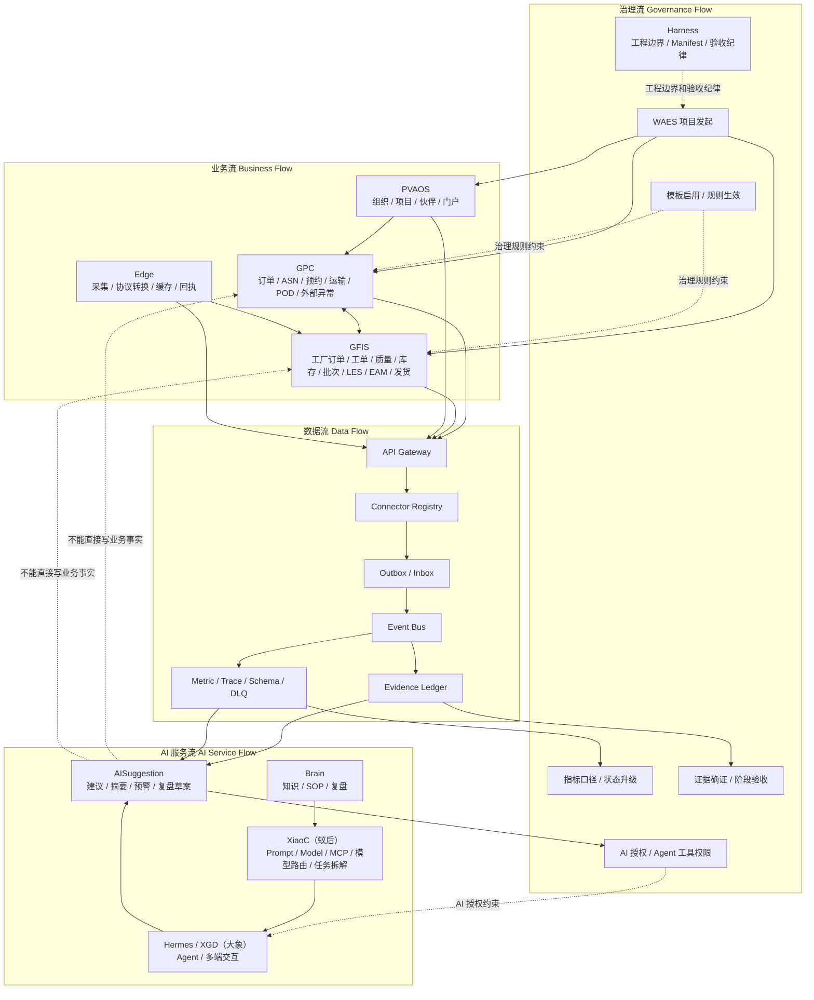
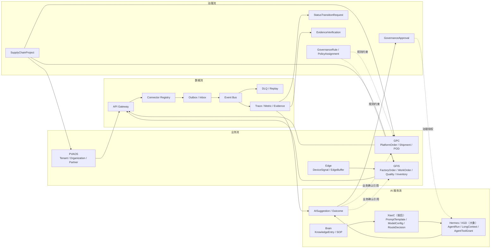
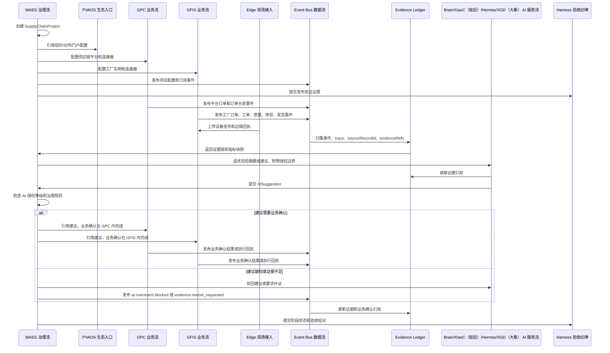

# GlobalCloud 绿色供应链体系四流综合架构分析与优化方案

日期：2026-06-07
状态：体系级综合分析与优化设计稿 v1
分析维度：治理流、业务流、数据流、AI 服务流
继承基线：README、层次化结构、对象目录、事件合同、一期验收矩阵、全局初始化 SOP、项目群架构方案、项目群架构图、专项图集、GPC ADR、GFIS V3.1。

## 1. 总体诊断结论

当前 GlobalCloud 绿色供应链体系的主方向是正确的：三层主架构已经建立，四阶段生命周期已经形成，WAES、GPC、GFIS、PVAOS、Edge、Brain、XiaoC、Hermes/XGD（大象） 的基本边界已经明确。

当前已经形成的基线包括：

1. 总体系名称为 **GlobalCloud 绿色供应链体系**。
2. 主架构采用三层：治理与监控层、运营与协同层、生产与执行层。
3. 生命周期采用四阶段：项目初始化、项目配置与 SOP 建设、正式运营、WAES 持续治理与监控。
4. WAES 是项目发起、配置编排、发布验证、规则治理、监控、证据、状态和 AI 授权中枢。
5. WAES 不参与具体事务审批，不审批工单、质量、库存、发货、签收、维修等业务动作。
6. 具体事务确认在 GFIS 或 GPC 内部完成，WAES 只引用 `BusinessApprovalReference` 和 `EvidenceRecord`。
7. GPC 是运营与协同层主线。
8. GFIS 是生产与执行层主线。
9. Edge 是现场与 GFIS 之间的边缘接入层，不是业务主账。
10. AI 建议不是业务事实，不能直接写入业务主账。
11. 绿色供应链平台一期主线系统为 `GPC`，宪法内容主要通过 `WAES` 的治理规则、证据纪律、状态门禁和 AI 授权进入总架构。

本次四流分析后的核心判断：

| 判断 | 结论 | 后续动作 |
|---|---|---|
| 总体架构 | 合理，但四流之间的约束关系还没有形成独立模型 | 新增四流架构总图和交互时序 |
| 治理流 | WAES 边界基本正确，但治理规则、状态流转、连接器治理和 Harness 边界仍需对象化 | 扩展对象目录和事件合同 |
| 业务流 | 主责系统清晰，但一链多厂、多链多厂的订单分发、产能协同、库存可见性、质量追溯仍偏弱 | 新增多厂协同对象和 SOP 场景 |
| 数据流 | envelope 基本可用，但缺少 schema 版本、数据质量、死信、重放、补偿、血缘、保留策略 | 补数据治理对象、事件和连接器合同 |
| AI 服务流 | L1-L5 边界正确，但 Agent 工具授权、运行记录、建议结果评价、越权拦截还不够落地 | 补 AI 服务对象、事件和验收场景 |

当前最需要补齐的不是再增加系统名称，而是把四流转成可执行合同：

1. **连接器合同**：每个连接器的身份、权限、schema、事件、重试、死信、重放、降级、证据要求。
2. **治理规则生命周期**：规则配置、生效、变更、冻结、回滚、废止的状态机。
3. **SOP 执行模板**：主责系统、主责角色、触发事件、业务确认点、治理确认点、证据要求、AI 允许与禁止动作。
4. **数据治理模型**：schema registry、数据质量、DLQ、重放、补偿、血缘、保留和租户隔离。
5. **AI 服务模型**：Agent 工具授权、AgentRun、AISuggestionOutcome、PromptEvaluation、越权拦截和采纳评价。
6. **平台主线纪律**：不把宪法扩写成大平台，而是把宪法下沉为 `WAES` 治理门，并让 `GPC` 保持平台主线边界。

## 2. 四流总览图



读图口径：

1. 治理流约束业务流，不替代业务流。
2. 业务流产生事实和事件，不把 WAES 作为业务主账。
3. 数据流承载跨系统事实、证据、指标和追踪，不共享业务数据库。
4. AI 服务流消费数据流，受治理流授权，输出建议、摘要、预警和复盘草案，不写业务事实。

## 3. 治理流详细分析

### 3.1 当前已形成基线

| 治理事项 | 当前基线 |
|---|---|
| 项目发起 | WAES 可新建供应链项目，支持按地区、产业链、客户、园区、集团或运营单位建立 |
| 模板启用 | 支持一链一厂、一链多厂、多链多厂、区域供应链平台 |
| 发布验证 | 初始化不能只看配置页面，必须有连接器、对象映射、事件链、证据回指、AI 授权、最小闭环验证 |
| 规则治理 | WAES 审批或确认规则、指标、AI 授权、Agent 工具权限、证据确证、状态升级、SOP 发布、连接器治理、阶段验收 |
| 事务边界 | WAES 不审批工单、质量放行、库存调整、发货、签收、维修验收和客户交付承诺 |
| 状态纪律 | 未完成真实运行态联调前最多 `ready_for_human_acceptance`，不能标记 `complete` |

### 3.2 遗漏内容

1. **治理规则缺少独立状态机**：当前有 `GovernancePolicy`，但还缺 `GovernanceRule`、`GovernanceRuleVersion`、`PolicyAssignment` 和规则命中审计。
2. **指标口径缺少版本漂移控制**：`MetricDefinition` 已存在，但没有定义 `MetricDefinitionVersion`、生效范围、废止策略和重算边界。
3. **状态升级缺少显式对象**：需要 `StatusTransitionRequest`，避免把状态从 `partial` 推到 `accepted` 或 `complete` 时只有口头结论。
4. **SOP 发布治理不够完整**：需要发布、冻结、回滚、退役事件和版本兼容策略。
5. **连接器治理缺少生命周期**：上线、下线、降级、恢复、密钥轮换、schema 变更、事件订阅变更都应进入治理流。
6. **WAES 与 Harness 边界需要显式化**：WAES 管业务体系治理和运行证据；Harness 管工程边界、命令入口、验证证据、状态纪律和人工确认门。
7. **证据驳回后缺少补证路径**：需要 `EvidenceCorrectionRequest` 或 `EvidenceReworkRequest`。

### 3.3 不合理或容易误解内容

| 可能误解 | 风险 | 优化口径 |
|---|---|---|
| WAES 发起项目等于 WAES 拥有全部业务配置 | 会把 WAES 写成超级业务系统 | PVAOS 管组织/门户，GPC/GFIS 管业务配置，WAES 管项目治理编排和发布验证 |
| 第四阶段 WAES 治理监控是前三阶段之后才开始 | 容易漏掉初始化和试运营阶段的治理控制 | S4 是常态模式，治理从 S1 即开始贯穿全生命周期 |
| 旧“AI 建议批准”事件名被理解为业务批准 | 可能让 AI 建议绕过业务系统确认 | 已调整为 `ai.suggestion.governance_authorized`，只表示治理授权通过 |
| EvidenceRecord 被标成业务事实 | 容易被误解为业务主账事实 | EvidenceRecord 是证据事实，不是生产、质量、库存、发货、签收主账事实 |

### 3.4 治理动作分类

| 动作 | 是否需要 `GovernanceApproval` | 是否允许用 `BusinessApprovalReference` | 主责 |
|---|---:|---:|---|
| 项目模板启用 | 是 | 否 | WAES |
| 规则生效、变更、废止 | 是 | 否 | WAES |
| 指标口径启用、变更、废止 | 是 | 否 | WAES |
| AI 授权等级变更 | 是 | 否 | WAES / Harness |
| Agent 工具权限启停 | 是 | 否 | WAES |
| 证据确证、驳回、归档 | 是 | 否 | WAES / Harness |
| 状态升级到 `accepted` 或 `complete` | 是 | 否 | WAES / Harness / Human |
| SOP 发布、冻结、回滚、退役 | 是 | 否 | WAES |
| 连接器上线、下线、降级、恢复 | 是 | 否 | WAES / Connector Registry |
| 工单审批 | 否 | 是 | GFIS |
| 质量放行 | 否 | 是 | GFIS |
| 库存调整 | 否 | 是 | GFIS |
| 发货出库 | 否 | 是 | GFIS |
| 客户签收、POD 争议处理 | 否 | 是 | GPC |
| 维修验收 | 否 | 是 | GFIS |
| 客户交付承诺变更 | 否 | 是 | GPC |

## 4. 业务流详细分析

### 4.1 当前已形成基线

| 业务域 | 主责系统 | 已形成口径 |
|---|---|---|
| 生态入口 | PVAOS | 组织、项目、伙伴、客户、供应商、承运商、门户入口 |
| 项目初始化 | WAES | 新建供应链项目、选择模板、配置拓扑、连接器、AI 能力、发布验证 |
| 外部协同 | GPC | 平台订单、样品申请、客户签样、转量产、ASN、预约、车辆、运输、POD、外部异常 |
| 工厂执行 | GFIS | 配方研发、样品打样、样品检测、工厂订单、工单、齐套、质量、库存、批次、LES、EAM、发货出库 |
| 现场接入 | Edge | 现场信号采集、协议转换、缓存、回执，不是业务主账 |
| AI 交互 | Brain/XiaoC（蚁后）/Hermes/XGD（大象） | 知识、Prompt、Agent、交互，受 WAES 治理授权约束 |

### 4.2 业务流主链路

```text
PVAOS 组织和伙伴接入
-> WAES 供应链项目初始化和发布验证
-> GPC 平台订单和外部协同
-> GPC / GFIS 样品确认、打样签样和转量产
-> GFIS 工厂订单确认和生产执行
-> GFIS 质量、库存、批次、LES、EAM、发货出库
-> GPC 运输、POD、外部异常
-> WAES 证据、指标、状态、复盘和治理监控
```

### 4.3 试运营与正式运营差异

| 项 | 试运营 | 正式运营 |
|---|---|---|
| 目标 | 验证关键 SOP 最小闭环 | 扩展 P0/P1/P2 真实运营闭环 |
| 覆盖范围 | 少量样例订单、样例批次、样例异常 | 多订单、多工厂、多异常、多角色、多外部方 |
| 完成状态 | 最多 `ready_for_human_acceptance` | 有真实执行、证据和人工验收后可到 `accepted` 或 `complete` |
| AI 使用 | 重点验证越权拦截和建议可追溯 | 统计建议质量、采纳率、驳回率、证据完整率 |
| 证据要求 | 最小链路证据完整 | 每个 SOP 有执行记录、事件、回执、复盘 |

### 4.4 一链多厂和多链多厂缺口

当前一链一厂链路较清晰，但一链多厂、多链多厂还缺少以下业务模型：

| 缺口 | 影响 | 建议新增对象 |
|---|---|---|
| 订单分发规则 | 无法决定订单分给哪个工厂 | `FactoryAllocationRule`、`FactoryAllocation` |
| 产能承诺 | GPC 不知道 GFIS 是否可接单 | `CapacityCommitment`、`CapacitySnapshot` |
| 跨厂库存可见性 | 缺少多厂库存汇总和可承诺库存口径 | `InventoryVisibilitySnapshot` |
| 质量追溯范围 | 多厂批次追溯可能断链 | `QualityTraceScope`、`TraceSegment` |
| 工厂间异常协同 | 一厂异常影响另一厂交付时缺少责任链 | `CrossFactoryException` |
| 多链租户隔离 | 数据、指标、AI 建议可能越界 | `TenantDataBoundary`、`ChainAccessPolicy` |

### 4.5 业务事实归属表

| 事实 | 主责系统 | WAES 处理方式 |
|---|---|---|
| 租户、组织、伙伴、门户账号 | PVAOS | 读取状态和证据 |
| 平台订单、ASN、预约、车辆、运输、POD、外部异常 | GPC | 读取事件、证据和业务确认引用 |
| 工厂订单、工单、齐套、质量、库存、批次、LES、EAM、发货出库 | GFIS | 读取事件、证据和业务确认引用 |
| 现场设备信号、边缘缓存和回放 | Edge / GFIS | 读取信号和回执，不作为业务主账 |
| 治理规则、指标口径、证据确证、状态升级、AI 授权 | WAES / Harness | 产生治理事实 |
| 知识条目、Prompt 模板、Agent 任务 | Brain / XiaoC / Hermes / XGD（大象） | 受 WAES 授权约束 |

## 5. 数据流详细分析

### 5.1 当前已形成基线

当前事件 envelope 已覆盖：

```text
eventId, eventType, eventVersion, sourceSystem, sourceRecordId,
occurredAt, publishedAt, actorType, actorId, riskLevel,
traceId, correlationId, idempotencyKey, payload, evidenceRefs
```

这是一期够用的事实通知结构。它可以支撑订单到交付、批次追溯、异常闭环、证据归档和 AI 建议引用。

### 5.2 数据流目标路径

| 来源 | 到 WAES 的路径 | 说明 |
|---|---|---|
| PVAOS | PVAOS Connector -> API Gateway -> Outbox/Inbox -> Event Bus -> WAES | 组织、项目、伙伴、门户上下文 |
| GPC | GPC Connector -> API Gateway -> Outbox/Inbox -> Event Bus -> WAES | 订单、运输、POD、外部异常 |
| GFIS | GFIS Connector -> API Gateway -> Outbox/Inbox -> Event Bus -> WAES | 工单、质量、库存、批次、LES、EAM、发货事实 |
| Edge | Edge Gateway -> GFIS -> Event Bus -> WAES | 现场信号先进入 GFIS 或边缘事件通道，再被 WAES 读取 |
| Brain | Knowledge Connector -> API Gateway -> WAES/XiaoC | SOP、知识、复盘、可信源 |
| XiaoC（蚁后）/Hermes/XGD（大象） | Agent Connector -> WAES | Prompt、AgentTask、AISuggestion、AgentRun |

### 5.3 数据流职责边界

| 组件 | 职责 | 不做什么 |
|---|---|---|
| API Gateway | 认证、路由、限流、风险等级、审计入口 | 不持久化业务主账 |
| Connector Registry | 连接器身份、版本、权限、schema、健康状态 | 不执行业务审批 |
| Outbox/Inbox | 事件可靠发布、消费幂等、重试、去重 | 不改变业务事实含义 |
| Event Bus | 事件分发、订阅、重放入口 | 不作为唯一证据源 |
| Evidence Ledger | 证据捕获、回指、确证、驳回、归档 | 不替代 GFIS/GPC 主账 |
| Metric | 指标定义、计算、快照、版本 | 不改变来源事实 |
| Trace | traceId、correlationId、链路追踪 | 不推断未发生事实 |

### 5.4 数据流缺口

| 缺口 | 风险 | 优化建议 |
|---|---|---|
| Schema Registry 缺失 | 事件版本升级可能破坏消费者 | 新增 `SchemaVersion`、`SchemaCompatibilityCheck` |
| Dead Letter Queue 缺失 | 失败事件丢失或无法追踪 | 新增 `DeadLetterRecord` 和 DLQ 事件 |
| 重放策略不明确 | 断点恢复、审计重算困难 | 新增 `ReplayRequest`、`ReplayRun` |
| 数据质量规则缺失 | 指标和 AI 建议基于脏数据 | 新增 `DataQualityRule`、`DataQualityIssue` |
| 数据血缘缺失 | 无法解释指标和证据来源 | 新增 `LineageRecord` |
| 保留策略缺失 | 证据和日志保留不符合审计要求 | 新增 `RetentionPolicy` |
| 租户隔离不够显式 | 多链多厂容易越权访问 | 新增 `TenantDataBoundary`、`ChainDataBoundary` |
| Edge 数据策略不完整 | 断网补传、去重、丢弃规则不清 | 新增 `EdgeBufferPolicy`、`EdgeReplayRun` |

### 5.5 数据不能共享数据库的范围

以下数据不得通过共享数据库解决，必须通过 API、事件或证据引用：

1. GFIS 的工单、质量、库存、批次、发货主账。
2. GPC 的平台订单、运输、POD、外部异常主账。
3. PVAOS 的组织、账号、角色、门户主数据。
4. WAES 的治理审批、证据确证、状态审计。
5. Brain 的 canonical 知识源。
6. XiaoC（蚁后）的生产 Prompt、模型配置、模型路由、任务拆解和结果汇总策略。
7. Edge 的现场采集缓存和设备信号明细。

## 6. AI 服务流详细分析

### 6.1 当前已形成基线

| 组件 | 当前定位 |
|---|---|
| Brain | 知识、SOP、案例、复盘、RAG 可信源 |
| XiaoC（蚁后） | Prompt、ModelConfig、MCP、模型路由、Agent 模板、任务拆解、评估和结果汇总 |
| Hermes/XGD（大象） | 长程 Agent、重分析、Agent 运行、桌面/语音/多端交互、后台任务 |
| WAES | AI 授权等级、Agent 工具权限、证据和治理约束 |

### 6.2 AI 服务链路

```text
业务事件 / 指标 / 证据
-> WAES 风险和上下文编排
-> Brain 提供 SOP、案例、知识
-> XiaoC（蚁后）提供 PromptTemplate、ModelConfig、MCP 工具、模型路由和任务拆解
-> Hermes/XGD（大象）执行 AgentTask、长程上下文和重分析任务
-> 生成 AISuggestion
-> WAES 检查授权、证据和风险等级
-> GFIS/GPC 内部业务确认
-> 业务系统生成执行回执
-> WAES 记录建议结果、证据和复盘
```

### 6.3 L1-L5 落地规则

| 等级 | AI 可以做 | 需要的控制 | 禁止事项 |
|---|---|---|---|
| L1 查询/报表 | 自动查询、摘要、日报草案 | 来源记录和证据引用 | 不得编造未确证事实 |
| L2 预警 | 自动识别风险、提醒、分派关注 | 阈值、规则、证据引用 | 不得直接关闭异常 |
| L3 建议 | 补料、维修、质检、运输处理建议 | 人工业务确认或业务系统流程 | 不得直接创建或关闭主账事务 |
| L4 治理授权 | AI 授权、工具权限、指标口径、状态升级建议 | WAES/Harness `GovernanceApproval` | 不得把治理授权写成业务批准 |
| L5 禁止接管 | 无 | 硬隔离、审计、阻断 | 急停、安全联锁、设备保护、环保排放控制、质量放行自动化 |

### 6.4 AI 服务缺口

| 缺口 | 风险 | 建议新增对象 |
|---|---|---|
| Agent 工具授权不够细 | Agent 可能越权调用写接口 | `AgentToolGrant`、`AgentToolPolicy` |
| Agent 运行过程不可审计 | 失败、重试、证据不足无法追踪 | `AgentRun`、`AgentRunStep` |
| AI 建议结果未闭环 | 无法评价采纳率和有效性 | `AISuggestionOutcome` |
| Prompt 质量不可评估 | 提示词上线后缺少回归测试 | `PromptEvaluation` |
| 模型配置变更缺少治理 | 模型切换可能影响建议质量 | `ModelEvaluation`、`ModelChangeRequest` |
| 证据引用缺少结构化 | AI 建议无法证明来源 | `EvidenceCitation` |
| 越权拦截缺少事件 | 安全边界无法验收 | `AIOverreachBlocked` |

### 6.5 AI 建议防误用规则

1. `AISuggestion` 默认不是业务事实。
2. `AISuggestion` 的状态不得命名为会误导业务完成的 `executed`，建议改为 `business_action_referenced` 或 `closed_with_reference`。
3. AI 建议必须带 `evidenceRefs`、`confidence`、`riskLevel`、`allowedActions`、`prohibitedActions`。
4. AI 只能通过 WAES 授权的工具调用读取或发起草案，不得绕过 GFIS/GPC 的业务确认流程。
5. AI 建议被采纳后，业务事实仍由 GFIS/GPC 生成，并由 WAES 记录 `BusinessApprovalReference`。

## 7. 四流之间的交叉关系

### 7.1 治理流约束业务流

| 治理对象 | 约束的业务内容 |
|---|---|
| ProjectTemplate | 决定一链一厂、一链多厂、多链多厂、区域平台的可选业务拓扑 |
| GovernanceRule | 决定哪些业务动作需要证据、哪些触发异常、哪些必须人工确认 |
| MetricDefinition | 决定业务绩效如何计算，不允许各系统各算各的 |
| AI Authorization | 决定 AI 对业务系统只能查、能建议、能否发起草案 |
| Connector Policy | 决定业务系统之间如何交换事实和回执 |

### 7.2 业务流产生数据流

| 业务动作 | 产生的数据 |
|---|---|
| 平台订单接收 | `gpc.platform_order.received`、PlatformOrder |
| 样品申请 | `gpc.sample_request.created`、SampleRequest |
| 样品打样完成 | `gfis.sample_work_order.completed`、SampleWorkOrder |
| 客户签样确认 | `gpc.sample.approved`、SampleApproval |
| 转量产放行 | `gpc.production_release.approved`、ProductionRelease |
| 订单分发到工厂 | `gpc.platform_order.dispatched_to_factory`、OrderMapping |
| 工厂订单确认 | `gfis.factory_order.accepted`、FactoryOrder |
| 齐套检查 | `gfis.kitting_check.completed`、KittingCheck |
| 质量检验 | `gfis.quality_inspection.accepted/rejected`、QualityInspection |
| 发货出库 | `gfis.factory_shipment.released`、FactoryShipmentRelease |
| 客户签收 | `gpc.pod.signed/disputed`、ProofOfDelivery |
| 异常处理 | `gpc.external_exception.*` 或 `gfis.*.exception_*`、ExceptionCase |

### 7.3 数据流支撑治理流

| 数据能力 | 支撑的治理判断 |
|---|---|
| TraceContext | 判断订单到交付是否闭环 |
| EvidenceRecord | 判断证据是否可验收 |
| BusinessApprovalReference | 证明具体事务已由主责系统确认 |
| MetricSnapshot | 支撑指标口径和阶段验收 |
| DeadLetterRecord | 判断事件链是否存在阻塞 |
| DataQualityIssue | 判断指标、AI 建议、验收证据是否可信 |

### 7.4 AI 服务流消费数据流并受治理流约束

| AI 动作 | 消费数据 | 治理约束 | 输出 |
|---|---|---|---|
| 日报摘要 | MetricSnapshot、EvidenceRecord | L1，可自动但必须引用来源 | 日报草案 |
| 缺料预警 | KittingCheck、InventoryTransaction | L2，可提醒 | 风险提醒 |
| 补料建议 | KittingCheck、LineSideStock、LogisticsTask | L3，需业务确认 | AISuggestion |
| 质量异常 CAPA 草案 | QualityInspection、MaterialLot、历史案例 | L3，需质量负责人确认 | CAPA 草案 |
| AI 工具权限变更 | AgentRun、ToolGrant、风险事件 | L4，需 GovernanceApproval | AgentToolGrant 变更 |
| 设备安全控制 | DeviceSignal、Equipment | L5，禁止接管 | 阻断和审计 |

## 8. 当前设计中已经合理的部分

1. 三层主架构清晰，避免把数据层或 AI 层误当业务主线。
2. GPC 替代 Odoo core 二开作为主线，降低长期维护风险。
3. GFIS 作为生产与执行层主账，边界清楚。
4. WAES 不参与具体事务审批，避免控制塔变业务主账。
5. Edge 被定义为边缘接入层，不是业务主账。
6. 事件 envelope 已具备 traceId、correlationId、idempotencyKey 和 evidenceRefs。
7. 一期验收矩阵强调来源记录、事件、证据和确认点。
8. 全局初始化 SOP 强调配置完成不等于真实完成。
9. AI L1-L5 授权边界已经建立。

## 9. 当前设计中遗漏的内容

1. 缺独立连接器合同文档。
2. 缺治理规则生命周期和规则版本对象。
3. 缺指标口径版本化和重算边界。
4. 缺状态升级请求对象和状态转换审计。
5. 缺 SOP 发布、冻结、回滚、退役细则。
6. 缺多厂订单分发、产能承诺、库存可视、质量追溯对象。
7. 缺数据质量、DLQ、重放、补偿、血缘、保留策略。
8. 缺 Edge 缓存、补传、去重、丢弃和回放策略。
9. 缺 Agent 工具授权、运行审计、建议结果评价。
10. 缺 AI 越权拦截验收场景。
11. 缺 WAES 与 Harness 的职责矩阵。
12. 缺连接器上线、降级、恢复的验收场景。

## 10. 当前设计中不合理或容易误解的内容

| 内容 | 问题 | 优化建议 |
|---|---|---|
| 旧“AI 建议批准”事件名 | 容易被理解为业务批准 | 已改为 `ai.suggestion.governance_authorized` |
| 旧“AI 建议已执行”状态 | 容易被理解为 AI 已执行业务事实 | 已改为 `business_action_referenced` |
| `EvidenceRecord` 的业务事实标记 | 可能误解为业务主账 | 标注为证据事实，不是业务交易事实 |
| `DeviceSignal` 的业务事实标记 | 现场信号不是业务主账 | 标注为遥测事实，进入 GFIS 后才可触发业务流程 |
| S4 阶段命名 | 容易理解为前三阶段后才治理 | 明确 S4 贯穿全生命周期，正式运营后成为常态模式 |
| WAES 发起项目 | 容易变成 WAES 包办业务系统配置 | 明确 WAES 编排和治理，业务配置由 PVAOS/GPC/GFIS 主责完成 |

## 11. 需要调整的对象目录

### 11.1 治理对象

| 对象 | 主责 | 用途 |
|---|---|---|
| GovernanceRule | WAES | 单条治理规则 |
| GovernanceRuleVersion | WAES | 规则版本和兼容性 |
| PolicyAssignment | WAES | 规则绑定到项目、链、厂、角色或连接器 |
| StatusTransitionRequest | WAES / Harness | 状态升级或降级请求 |
| ReleaseGate | WAES / Harness | 发布和阶段验收门 |
| ConnectorLifecycleRecord | Connector Registry / WAES | 连接器上线、降级、恢复、下线审计 |
| EvidenceReworkRequest | WAES | 证据驳回后的补证请求 |

### 11.2 业务对象

| 对象 | 主责 | 用途 |
|---|---|---|
| FactoryAllocationRule | GPC / WAES | 多厂分单规则 |
| FactoryAllocation | GPC | 平台订单到工厂的分配结果 |
| CapacityCommitment | GFIS | 工厂对订单或时段的产能承诺 |
| CapacitySnapshot | GFIS | 工厂产能快照 |
| InventoryVisibilitySnapshot | GFIS / GPC | 多厂库存可见性快照 |
| QualityTraceScope | GFIS / WAES | 跨厂或跨链质量追溯范围 |
| CrossFactoryException | GPC / WAES | 多厂协同异常 |

### 11.3 数据对象

| 对象 | 主责 | 用途 |
|---|---|---|
| SchemaVersion | Connector Registry | API 和事件 schema 版本 |
| SchemaCompatibilityCheck | Connector Registry | schema 兼容性检查 |
| DeadLetterRecord | Event Bus | 失败事件记录 |
| ReplayRequest | WAES / Event Bus | 事件重放请求 |
| ReplayRun | Event Bus | 重放执行记录 |
| DataQualityRule | WAES | 数据质量规则 |
| DataQualityIssue | WAES | 数据质量问题 |
| LineageRecord | WAES / Data Platform | 指标、证据和报表血缘 |
| RetentionPolicy | WAES / Data Platform | 数据和证据保留策略 |
| TenantDataBoundary | PVAOS / WAES | 租户数据边界 |
| EdgeBufferPolicy | Edge / WAES | 边缘缓存、补传、丢弃策略 |

### 11.4 AI 服务对象

| 对象 | 主责 | 用途 |
|---|---|---|
| AgentToolGrant | WAES | Agent 工具授权 |
| AgentToolPolicy | WAES / XiaoC | 工具权限策略 |
| AgentRun | Hermes / WAES | Agent 运行实例 |
| AgentRunStep | Hermes | Agent 步骤审计 |
| AISuggestionOutcome | WAES | 建议采纳、驳回、业务引用和效果 |
| PromptEvaluation | XiaoC / WAES | Prompt 评估 |
| ModelEvaluation | XiaoC / WAES | 模型评估 |
| EvidenceCitation | WAES / Agent | AI 建议中的结构化证据引用 |
| AIOverreachBlocked | WAES | 越权拦截记录 |

## 12. 需要调整的事件合同

### 12.1 治理事件

```text
waes.governance_rule.created
waes.governance_rule.activated
waes.governance_rule.retired
waes.policy_assignment.changed
waes.status_transition.requested
waes.status_transition.approved
waes.status_transition.rejected
waes.release_gate.passed
waes.release_gate.failed
waes.connector_lifecycle.changed
waes.evidence.rework_requested
```

### 12.2 业务事件

```text
gpc.factory_allocation.proposed
gpc.factory_allocation.confirmed
gpc.cross_factory_exception.raised
gpc.cross_factory_exception.closed
gfis.capacity_commitment.published
gfis.capacity_snapshot.published
gfis.inventory_visibility.snapshot_published
gfis.quality_trace_scope.created
```

### 12.3 数据事件

```text
data.schema_version.published
data.schema_compatibility.checked
data.dead_letter.created
data.replay.requested
data.replay.completed
data.quality_issue.detected
data.quality_issue.resolved
data.lineage_record.created
data.retention_policy.changed
edge.buffer_policy.changed
edge.replay_run.completed
```

### 12.4 AI 服务事件

```text
ai.tool_grant.changed
ai.agent_run.started
ai.agent_run.completed
ai.agent_run.failed
ai.prompt_evaluation.completed
ai.model_evaluation.completed
ai.suggestion.governance_authorized
ai.suggestion.outcome_recorded
ai.overreach.blocked
```

需要废止或重命名：

```text
旧“AI 建议批准”事件名 -> ai.suggestion.governance_authorized
```

废止原因：`approved` 容易被理解为业务批准。

## 13. 需要调整的验收矩阵

建议在现有 A1-A9 基础上新增 A10-A18：

| 编号 | 场景 | 目标 | 优先级 |
|---|---|---|---|
| A10 | 治理规则生效、命中、回滚 | 验证 `GovernanceRuleVersion` 和 `PolicyAssignment` | P0 |
| A11 | 连接器降级与恢复 | 验证连接器健康、降级、恢复、证据 | P0 |
| A12 | 事件死信与重放 | 验证 DLQ、ReplayRequest、ReplayRun | P0 |
| A13 | AI 越权拦截 | 验证 `ai.overreach.blocked` 且业务主账无变化 | P0 |
| A14 | SOP 版本冻结和回滚 | 验证 SOP 发布治理和回滚证据 | P1 |
| A15 | 一链多厂订单分发 | 验证 FactoryAllocation 和 CapacityCommitment | P1 |
| A16 | Edge 断网缓存补传 | 验证 EdgeBufferPolicy、去重和回放 | P1 |
| A17 | 指标口径变更和重算 | 验证 MetricDefinitionVersion 和血缘 | P1 |
| A18 | 多租户数据隔离 | 验证 TenantDataBoundary 和 AI 查询隔离 | P2 |

## 14. 需要补充的连接器合同

建议新建独立文档：`GlobalCloud绿色供应链体系连接器合同.md`。

每个连接器必须包含：

| 合同项 | 必填内容 |
|---|---|
| 身份 | connectorId、sourceSystem、targetSystem、owner、environment |
| 权限 | read/write/event-only、允许对象、禁止对象、风险等级 |
| 鉴权 | authType、secretRef、rotationPolicy，不写明文密钥 |
| API | OpenAPI 版本、接口清单、幂等要求、限流 |
| 事件 | 发布事件、订阅事件、schemaVersion、兼容性策略 |
| 可靠性 | retryPolicy、timeout、deadLetter、replayWindow |
| 证据 | evidenceRefs、sourceRecordId、BusinessApprovalReference 要求 |
| 数据治理 | dataQualityRule、retentionPolicy、tenantBoundary |
| 运行状态 | active、degraded、disabled、retired |
| 发布治理 | 上线、下线、降级、恢复、回滚需要的 GovernanceApproval |

## 15. 需要补充的 SOP 模板

建议新建独立文档：`GlobalCloud绿色供应链体系SOP模板库.md`。

每个 SOP 模板必须包含：

| 字段 | 说明 |
|---|---|
| SOPDefinition | SOP 名称、编号、业务域、适用模板 |
| SOPVersion | 版本、生效时间、冻结状态、回滚关系 |
| 主责系统 | GFIS、GPC、PVAOS、WAES、Edge |
| 主责角色 | 业务负责人、执行人、治理负责人、证据负责人 |
| 输入对象 | 触发前必须存在的业务对象 |
| 输出对象 | 执行后必须生成的业务对象 |
| 触发事件 | 事件合同中的事件 |
| 执行步骤 | 步骤、责任人、时限、系统动作 |
| 业务确认点 | 由 GFIS/GPC/PVAOS 内部完成 |
| WAES 治理确认点 | 规则、证据、状态、AI 授权 |
| 证据要求 | 业务记录、事件、日志、截图、回执 |
| AI 可参与范围 | 查询、摘要、预警、建议、复盘草案 |
| AI 禁止动作 | 写业务事实、审批事务、关闭异常、质量放行 |
| 异常升级 | 超时、证据缺失、连接器失败、AI 越权 |
| 验收场景 | 对应 A1-A18 |

一期应先建立 P0 SOP：

1. 订单到交付 SOP。
2. 批次追溯 SOP。
3. 缺料异常 SOP。
4. 质量异常 SOP。
5. 运输签收异常 SOP。
6. AI 越权拦截 SOP。
7. 连接器降级恢复 SOP。
8. 事件死信重放 SOP。

## 16. 需要补充的 AI 服务对象和事件

### 16.1 AI 服务对象状态机

`AgentToolGrant`：

```text
draft -> submitted -> approved -> active -> suspended -> revoked -> expired
```

`AgentRun`：

```text
queued -> running -> waiting_governance -> waiting_business_reference -> completed -> failed -> cancelled
```

`AISuggestion`：

```text
draft -> submitted -> needs_evidence -> governance_authorized -> business_action_referenced -> rejected -> closed
```

`PromptEvaluation`：

```text
not_started -> running -> pass -> fail -> blocked -> superseded
```

### 16.2 AI 服务质量指标

| 指标 | 说明 |
|---|---|
| suggestion_adoption_rate | AI 建议被业务采纳的比例 |
| suggestion_rejection_rate | AI 建议被驳回的比例 |
| overreach_block_count | 越权调用被拦截次数 |
| evidence_completeness_rate | 建议带完整证据引用的比例 |
| recommendation_effectiveness | 建议采纳后的异常关闭、时效或质量改善 |
| prompt_regression_pass_rate | Prompt 回归测试通过率 |
| model_fallback_rate | 模型失败或降级比例 |
| tool_permission_violation_rate | 工具权限违规比例 |

## 17. P0/P1/P2 优化优先级

### P0 必须先做

1. 新建连接器合同文档。
2. 在对象目录补治理规则、状态转换、DLQ、重放、AgentToolGrant、AgentRun、AISuggestionOutcome。
3. 在事件合同补治理规则、连接器生命周期、死信重放、AI 越权拦截事件。
4. 在验收矩阵补 A10-A13。
5. 已明确旧“AI 建议批准”事件名改为 `ai.suggestion.governance_authorized`，避免被理解为业务批准。
6. 明确 EvidenceRecord 是证据事实，不是业务主账事实。
7. 明确 DeviceSignal 是遥测事实，不是业务主账事实。

### P1 其次推进

1. 新建 SOP 模板库。
2. 补一链多厂订单分发、产能承诺、库存可视性和质量追溯模型。
3. 补 Edge 缓存、补传、去重、丢弃和回放策略。
4. 补指标口径版本和血缘。
5. 补证据驳回后的补证流程。
6. 补连接器降级恢复演练。

### P2 后续扩展

1. 区域供应链平台的监管、园区、公共服务对象。
2. 能源、安环、碳、ESG 指标。
3. 多链多厂经营分析和预测优化。
4. AI 建议长期效果评估。
5. 训练样本、数据湖归档和长期保留策略。

## 18. Mermaid 四流总架构图



## 19. Mermaid 四流交互时序图



## 20. 仍需人工确认的问题

| 问题 | 类型 | 影响 |
|---|---|---|
| GPC 后端技术栈最终选 FastAPI 还是 NestJS | 待确认 | 影响接口、事件和团队维护方式 |
| WAES 与 Harness 的产品边界是否拆成两个界面还是一个控制塔内两个域 | 待确认 | 影响治理对象归属和用户工作台设计 |
| 一链多厂是否一期纳入真实试运营，还是只做设计预留 | 待确认 | 影响 P0/P1 验收范围 |
| 连接器是否由 WAES 内置，还是单独建立 Connector Registry 服务 | 待确认 | 影响发布、权限和运行责任 |
| Edge 是否一期只接模拟数据，还是接入真实 PLC/SCADA/网关 | 阻塞项 | 影响现场验证和安全边界 |
| AI Agent 是否允许发起业务系统草案单据 | 待确认 | 影响 AgentToolGrant 风险等级 |
| Evidence Ledger 是否作为 WAES 内部模块还是独立服务 | 待确认 | 影响证据保留、审计和跨项目复用 |
| 多租户隔离是否需要满足监管或客户侧合规要求 | 待确认 | 影响数据权限和保留策略 |

阻塞项说明：

1. 设计文档可以完成，但没有真实运行态联调、连接器验证、业务闭环和人工验收前，体系状态不能标记为 `complete`。
2. 如果 Edge 需要接真实现场设备，必须先确认 OT/IT 安全边界、只读采集策略、断网策略和安全责任人。
3. 如果 AI 需要调用任何写接口，必须先完成 `AgentToolGrant`、`GovernanceApproval`、越权拦截和业务系统内部确认流程。

## 21. 文档落地状态与下一步

### 21.1 已新增专项基线

| 文档 | 目的 | 优先级 |
|---|---|---|
| `GlobalCloud绿色供应链体系连接器合同.md` | 定义连接器身份、权限、API、事件、DLQ、重放、证据和治理生命周期 | P0 |
| `GlobalCloud绿色供应链体系SOP模板库.md` | 定义可执行 SOP 模板和 P0/P1/P2 SOP 清单 | P0 |
| `GlobalCloud绿色供应链体系AI服务模型.md` | 定义 AgentToolGrant、AgentRun、AISuggestionOutcome、PromptEvaluation | P0 |
| `GlobalCloud绿色供应链体系数据治理模型.md` | 定义 schema、数据质量、DLQ、重放、血缘、保留、租户隔离 | P0 |
| `GlobalCloud绿色供应链体系多厂协同模型.md` | 定义一链多厂、多链多厂的分单、产能、库存、追溯和异常协同 | P1 |
| `GlobalCloud绿色供应链体系Edge接入与安全模型.md` | 定义边缘采集、缓存、补传、去重、回放和 OT/IT 安全 | P1 |

### 21.2 已更新核心文档

| 文档 | 更新内容 | 优先级 |
|---|---|---|
| 对象目录 | 增加治理、业务、数据、AI 服务对象，修正 EvidenceRecord 和 DeviceSignal 口径 | P0 |
| 事件合同 | 增加治理规则、连接器生命周期、DLQ、重放、AI 越权拦截事件，调整 AI 建议命名 | P0 |
| 一期验收矩阵 | 增加 A10-A18 四流验收场景 | P0 |
| 全局初始化 SOP 方案 | 加入连接器合同、数据治理、AI 服务流和多厂协同检查项 | P1 |
| 专项架构图集 | 增加四流总图、数据治理图、AI 服务授权图 | P1 |
| README | 增加本方案索引和当前主结论 | P0 |

### 21.3 下一步仍需细化

| 文档 | 目的 | 优先级 |
|---|---|---|
| `GPC一期产品与技术蓝图.md` | 将 GPC 从 ADR 推进到一期产品、对象、接口和服务设计 | P0 |
| `GFIS工厂执行子域LES最小模型.md` | 补齐线边配送、厂内物流、AGV/叉车/人工任务和仓储联动 | P0 |
| `WAES体系级控制塔与EvidenceLedger模型.md` | 定义控制塔视图、证据确证、状态审计和治理看板 | P0 |
| `WAES项目初始化与发布验证模型.md` | 将项目初始化、发布包、验证运行和阶段状态转成 WAES 产品模型 | P1 |

## 22. 状态判定

本方案的完成状态仅限于文档设计层：

| 范围 | 当前状态 | 原因 |
|---|---|---|
| 四流综合分析文档 | `ready_for_human_acceptance` | 已继承现有基线并给出优化方案，待用户确认是否采纳 |
| 对象目录更新 | `ready_for_human_acceptance` | 已写入四流补充对象，待用户确认 |
| 事件合同更新 | `ready_for_human_acceptance` | 已写入治理、业务、数据、AI 服务扩展事件，待用户确认 |
| 一期验收矩阵更新 | `ready_for_human_acceptance` | 已补 A10-A18 四流扩展验收，待用户确认 |
| 连接器合同 | `ready_for_human_acceptance` | 已新增独立文档，待用户确认 |
| SOP 模板库 | `ready_for_human_acceptance` | 已新增独立文档，待用户确认 |
| AI 服务模型 | `ready_for_human_acceptance` | 已新增独立文档，待用户确认 |
| 数据治理模型 | `ready_for_human_acceptance` | 已新增独立文档，待用户确认 |
| 多厂协同模型 | `ready_for_human_acceptance` | 已新增独立文档，待用户确认 |
| Edge 接入安全模型 | `ready_for_human_acceptance` | 已新增独立文档，待用户确认 |
| 运行态闭环 | `not_started` | 未进行真实系统联调 |
| 体系完成状态 | `partial` | 设计文档继续完善中，不能标记 `complete` |
