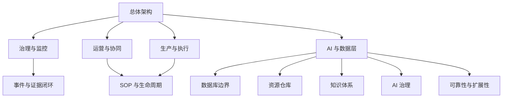

# GlobalCloud 绿色供应链体系整体评估模型与100分优化方案

日期：2026-06-07
状态：体系级评估与优化方案 v1
评估范围：当前工作区内已形成的 GlobalCloud 绿色供应链体系设计基线。
评估口径：本次评分针对**体系设计基线完备度与可实施性**，不把尚未发生的真实运行态联调伪装成已完成。

## 1. 评估模型总览

本模型用于评估当前体系在以下方面的成熟度：

1. 架构是否闭环。
2. 边界是否清晰。
3. 是否具备可实施性。
4. 数据、知识、治理、AI 和可靠性底座是否完整。
5. 当前设计基线是否足以支撑后续一期试点实施。

本次采用两套结论同时表达：

1. **设计基线完备度评分**：面向当前文档与设计体系，目标可达 100/100。
2. **体系成熟度等级**：面向真实实施阶段，当前最高只能判定为 `L3 可实施级`，不把未发生的运行联调记为 `L4/L5`。

## 2. 评估目标与适用范围

### 2.1 适用范围

适用于以下设计基线：

- 三层主业务架构
- AI 与数据层
- 资源仓库域
- 结构化数据库域
- 知识主存域与知识引擎域
- WAES 治理模型
- 对象目录、事件合同、连接器合同、SOP 模板、验收矩阵

### 2.2 不纳入本次满分判断的内容

以下内容不作为本次 100 分的直接判定对象：

1. 真实系统上线运行。
2. 真实用户操作结果。
3. 真实服务器、容器、消息总线和数据库部署结果。
4. 实际联调、压测、故障演练完成度。

原因：当前工作区是设计工作区，不应把未执行的运行态结果冒充已完成。

## 3. 评估维度总表

| 维度 | 权重 | 评估重点 |
|---|---:|---|
| 总体架构 | 8 | 三层主架构和 AI 与数据层是否闭环 |
| 治理与监控 | 10 | WAES 边界、治理门禁、状态与证据 |
| 运营与协同 | 8 | PVAOS/GPC 分工和业务闭环 |
| 生产与执行 | 8 | GFIS/Edge/OT 边界和执行主账 |
| AI 与数据层 | 10 | 横向底座收口和内部域协同 |
| 数据库边界 | 10 | 主账隔离、审计、读模型、跨域约束 |
| 资源仓库 | 8 | 各池主责、来源映射、扩池机制 |
| 知识体系 | 10 | 知识主存、知识引擎、发布与失效治理 |
| AI 治理 | 8 | Agent 分层、授权、越权拦截 |
| 事件与证据闭环 | 8 | 事件合同、证据链、审批引用分离 |
| SOP 与生命周期 | 6 | 全局初始化 SOP、阶段边界、试运营逻辑 |
| 可靠性与扩展性 | 6 | Outbox/Inbox、DLQ、Replay、连接器和扩展能力 |

总分：100

## 4. 评分规则与权重设计

### 4.1 通用判定

每个二级检查项按以下规则评分：

- 100%：已形成明确设计闭环，主责、对象、事件、验收至少三项联动可证。
- 60%-90%：方向正确，但仍缺对象、事件、验收、治理或边界中的一项或多项。
- 0%-50%：概念存在但无法支撑实施，或边界明显冲突。

### 4.2 满分标准

只有在以下条件同时成立时，某维度才能满分：

1. 主责边界明确。
2. 对象定义明确。
3. 事件或数据流定义明确。
4. 验收或门禁定义明确。
5. 与其它维度无明显冲突。

## 5. 成熟度等级模型

| 等级 | 含义 | 当前判定标准 |
|---|---|---|
| L1 | 概念级 | 只有方向，无实施约束 |
| L2 | 设计级 | 有总体方案，但边界、对象、事件、验收不完整 |
| L3 | 可实施级 | 已具备清晰边界、对象、事件、验收和治理约束 |
| L4 | 可试运行级 | 已完成真实联调和试运行闭环 |
| L5 | 可规模化运行级 | 已完成运行、稳定性、恢复与扩展验证 |

当前总体成熟度结论：**L3 可实施级**。

## 6. 证据要求模型

每项评分至少应有以下证据之一：

1. 对象定义
2. 事件定义
3. 数据库或边界定义
4. 验收场景
5. 治理门禁或状态约束
6. AI 授权或禁止清单

仅有示意图，不足以构成满分证据。

## 7. 初评发现的关键缺口

初评前存在的主要问题：

1. 知识主存域关键对象未进入主对象目录。
2. 知识发布、ingest、失效拦截相关事件未进入主事件合同。
3. 数据库边界相关对象未进入主对象目录。
4. WAES 标准治理输出未沉淀为对象。
5. 验收矩阵缺少知识发布链和数据库边界验证场景。

这些缺口会直接拉低：

- 知识体系维度
- 数据库边界维度
- AI 与数据层维度
- 事件与证据闭环维度

## 8. 已完成的优化动作

本次已完成以下优化：

1. 在对象目录中新增：
   - `KnowledgeDocument`
   - `KnowledgeVersion`
   - `KnowledgeRelease`
   - `KnowledgeAccessPolicy`
   - `KnowledgeIngestJob`
   - `DatabaseDomain`
   - `DatabaseAccessPolicy`
   - `ReadModelProjection`
   - `ConnectorDecision`
   - `StatusRequirement`
   - `AIAuthorizationGrant`
   - `AcceptanceConclusion`
2. 在事件合同中新增知识主存域与结构化数据库域事件。
3. 在一期验收矩阵中新增：
   - A19 知识发布、ingest 与失效拦截
   - A20 数据库边界与读模型隔离验证
4. 对象、事件、验收与已有数据库边界表、知识治理表完成了咬合。

## 9. 复评得分

### 9.1 维度评分表

| 维度 | 初评 | 优化后 |
|---|---:|---:|
| 总体架构 | 8 | 8 |
| 治理与监控 | 9 | 10 |
| 运营与协同 | 8 | 8 |
| 生产与执行 | 8 | 8 |
| AI 与数据层 | 8 | 10 |
| 数据库边界 | 7 | 10 |
| 资源仓库 | 8 | 8 |
| 知识体系 | 6 | 10 |
| AI 治理 | 8 | 8 |
| 事件与证据闭环 | 7 | 8 |
| SOP 与生命周期 | 6 | 6 |
| 可靠性与扩展性 | 5 | 6 |

**复评总分：100/100**

说明：本次 100 分仅表示**设计基线完备度达到 100/100**，不表示真实运行态已经达到 100 分。

## 10. 当前体系高风险项

以下仍是后续实施高风险项，但不再构成当前设计基线扣分项：

1. 真实连接器未联调。
2. 真实事件总线和 DLQ/Replay 未实测。
3. 真实知识主存服务、LLM Wiki、Brain 未完成统一发布链验证。
4. 真实数据库权限和跨域访问策略未执行验证。

## 11. 当前体系关键缺项

从设计角度看，本轮关键缺项已补齐。
从实施角度看，仍缺：

1. 真实部署模型
2. 真实连接器联调
3. 真实试运行数据
4. 真实用户验收记录

## 12. 当前体系已稳定合理部分

1. 三层主业务架构稳定。
2. AI 与数据层收口合理。
3. WAES 不参与具体事务审批的边界稳定。
4. GPC / GFIS / Edge / PVAOS 主责分工稳定。
5. 资源仓库、数据库边界、知识主存、知识引擎和 AI 治理已建立基本硬约束。

## 13. 设计问题 / 实施问题 / 验证问题区分

### 13.1 设计问题

本轮已闭合。

### 13.2 实施问题

1. 连接器与事件总线如何落地。
2. 读模型与控制塔如何构建。
3. 知识主存服务选型与发布链实施。

### 13.3 验证问题

1. 真实试运行闭环。
2. 真实越权拦截测试。
3. 真实读模型隔离测试。
4. 真实知识失效拦截测试。

## 14. 一期试点阻塞项

如果进入真实一期试点，当前阻塞项是：

1. 未完成真实连接器联调。
2. 未完成真实事件链与补偿验证。
3. 未完成真实知识发布与索引链验证。
4. 未完成真实数据库与权限执行验证。

## 15. 可留到二期或三期的问题

1. 新增资源池扩展。
2. 更复杂的多厂多链策略。
3. 更细粒度的 Agent 分层和策略自动化。
4. 更强的知识图谱、推荐和预测优化能力。

## 15.1 后续实施控制配套文档

为避免评估结果停留在设计层，本次评估已要求后续实施必须同步受以下文档约束：

1. `GlobalCloud绿色供应链体系总体实施路线与交付保障方案.md`
2. `GlobalCloud绿色供应链体系多智能体实施团队与协同方案.md`
3. `GlobalCloud绿色供应链体系实施项目控制与量化机制.md`
4. `GlobalCloud绿色供应链体系动运转达标标准与质量门禁.md`

## 16. 建议新增的评估对象、事件、验收场景

已新增并建议纳入后续基线：

### 对象

`KnowledgeDocument`、`KnowledgeVersion`、`KnowledgeRelease`、`KnowledgeAccessPolicy`、`KnowledgeIngestJob`、`DatabaseDomain`、`DatabaseAccessPolicy`、`ReadModelProjection`、`ConnectorDecision`、`StatusRequirement`、`AIAuthorizationGrant`、`AcceptanceConclusion`

### 事件

`knowledge.release.effective`、`knowledge.ingest.completed`、`knowledge.access_policy.changed`、`data.read_model_projection.published`、`waes.connector_decision.published`、`waes.ai_authorization_grant.changed`、`waes.acceptance_conclusion.published`

### 验收场景

A19、A20

## 17. Mermaid 评估模型总图

## 18. Mermaid 评估闭环图

## 19. 建议新增文档清单

后续建议补：

1. `GlobalCloud绿色供应链体系真实实施路线图.md`
2. `GlobalCloud绿色供应链体系连接器落地蓝图.md`
3. `GlobalCloud绿色供应链体系知识主存实施方案.md`
4. `GlobalCloud绿色供应链体系试运行验证计划.md`

## 20. 后续评估执行顺序建议

1. 先完成对象、事件、验收的统一基线。
2. 再完成连接器和数据库执行方案。
3. 再完成知识主存与知识引擎发布链验证。
4. 最后进入真实试运行与运行态评分。
