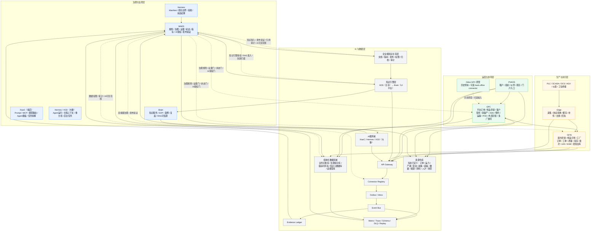

# GlobalCloud 绿色供应链体系最新架构图

日期：2026-06-07
状态：最新统一架构图 v1
口径：以 `GPC` 为绿色供应链平台主线，以 `WAES` 为治理与监控平面，以 `GFIS + Edge` 为生产与执行平面，横向统一为 `AI 与数据层`；其内部包含资源仓库、结构化数据库、企业级知识主存、知识引擎、AI 服务和技术运行底座。

## 1. 最新总架构图

## 2. 读图重点

1. `GPC` 是绿色供应链平台主线，不再把 Odoo 原型当成主线。
2. `WAES` 是治理与监控平面，不承办工单、质量、库存、发货、签收等具体事务审批。
3. `GFIS` 是工厂事实主账，`Edge` 是现场接入层，不是业务主账。
4. 横向底座已经统一收口为 `AI 与数据层`，其中包含资源仓库、结构化数据库、企业级知识主存、知识引擎、AI 服务和技术运行底座。
5. KDS 为企业级知识主存（canonical source），Brain 为知识 UI 平台；LLM Wiki 为知识编制工具，不直接等于企业级知识真源。
6. 结构化数据库已显式纳入主架构，用于承载业务主账、治理审计、指标时序、知识元数据和查询读模型。
7. 宪法内容不单独形成业务平台，而是通过规则门、证据门、状态门、授权门、知识准入门和连接器治理进入总架构。
8. AI 服务流只能生成建议、摘要、预警和复盘草案，不能直接写业务事实，也不能直接改写正式知识版本。

## 3. 一句话口径

最新统一架构不是“一个大平台统管全部”，而是：

`GPC 负责平台协同，GFIS 负责工厂执行，WAES 负责治理约束，PVAOS 负责生态入口，Edge 负责现场接入。`
