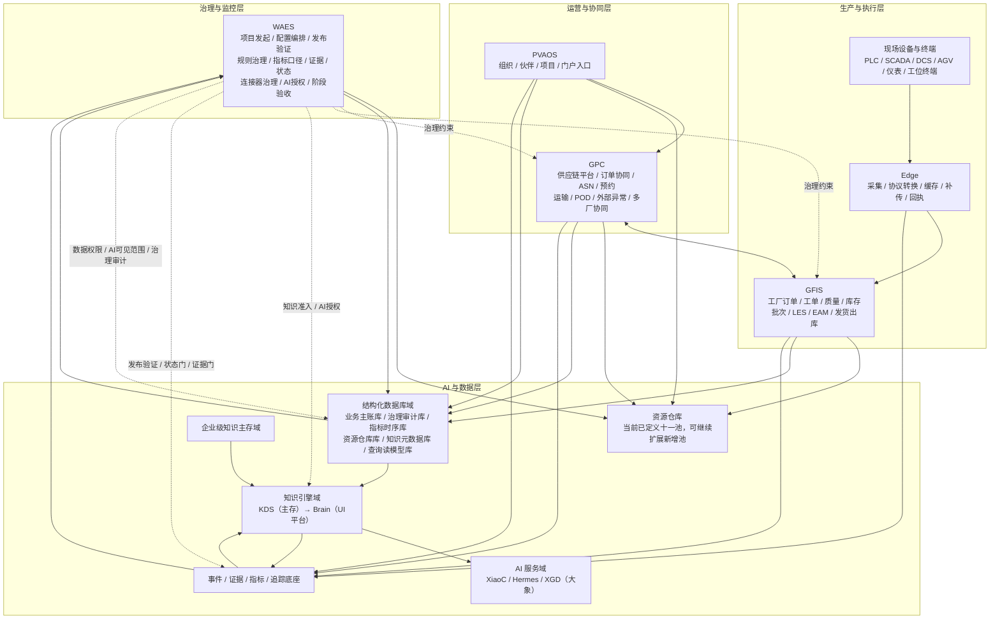

# GlobalCloud 绿色供应链体系真实层次架构图

日期：2026-06-07
状态：体系级主架构图 v1
口径：只表达真实主责分层、横向底座和治理边界，不展开实现细节。横向底座统一收口为 `AI 与数据层`，内部包含资源仓库、结构化数据库、知识主存、知识引擎、AI 服务和事件证据底座。

## 1. 真实层次架构图

## 2. 一句话解释

这张图表达的是：

1. `WAES` 在最上层，负责治理与监控，不负责具体事务审批。
2. `PVAOS + GPC` 组成运营与协同层，其中 `GPC` 是平台主线。
3. `GFIS + Edge + OT` 组成生产与执行层，其中 `GFIS` 是工厂事实主线。
4. `AI 与数据层` 统一承载资源仓库、结构化数据库、企业级知识主存、知识引擎、AI 服务和事件证据底座。
5. 结构化数据库必须显式纳入架构，分别承载业务主账、治理审计、指标时序、知识元数据和查询读模型。
6. `XiaoC + Hermes/XGD（大象）` 作为 AI 服务域，只消费知识和数据，不直接写业务主账。

## 3. 这张图刻意不表达的内容

为了保持真实和清晰，这张图不展开：

1. 具体对象目录。
2. 具体事件合同。
3. 连接器明细。
4. WAES 内部子模块。
5. 知识对象明细。
6. AI 授权等级细则。

这些内容应留在专项图和专项文档中。

## 4. 主责边界

| 层 | 主责 | 不做什么 |
|---|---|---|
| 治理与监控层 | 治理、证据、状态、发布验证、AI 授权 | 不做工单、质量、库存、发货、签收审批 |
| 运营与协同层 | 链侧协同、平台订单、运输与外部异常 | 不做工厂主账 |
| 生产与执行层 | 工厂执行、质量、库存、批次、设备执行事实 | 不做区域协同治理 |
| AI 与数据层 | 资源仓库、结构化数据库、知识真源、知识引擎、AI 服务、事件证据支撑 | 不替代业务系统，不直接改变业务事实归属 |
