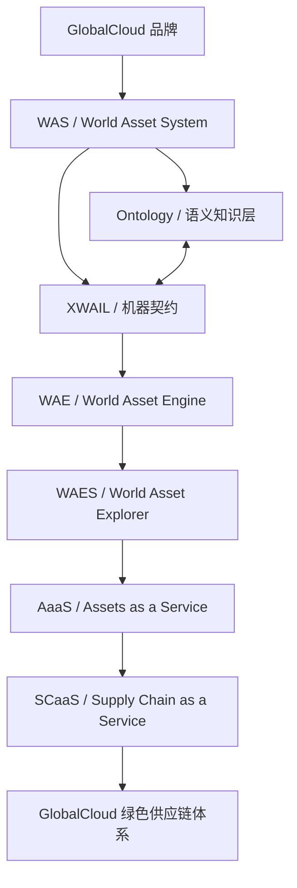

# WAS世界资产体系总体方案

## 1. 文档地位与控制范围

本文是 GlobalCloud 项目群关于 `WAS / World Asset System / 世界资产体系` 的唯一总体控制性文档。

本文控制：

- WAS 体系总定义、总架构和治理原则；
- 项目群总体架构、项目定位、项目间协同关系；
- 所有项目总体方案的命名、版本、继承、兼容和门禁；
- 技术架构现状基线和中长期收敛路线；
- 测试、验收、交付、LOOP 工程体系和证据治理；
- 数据、安全、合规、风险、依赖、配置、密钥、客户交付和持续运营边界。

本文不声明任何业务系统已经生产上线，不声明客户交付完成，不声明 WAES 发布审批完成，不声明 AaaS 已商业订阅，不声明项目群已达到 `accepted`、`integrated` 或 `production_ready`。

本文建立后，以下文档降级为支撑文档或专项门禁文档，不再作为项目群最高控制性文档：

| 文档 | 后续地位 |
|---|---|
| `GlobalCloud 世界资产体系正式命名与产品系统架构总纲` | 命名、产品系统架构和项目映射支撑文档 |
| `WAS-XWAIL-AaaS 三主项目方案协同矩阵与门禁` | 三主项目方案协同专项门禁文档 |
| `WAS-Ontology-XWAIL 语义契约与映射机制` | 语义契约和映射机制支撑文档 |
| `XWAIL 可扩展世界资产信息建模语言规范 V1.2 草案` | XWAIL 契约层规范草案 |
| `XWAIL V1.2 Validator 规则清单` | XWAIL 验证器规则支撑文档 |

## 2. 统一命名与版本基线

### 2.1 总体方案命名

| 层级 | 唯一名称 | 说明 |
|---|---|---|
| 项目群总控方案 | `WAS世界资产体系总体方案` | 本文，项目群唯一总体控制性文档 |
| 项目总体方案 | `GlobalCloud {项目名} 总体方案` | 每个项目只能有一个当前有效总体方案 |
| 实施方案 | `GlobalCloud {项目名} 实施方案` | 服从项目总体方案，不得替代总体方案 |
| 测试方案 | `GlobalCloud {项目名} 测试方案` | 服从项目总体方案和项目群测试体系 |
| 交付方案 | `GlobalCloud {项目名} 交付方案` | 服从项目总体方案和项目群交付门禁 |

所有项目方案必须使用上述命名。历史 `规划方案`、`实施路线`、`对齐版`、`重构版` 等文档可保留，但不得作为当前唯一总体方案。

### 2.2 项目群版本基线

```yaml
baseline_id: GC-WAS-PG-BASELINE-0.1.0
baseline_name: GlobalCloud WAS Project Group Baseline
baseline_date: 2026-06-24
status: controlled
was_baseline: WAS 1.2.0
ontology_baseline: Ontology 0.2.x
xwail_baseline: XWAIL 1.2.0
wae_baseline: WAE 0.1.x
waes_baseline: WAES 0.1.x
aaas_baseline: AaaS 0.1.x
scaas_baseline: SCaaS 0.1.x
compatibility_decision: compatible
```

没有声明 `project_group_baseline` 的项目总体方案，不得被视为当前正式总体方案。

### 2.3 版本兼容判定

| 判定 | 含义 | 处理 |
|---|---|---|
| `compatible` | 可与当前项目群基线共同演进 | 可进入下一门禁 |
| `migration_required` | 可接受但需要迁移任务 | 登记迁移计划，不得直接发布 |
| `deprecated` | 保留历史引用，不再作为新增基础 | 新方案不得继续引用为主基线 |
| `blocked` | 与总方案冲突 | 阻断合入、发布和交付 |

## 3. GlobalCloud WAS 总定义

GlobalCloud WAS 世界资产体系，是 GlobalCloud 品牌下以世界资产为核心对象、以 Ontology 为语义知识层、以 XWAIL 为机器契约、以 WAE 为世界资产引擎、以 WAES 为治理发布入口、以 AaaS/SCaaS 为服务化运营模式的产品体系和项目群控制体系。

固定链路为：

```text
WAS 定义体系。
Ontology 定义语义。
XWAIL 定义契约。
WAE 负责资产主账和运行底座。
WAES 负责注册、授权、发布、治理和业务入口。
AaaS / SCaaS 负责服务包、计量、SLA、订阅和商业运营。
LOOP / Harness 负责工程闭环、证据和状态门禁。
```

## 4. WAS 体系总架构



WAS 的统一对象模型为：

```text
资产 = 身份 + 元数据 + 八维画像 + 静态关系 + 八流行为 + 生命周期 + 策略权限 + 快照证据 + 服务接口
```

## 5. 项目群分层架构

| 层级 | 项目/能力 | 主要职责 |
|---|---|---|
| 品牌与体系层 | GlobalCloud、WAS世界资产体系 | 总体语义、产品体系、项目群控制 |
| 语义与契约层 | Ontology、GlobalCloud XWAIL | 术语、关系、Schema、Profile、Validator |
| 资产运行与治理层 | WAE、GlobalCloud WAES | 资产主账、模型注册、授权、发布、证据、审计 |
| 服务化与商业运营层 | GlobalCloud AaaS、SCaaS | ServicePackage、Metering、SLA、订阅、商业状态 |
| 行业场景与业务运行层 | GFIS、GPC、PVAOS、Studio、Brain | 工厂事实、供应链协同、联盟运营、建模配置、知识治理 |
| 知识与工程治理层 | KDS、GPCF、MMC、Harness、LOOP | 文档知识、门禁、证据、项目群治理、状态裁决 |
| 交互与专项能力层 | XGD、XiaoC、XiaoG、PKC、SOP | 逐步归并到 Studio 或 WAES 的专项能力 |

## 6. 项目总体架构矩阵

| 项目 | 所属层级 | 体系定位 | 上游依赖 | 下游输出 | 不得替代 |
|---|---|---|---|---|---|
| WAS世界资产体系 | 品牌与体系层 | WAS 主项目，总语义和总控制 | GlobalCloud 品牌战略 | WAS 基线、术语、治理原则 | 不替代业务事实源 |
| GlobalCloud XWAIL | 语义与契约层 | XWAIL 主项目，机器契约 | WAS、Ontology | Schema、Profile、Validator、XAP | 不重定义 WAS |
| GlobalCloud WAES | 资产运行与治理层 | 注册、授权、发布、治理、业务入口 | WAE、XWAIL | 治理状态、证据、服务发布 | 不替代事实源 |
| GlobalCloud AaaS | 服务化与商业运营层 | AaaS 主项目，服务包和商业运营 | XWAIL、WAES | 服务目录、计量、SLA、订阅状态 | 不私建资产模型 |
| GFIS | 行业事实源 | 工厂执行事实 | WAS、XWAIL、WAES | 生产、能耗、排放、质量证据 | 不替代 WAES |
| GPC | 供应链协同入口 | 订单、企业、供需、物流协同 | WAS、XWAIL、WAES | 订单、物流、协同事实 | 不替代 WAE |
| PVAOS | 运营平台 | 联盟、租户、结算和价值运营 | WAS、XWAIL、WAES | 运营、结算、订阅事实 | 不替代 AaaS |
| KDS | 知识源 | 文档与知识主存 | 项目文档与证据 | 受控知识、引用、镜像 | 不替代事实源 |
| Brain | 智能层 | 知识治理、问答、候选推理 | KDS、Ontology、XWAIL | 建议、解释、候选推理 | 不直接写主账 |
| Studio | 建模配置 | 低代码、模板、场景搭建 | XWAIL、WAES | 模板、配置、场景模型 | 不绕过 WAES |
| GPCF | 工程治理 | LOOP、Harness、文档和门禁 | 全项目 | 状态、证据、门禁、台账 | 不替代项目实现 |
| MMC | 管理控制 | 项目群管理配置与控制面能力 | GPCF、WAES | 控制面配置和治理辅助 | 不进入客户侧产品图 |

## 7. 项目间协同架构

### 7.1 五大跨项目链路

| 链路 | 标准路径 | 控制要求 |
|---|---|---|
| 模型链路 | WAS -> Ontology -> XWAIL -> WAES -> 各业务项目 | 必须有模型版本、Profile、Validator 和 WAES 状态 |
| 事实链路 | GFIS/GPC/PVAOS -> WAE -> WAES -> Evidence | 必须声明事实源、证据源、审计和回滚 |
| 服务链路 | XWAIL Model -> WAES ServicePackage -> AaaS Service Catalog | AaaS 不得绑定未授权模型 |
| 知识链路 | 项目文档/证据 -> KDS -> Brain -> WAES Candidate | Brain 输出默认是候选，不是事实 |
| 治理链路 | 项目变更 -> GPCF LOOP -> Harness Evidence -> Gate -> 状态裁决 | 无证据不得升级状态 |

### 7.2 跨项目业务能力

`碳账本、认证、结算、物流、价值计量、知识治理、证据审计` 是跨项目能力。原则为：

```text
事实源分布，账本统一，治理集中，服务组装。
```

## 8. 全项目主方案传导机制

主方案变化必须可传导到项目群内所有相关项目总体方案；任何项目总体方案变化也必须可回流到主方案，再传导到受影响的关联项目。

### 8.1 传导方向

| 方向 | 触发 | 处理 |
|---|---|---|
| 主方案 -> 项目方案 | 主方案命名、架构、版本、术语、门禁、技术、测试、交付、LOOP 或安全边界变化 | 生成影响矩阵，标记受影响项目，更新项目总体方案或登记迁移任务 |
| 项目方案 -> 主方案 | 项目新增职责、架构位置、接口、技术栈、版本、交付物、事实源或服务边界变化 | 先提交 Change Proposal，评估是否需要修改主方案，再传导到其它相关项目 |
| 项目方案 -> 项目方案 | 一个项目变化影响其它项目接口、事实、模型、证据、服务、测试或交付 | 由主方案或 GPCF 影响矩阵统一中转，不允许点对点私下改变总口径 |

### 8.2 传导流程

```text
Change Proposal
  -> Impact Review
  -> Affected Project Matrix
  -> Master Plan Update Decision
  -> Project Plan Patch List
  -> User Confirmation
  -> Document Control / KDS Mirror
  -> Gate Validation
  -> Decision Log / Evidence
```

### 8.3 传导确认要求

任何主方案或项目总体方案的结构性变化，必须回答以下问题：

| 问题 | 必填 |
|---|---|
| 这次变化来自主方案还是项目方案 | 是 |
| 是否影响命名、版本、架构、职责、接口、技术、测试、交付、LOOP、安全或商业边界 | 是 |
| 影响哪些项目 | 是 |
| 哪些项目方案必须同步更新 | 是 |
| 是否需要用户确认 | 是 |
| 用户是否已确认 | 是 |
| 是否已进入文档台账和 KDS 镜像 | 是 |
| 是否通过自动门禁 | 是 |

没有用户确认的结构性主方案变更，只能进入 `draft` 或 `candidate`，不得作为正式控制口径发布。用户确认可以是当前会话中的明确授权，也可以是已登记的 Decision Log。

### 8.4 全项目传导矩阵

| 项目 | 必须继承主方案 | 主方案变化传导 | 项目变化回流 | 备注 |
|---|---|---|---|---|
| WAS世界资产体系 | 是 | 必须 | 必须 | WAS 主项目 |
| GlobalCloud XWAIL | 是 | 必须 | 必须 | XWAIL 主项目 |
| GlobalCloud AaaS / GlobalCloud AAAS | 是 | 必须 | 必须 | AaaS 主项目，本地目录为 AAAS |
| GlobalCloud WAES | 是 | 必须 | 必须 | 发布治理入口 |
| GlobalCloud GFIS | 是 | 必须 | 必须 | 工厂事实源 |
| GlobalCloud GPC | 是 | 必须 | 必须 | 供应链协同入口 |
| GlobalCloud PVAOS | 是 | 必须 | 必须 | 运营和联盟平台 |
| GlobalCloud KDS | 是 | 必须 | 必须 | 知识源 |
| GlobalCloud Brain | 是 | 必须 | 必须 | 候选推理和知识工作台 |
| GlobalCloud Studio | 是 | 必须 | 必须 | 建模配置和低代码 |
| GlobalCloud MMC | 是 | 必须 | 必须 | 管理控制能力 |
| GlobalCoud GPCF | 是 | 必须 | 必须 | LOOP、Harness、文档门禁 |
| GlobalCloud PKC | 是 | 必须 | 必须 | 逐步并入 Studio 的历史能力 |
| GlobalCloud SOP | 是 | 必须 | 必须 | 逐步并入 WAES 的流程和证据闭环 |
| GlobalCloud XGD | 是 | 必须 | 必须 | 逐步并入 Studio 的专项能力 |
| GlobalCloud XiaoC | 是 | 必须 | 必须 | 逐步并入 Studio 的交互能力 |
| GlobalCloud XiaoG | 是 | 必须 | 必须 | 逐步并入 Studio 的交互能力 |

### 8.5 传导证明

每次传导完成必须留下：

- Change Proposal 或本会话用户确认记录；
- 受影响项目矩阵；
- 已更新项目方案清单；
- 未更新项目及原因；
- 自动门禁结果；
- 文档控制台账和 KDS 镜像记录；
- 若未完成，必须登记 `repair_required` 或 `migration_required`。

没有传导证明，不得声明“项目群方案已同步”。

## 9. 项目总体方案继承规则

每个项目只能有一个当前有效总体方案。项目总体方案必须声明：

```yaml
inherits_from: WAS世界资产体系总体方案
project_group_baseline: GC-WAS-PG-BASELINE-0.1.0
was_baseline: WAS 1.2.0
ontology_baseline: Ontology 0.2.x
xwail_baseline: XWAIL 1.2.0
waes_gate_required: true
loop_enabled: true
compatibility_status: compatible | migration_required | deprecated | blocked
```

项目总体方案不得覆盖以下内容：

| 继承项 | 是否允许覆盖 |
|---|---|
| WAS 总定义 | 否 |
| 三层资产 | 否 |
| 八维 | 否 |
| 八流 | 否 |
| 生命周期 | 否 |
| WAES 发布门禁 | 否 |
| 版本兼容矩阵 | 只能补充，不得删除 |
| 技术架构现状 | 可登记现状，但必须进入总基线 |

## 10. 统一术语与名词表

本文内置统一术语与名词表。项目总体方案、实施方案、测试方案、交付方案、AGENTS、README、接口契约和证据文档必须继承本术语表。

| 术语 | 英文 | 统一定义 | 禁止误用 |
|---|---|---|---|
| GlobalCloud | GlobalCloud | 品牌 | 不写成单一系统或单一项目 |
| WAS | World Asset System | 世界资产体系，GlobalCloud 品牌下的产品体系总称 | 不写成普通资产管理软件 |
| WAS世界资产体系 | WAS World Asset System | WAS 主项目和总体体系承载项目 | 不替代 GFIS/GPC/PVAOS 事实源 |
| Ontology | Ontology | WAS 的语义知识层，定义术语、概念、关系和推理规则 | 不替代 XWAIL Schema，不替代事实源 |
| XWAIL | eXtensible World Asset Information Language | WAS 的主规范建模语言和机器契约 | 不重定义 WAS 语义 |
| GlobalCloud XWAIL | GlobalCloud XWAIL | XWAIL 主项目 | 不承担 AaaS 商业治理 |
| WAE | World Asset Engine | 世界资产引擎，资产主账、模型注册、事件、关系、策略、证据、计量和运行底座 | 不写成浏览器或前端入口 |
| WAES | World Asset Explorer | 世界资产浏览器，基于 WAE 的业务实现、治理发布入口和运营工作台 | 不写成 WAE 同义词，不写成事实源 |
| AaaS | Assets as a Service | 资产即服务，服务包、订阅、计量、SLA 和商业运营模式 | 不私建资产模型 |
| GlobalCloud AaaS | GlobalCloud Assets as a Service | AaaS 主项目正式产品名 | 本地目录 `GlobalCloud AAAS` 不改变正式名 |
| SCaaS | Supply Chain as a Service | AaaS 在供应链行业的行业化架构 | 不写成脱离 WAS 的独立顶层体系 |
| GlobalCloud 绿色供应链体系 | GlobalCloud Green Supply Chain System | SCaaS 的对外场景名称和当前切入口 | 不替代 WAS 总体方案 |
| GFIS | GlobalCloud Factory Information System | 工厂执行与绿色事实源 | 不替代 WAES 发布治理 |
| GPC | GlobalCloud Public Collaboration / Green Supply Chain Public Service context | 供应链公共协同入口 | 不替代 WAE 主账 |
| PVAOS | Platform Value Alliance Operating System | 供应链价值联盟运营平台 | 不替代 AaaS 通用订阅治理 |
| KDS | Knowledge/Data Source context | 文档与知识主存 | 不替代业务事实源 |
| Brain | GlobalCloud Brain | 企业知识治理、高级工作台、问答和候选推理 | 不直接写主账 |
| Studio | GlobalCloud Studio | 建模配置、低代码、场景搭建和部分归并能力承载 | 不绕过 XWAIL/WAES |
| GPCF | GlobalCoud GPCF | 项目群治理编排、文档、LOOP、Harness 控制仓 | 不替代项目实现 |
| MMC | Management/Module Control context | 项目群管理控制能力 | 不进入客户侧产品图 |
| ServicePackage | Service Package | WAES 治理、AaaS 商业化绑定的服务包 | 不绑定未授权模型 |
| EvidenceRecord | Evidence Record | 证据记录，绑定来源、时间、版本、主体、策略和回滚路径 | 不用聊天或摘要替代事实证据 |
| Candidate | Candidate | 候选状态或候选推理 | 不等于事实、发布或验收 |
| Published | Published | WAES 或模型治理发布状态 | 不等于客户交付或运营上线 |
| Operational | Operational | 持续运营状态，有监控、SLA、支持和回滚 | 不等于测试通过 |

术语变更必须先修改本术语表，经用户确认后，再传导到相关项目总体方案。项目方案不得自行新增同义词替代本表术语。

## 11. 统一状态模型

| 状态域 | 状态集合 | 说明 |
|---|---|---|
| 文档状态 | `draft / controlled / superseded / deprecated / archive` | 文档治理状态 |
| 模型治理状态 | `Draft / Registered / Authorized / Published / Deprecated / Archived` | XWAIL/WAES 模型状态 |
| 推理可信状态 | `Candidate / Verified / Trusted / Rejected` | Brain/Ontology 推理状态 |
| 项目交付状态 | `Draft / Implemented / Tested / Integrated / Release Candidate / Delivered / Operational / Deprecated / Archived` | 项目交付状态 |
| LOOP 状态 | `candidate / planned / in_progress / verified / repair_required / authorization_boundary / blocked / ready_for_review / accepted / integrated / archived` | 工程闭环状态 |
| 商业状态 | `draft / pilot / subscribable / suspended / retired / blocked` | AaaS 服务商业状态 |

不同状态域不得混写。`Tested` 不等于 `Delivered`，`Published` 不等于 `Operational`，`verified` 不等于 `accepted`。

## 12. 事实源、证据源与知识源矩阵

| 来源 | 类型 | 可作为事实 | 说明 |
|---|---|---|---|
| GFIS | 工厂执行事实源 | 是，需证据 | 生产、设备、能耗、排放、质量 |
| GPC | 供应链协同事实源 | 是，需证据 | 订单、企业、供需、物流、协同确认 |
| PVAOS | 运营事实源 | 是，需证据 | 联盟、租户、结算、订阅、运营状态 |
| WAE | 资产主账视图 | 是，基于已治理事实 | 不替代原始事实源 |
| WAES | 治理状态源 | 是，限治理状态 | 注册、授权、发布、审计、证据 |
| KDS | 知识源 | 否，除非引用事实源 | 文档、来源、知识主存 |
| Brain | 候选推理源 | 否，默认候选 | 需要 WAES 授权和证据才可升级 |
| GPCF/Harness | 工程证据源 | 是，限工程状态 | 测试、门禁、证据、状态裁决 |

## 13. 版本控制基线与兼容矩阵

项目群版本控制采用 SemVer，但受项目群基线约束：

| 版本类型 | 触发条件 |
|---|---|
| MAJOR | 破坏 WAS 语义、XWAIL 契约、WAES 发布逻辑或 AaaS 计量规则 |
| MINOR | 新增兼容能力、Profile、服务包、场景能力 |
| PATCH | 修复错误、补充文档、非破坏性验证增强 |

权威兼容矩阵：

| Baseline | WAS | Ontology | XWAIL | WAE | WAES | AaaS | SCaaS | GFIS/GPC/PVAOS | 状态 |
|---|---|---|---|---|---|---|---|---|---|
| GC-WAS-PG-BASELINE-0.1.0 | 1.2.0 | 0.2.x | 1.2.0 | 0.1.x | 0.1.x | 0.1.x | 0.1.x | 0.1.x | controlled |

任何项目版本升级必须更新兼容矩阵或登记 `migration_required`。

## 14. 技术架构现状基线与收敛路线

短期原则：

```text
现状可以多样，但必须登记。
实现可以不同，但接口必须统一。
短期不强推重构，但新增能力必须进入基线。
长期必须向统一架构收敛。
```

技术栈状态：

| 状态 | 含义 |
|---|---|
| `retained` | 当前保留 |
| `contained` | 保留但限制扩展 |
| `migrating` | 已进入迁移 |
| `target` | 目标技术栈 |
| `deprecated` | 不再新增使用 |
| `blocked` | 禁止继续使用 |

技术架构分层：

| 层 | 短期策略 | 中长期目标 |
|---|---|---|
| 用户界面层 | 保留现有前端和移动端差异 | 统一设计系统、权限、证据 UI |
| API 与服务层 | 保留不同后端框架 | 统一 API、事件、认证、响应格式 |
| 业务运行层 | 保留项目现有运行方式 | 统一运行状态、任务、工单和回滚 |
| 资产模型与契约层 | XWAIL 优先 | 统一 Schema、Profile、Validator |
| 数据与事件层 | 保留现有数据库和文件态 | 统一事实源、事件流、证据仓 |
| AI 与知识层 | 保留 Brain/KDS/专项能力 | 统一模型路由、候选推理边界 |
| 治理、安全与证据层 | WAES/GPCF 控制 | 统一授权、审计、证据生命周期 |
| 部署、运维与观测层 | 保留本地/Docker/云差异 | 统一环境、CI/CD、日志、监控、回滚 |

技术收敛路线：

```text
T0 现状登记 -> T1 接口统一 -> T2 运行治理统一 -> T3 平台化收敛
```

## 15. 测试、验收与交付控制体系

测试分层：

| 层级 | 测试对象 |
|---|---|
| L0 | 文档、方案、AGENTS、版本矩阵 |
| L1 | XWAIL Schema、Profile、API、事件、ServicePackage |
| L2 | 单项目功能 |
| L3 | 跨项目集成 |
| L4 | 绿色供应链、仓储发运、碳账本、结算等场景 |
| L5 | Evidence、日志、快照、审批、回滚 |
| L6 | 性能、稳定性、AI 调用、批处理 |
| L7 | 部署、客户配置、培训、SLA、运维手册 |

统一 Definition of Done：

- 方案一致性通过；
- 版本兼容矩阵通过；
- AGENTS 控制通过；
- 契约测试通过；
- 项目功能测试通过；
- 跨项目影响评估通过；
- 证据链完整；
- 回滚路径存在；
- 运行命令明确；
- 测试命令明确；
- 交付边界明确。

没有测试矩阵，不算测试完成。没有集成链路，不算项目群完成。没有交付包，不算可交付。没有运营和回滚，不算可上线。

## 16. LOOP 工程体系

WAS 和项目群整体纳入 LOOP 工程体系。LOOP 采用：

```text
run -> stop -> verify -> recover -> debug
```

| LOOP 方向 | WAS 项目群含义 |
|---|---|
| run | 执行本轮方案、代码、文档、测试或门禁任务 |
| stop | 判断阻断、人工确认、版本冲突、权限边界 |
| verify | 运行文档、版本、契约、技术、测试、交付、证据门禁 |
| recover | 给出修复、回滚、降级或迁移路径 |
| debug | 记录根因、漂移点、下一轮输入和改进约束 |

每个项目总体方案必须声明：

```yaml
loop_enabled: true
loop_owner: GPCF
required_gates:
  - document_gate
  - version_gate
  - architecture_gate
  - technical_gate
  - contract_gate
  - test_gate
  - delivery_gate
  - evidence_gate
```

没有纳入 LOOP，不算进入项目群工程体系。没有 Evidence，不算可升级状态。

## 17. 数据、证据与知识治理

必须纳入治理的数据对象：

- 主数据；
- 事实数据；
- 事件数据；
- 模型数据；
- 证据数据；
- 计量数据；
- 订阅和商业状态；
- 推理候选数据；
- 审计和日志。

证据生命周期：

```text
采集 -> 验证 -> 绑定 -> 使用 -> 复核 -> 归档 -> 失效 / 撤销
```

证据不得脱离来源、时间、版本、主体、策略和回滚路径存在。

## 18. 安全、权限、租户与合规

项目群统一安全基线包括：

- 身份认证；
- 角色权限；
- 租户隔离；
- 数据分类；
- 脱敏和加密；
- 密钥不入库；
- 审计日志；
- 敏感操作人工确认；
- 合同、碳、数据、知识产权和外部监管适配。

任何绕过统一权限、私有写入事实源、私有 AI 推理写主账、未登记密钥或生产配置入库的行为均为 `blocked`。

## 19. 组织、决策、风险与依赖治理

必须建立并维护：

- RACI 权责矩阵；
- Decision Log 决策日志；
- Risk Register 风险台账；
- Dependency Register 依赖台账；
- Change Proposal 变更提案；
- Issue Register 问题台账；
- Vendor / License / Third-party Dependency 记录。

没有决策记录，不能改变总控口径。没有依赖登记，不能声明集成完成。

## 20. 商业服务、计量与客户运营

AaaS/SCaaS 服务必须声明：

- ServicePackage；
- Metering；
- SLA/SLO；
- EvidenceRequirement；
- Commercial status；
- 客户责任边界；
- 服务开通、暂停、关闭和退出流程；
- 账单、争议和价值证明口径。

AaaS 不得把未发布模型包装为可订阅服务，不得以商业叙事替代事实、证据和计量。

## 21. 项目总体方案标准模板

每个项目总体方案必须包含：

1. 项目定位；
2. 与 WAS 总体方案的继承关系；
3. 项目群版本基线；
4. 本项目权威职责；
5. 本项目不承担的职责；
6. 核心交付物；
7. 与其他项目的接口关系；
8. 技术架构现状和目标架构；
9. 测试、交付和运行命令；
10. LOOP 接入；
11. 风险、依赖、回滚和非声明边界。

## 22. 冲突判定与变更流程

冲突裁决优先级：

```text
WAS世界资产体系总体方案
  > XWAIL 规范与契约
  > WAES 发布与治理门禁
  > AaaS 服务化运营规则
  > 项目总体方案
  > 实施方案
  > 临时讨论记录
```

变更流程：

```text
Change Proposal
  -> Impact Review
  -> Affected Project Matrix
  -> WAS 语义审查
  -> XWAIL 契约审查
  -> WAES 发布影响审查
  -> AaaS 商业影响审查
  -> User Confirmation
  -> GPCF/LOOP/Harness 证据门禁
  -> Decision Log
```

任何影响主方案或项目总体方案的变更，如果没有用户确认，只能登记为 `candidate` 或 `draft`。任何项目方案变更影响其它项目时，必须先回流到本主方案或其 Change Proposal，再由本主方案传导到相关项目。

## 23. 禁止事项与非声明边界

禁止：

- 单项目自行定义新的 WAS 语义；
- XWAIL 为工程便利重定义 WAS；
- AaaS 私建资产模型或绑定未授权模型；
- Brain 绕过 WAES 写主账；
- KDS 摘要替代业务事实；
- 文档完成替代实现完成；
- 测试通过替代客户交付；
- 方案通过替代生产可用；
- 技术栈未登记直接扩展；
- 密钥、TOKEN、生产配置入库。
- 项目方案绕过主方案直接改变项目群架构。
- 主方案变化未传导到受影响项目方案却声明已同步。
- 项目方案变化未回流到主方案却声明项目群兼容。
- 项目方案自行新增同义术语替代主方案术语。

## 24. 自动一致性检查与治理脚本

当前主方案建立以下门禁方向：

```text
validate_was_master_plan_control.py
validate_project_group_master_plan_governance.py
validate_was_xwail_aaas_plan_alignment.py
validate_project_master_plan_register.py
validate_project_master_plan_uniqueness.py
validate_project_plan_inheritance.py
validate_project_technical_baseline.py
validate_project_group_delivery_readiness.py
validate_was_loop_integration.py
```

本轮先建立 `validate_was_master_plan_control.py`，用于验证主方案名称、版本、基线、继承、项目群架构、技术架构、测试交付、LOOP、风险依赖和禁止事项等关键控制域是否存在。

项目群主方案落地状态由 `09-status/globalcloud-project-master-plan-control-register.md` 控制。该台账记录每个项目的唯一当前有效总体方案、候选方案、缺口、冲突、继承状态和下一步动作。`validate_project_master_plan_register.py` 用于验证该台账是否覆盖全项目、是否声明用户确认和传导机制、是否把 `shared/python_utils` 明确为共享工具目录而非业务项目。

## 25. 后续项目总体方案更新路线

下一阶段按以下顺序更新项目总体方案：

1. GlobalCloud XWAIL 总体方案；
2. GlobalCloud AaaS 总体方案；
3. GlobalCloud WAES 总体方案；
4. WAS世界资产体系仓内总体方案对齐；
5. GFIS、GPC、PVAOS 总体方案；
6. Studio、Brain、KDS、GPCF、MMC 总体方案；
7. XGD、XiaoC、XiaoG、PKC、SOP 归并或保留方案。

每个项目只保留一个当前有效总体方案，其他方案降级为实施方案、历史方案、附录或归档。
