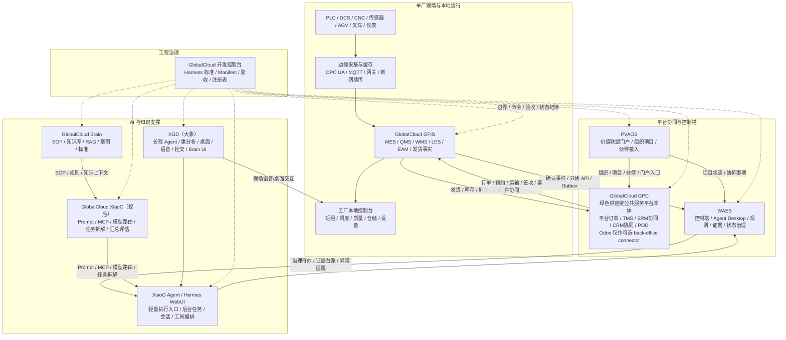

# 基于 GlobalCloud 项目群的 GlobalCloud 绿色供应链体系架构设计方案

日期：2026-06-07
依据：`AI驱动工厂信息化系统完整方案V3.1.md`、当前本机项目现场采样、GlobalCloud Harness Engineering 标准
当前口径：总体系已升级为 **GlobalCloud 绿色供应链体系**；原“智慧工厂”降级为 **生产与执行层/工厂执行子域**。主架构采用三层：治理与监控层、运营与协同层、生产与执行层。
边界声明：WAES 只做规则、监控、治理、证据、状态和 AI 授权，不参与工单、质量、库存、发货、签收等具体事务审批，不写业务主账。
口径：本方案是架构设计与项目群能力映射，不宣称任何项目已完成生产级交付。

当前阅读口径：

1. 绿色供应链平台主线系统看 `GPC`。
2. 治理与监控平面看 `WAES`。
3. 工厂执行和现场事实看 `GFIS + Edge`。
4. 宪法内容通过证据、状态、授权和连接器治理约束进入当前架构。

## 0. 整体评估结论

本方案可以作为项目群“绿色供应链体系 + 工厂执行子域”的架构基线继续使用，但必须按最新统一口径修订后再进入实施规划：

| 维度 | 评估 | 修订结论 |
|---|---|---|
| 总体方向 | 成立 | 三层主架构、主账边界、AI 授权边界方向正确 |
| GPC 定位 | 需修订 | GPC 统一表述为绿色供应链公共服务平台本体，不再写成临时中间层或单厂执行系统 |
| GFIS 边界 | 需收紧 | GFIS 承接工厂执行事实和发货出库，不承接客户签收/POD 主账 |
| WAES 边界 | 成立但需强化 | WAES 只做治理、证据、状态门控、审计和 AI 授权，不审批具体业务事务 |
| AI 分层 | 需统一 | XiaoC 为蚁后，负责能力生产、模型路由、任务拆解和汇总；XGD 为大象，负责长程 Agent、重分析和复杂任务承载；XiaoG 为轻量执行入口 |
| 证据状态 | 不足 | 当前是架构设计和项目能力映射，不是运行完成证明；阶段状态应保持 `partial` |

本次修订把该文档从“项目群智慧工厂设想”收敛为“绿色供应链体系下的工厂执行子域与项目群协同架构”。后续所有实施、验收、状态升级都应以主账边界、连接器合同、事件合同和证据链为准。

## 1. 结论总览

当前 GlobalCloud 项目群已经具备搭建 GlobalCloud 绿色供应链体系的主要组成能力，但这些能力分散在多个项目中，尚未形成统一的运行架构、统一事件模型、统一主数据、统一验收证据链。

推荐采用“三层主架构 + 横向数据事件底座”的总体架构：

1. **生产与执行层：GlobalCloud GFIS + Edge**
   作为单厂本地运行第一执行系统，承载配方研发、样品打样、样品检测、工厂订单、工单、生产、质量、库存、仓储、设备、厂内物流、发货出库和本地运行事实。GFIS 是智慧工厂 V3.1 中 MES/MOM、QMS、WMS 初始能力、EAM 初始能力和工厂本地控制台的核心落点；客户签样、转量产和客户签收/POD 主账归 GPC。

2. **运营与协同层：PVAOS + GlobalCloud GPC**
   GPC 作为绿色供应链公共服务平台本体，承载平台订单、需求池、样品申请、客户签样、转量产门禁、供应商协作、产能协同、工厂分配、ASN、预约、运输、POD、异常协同、绿色绩效、合规证据包、服务开放和生态接入。PVAOS 提供租户、组织、伙伴、用户、权限、门户和项目空间。GPC 不基于 Odoo core 二开，不替代工厂本地执行事实，应读取或接收 GFIS 的样品打样、样品检测和工厂执行确认事件。现有 Odoo GPC 降级为历史原型、流程样本或可选 back-office connector。

3. **治理与监控层：WAES + Harness + Brain + XiaoC（蚁后） + Hermes/XGD（大象） + XiaoG Agent**
   WAES 作为治理控制塔、Agent Desktop、场景包治理、证据台账、规则审批和审计平面。WAES 可以做跨项目控制塔，但不得直接改写 GFIS 的生产、质量、库存、资金事实，也不得承办具体事务审批。

4. **知识与 Agent 支撑：Brain + XiaoC（蚁后） + Hermes/XGD（大象） + XiaoG Agent**
   Brain 提供长期知识库、SOP、架构、案例、RAG 可信源；XiaoC 作为蚁后，负责 Prompt/MCP、模型路由、Agent 模板、任务拆解和结果汇总；Hermes/XGD 作为大象承载层，负责长程 Agent、重分析、后台任务、多端交互和运行回执；XiaoG Agent 作为轻量执行入口。

5. **横向工程治理底座：GlobalCloud 开发控制台 / Harness Engineering**
   负责项目注册、执行边界、命令入口、验证证据、人工确认门和状态纪律。它不参与业务运行，但必须约束所有 Agent 和发布动作。

关键判断：

- **GFIS 是智慧工厂的执行核心，不是 GPC、WAES 或 Agent。**
- **GPC 是绿色供应链公共服务平台本体，不应下沉为单厂 MES/WMS，也不应继续演变为私有 Odoo 发行版。**
- **WAES 是治理与监控平面，不应成为业务主账数据库，也不审批具体事务。**
- **Brain 是知识可信源，不是运行事实源。**
- **XiaoC（蚁后）/Hermes/XGD（大象）/XiaoG 是 AI 能力与交互层，不得越过 L3/L4/L5 授权边界。**
- **Harness 是工程约束和验收机制，不是业务模块。**

## 2. 当前项目现场证据

本轮按只读方式执行项目定位、Git/remote/branch/结构采样和关键文档/脚本读取。未执行 push、pull、merge、deploy、数据库写入、生产变更或跨项目修改。

| 项目 | 当前定位 | 当前证据摘要 | 架构定位 |
|---|---|---|---|
| GlobalCloud GFIS | `/Users/lujunxiang/Projects/GlobalCloud GFIS` | Git 分支 `codex/gcfis-demo-v0.1`，远程 `Jiumilu/gcfis.git`，工作区存在大量已修改/未跟踪文件；README 明确 GFIS 是工厂本地运行 + 云端 SaaS + 绿色供应链平台对接；包名 `globalcloud-gfis`，包含 Frappe/ERPNext 自定义 App、demo、验证脚本、Harness 证据。 | 单厂本地执行核心，承接 MES/MOM、QMS、WMS 初始、EAM 初始、工厂本地事实和发货闭环。 |
| GlobalCloud GPC（现有 Odoo 原型） | `/Users/lujunxiang/Projects/GlobalCloud GPC` | Git 分支 `19.0`，远程 `origin=odoo/odoo`、`fork=Jiumilu/odoo`，ahead 18，存在未跟踪标准化文档；README 明确为基于 Odoo 19.0 的绿色供应链公共服务平台。经实践复盘，Odoo core 二开风险过高，后续不作为主架构底座。 | 降级为历史原型、流程验证样本和可选 back-office connector；目标主线改为 GPC 绿色供应链公共服务平台本体。 |
| GlobalCloud WAES | `/Users/lujunxiang/Documents/Codex Space/WAES` | 轻量采样确认 Git 仓库、分支 `waes/integration-release`、远程 `Jiumilu/WAES.git`；包名 `@waes/app`；架构文档称其为 Global Cloud Workbench、治理平面、Agent Desktop、事件总线、连接器和 Rust/WASM 分析核心。完整 dirty 状态本轮未确认。 | 跨系统控制塔、治理平面、Agent Desktop、证据台账、规则审批、状态治理、场景包发布与审计；不承办具体事务审批。 |
| GlobalCloud PVAOS | `/Users/lujunxiang/Documents/Codex Space/PVAOS` | 轻量采样确认 Git 仓库、分支 `pvaos/pm-governance`、远程 `Jiumilu/PVAOS.git`；包名显示为 Vite/React 应用，README 定位为供应链价值联盟门户与平台系统。完整 dirty 状态本轮未确认。 | 生态门户、联盟组织、项目/合作伙伴接入、外部用户协作入口。 |
| GlobalCloud Brain | `/Users/lujunxiang/Projects/GlobalCloud Brain` | Git 分支 `master`，无 remote 输出；工作区存在大量修改/未跟踪治理文件；README 定位为长期知识库，Markdown 是 source of record，Brain/PGLite 是派生检索层；已有 `CASE-009 智慧工厂方案`。 | SOP、标准、案例、知识图谱、RAG 可信源和方案知识底座。 |
| GlobalCloud XiaoC | `/Users/lujunxiang/Projects/GlobalCloud XiaoC` | Git 分支 `develop`，远程 `origin=linshenkx/prompt-optimizer`、`fork=Jiumilu/prompt-optimizer`，ahead 22，工作区大量修改/未跟踪；包名 `globalcloud-xiaoc`，pnpm workspace，Web/Extension/Desktop/Core/MCP，多模型与 prompt 资产。 | 蚁后：AI 能力生产、Prompt/MCP、模型路由、Agent 模板、任务拆解、评估和结果汇总中心。 |
| GlobalCloud XiaoG Agent | `/Users/lujunxiang/Projects/hermes-webui` | Git 分支 `codex/health-100`，远程 `nesquena/hermes-webui.git`，存在 Harness 未跟踪文件；Python + vanilla JS WebUI，无前端构建；README 定位为自托管 Hermes Agent Web UI。 | 轻量执行入口和持续运行 Agent 控制台，承接后台任务、人机协作、运行监控与 Agent 会话入口。 |
| GlobalCloud XGD | `/Users/lujunxiang/Projects/GlobalCloud XGD` | Git 分支 `codex/xgd-harness-100`，远程 `origin=Jiumilu/XGD.git`、`xiaog=Jiumilu/XiaoG.git`；包名 `xiaog`；Electron/Node，语音、社交、Brain UI、工具、记忆、LLM 路由。 | 大象：长程 Agent、重分析、多端交互和复杂任务承载层，适合班组长、调度、管理者的深度分析与现场交互。 |
| GlobalCloud 开发控制台 | `/Users/lujunxiang/Projects/GlobalCloud开发控制台` | 当前目录不是 Git 仓库；包含 Harness Engineering 标准、Manifest 模板、验收清单和项目注册表。 | 工程治理规范源和项目群接入标准。 |

当前工程风险：

1. 多数项目不是 clean worktree，不能直接进入跨仓库集成开发。
2. WAES/PVAOS 完整 dirty 状态因 Git 状态检查较慢，本轮只确认了轻量分支和 remote。
3. GFIS/现有 Odoo GPC/XiaoC/XGD 均存在 ahead 或本地 Harness/业务改动，必须先确认集成策略再做跨项目改造。
4. 当前没有统一事件总线、统一主数据服务、统一身份与权限模型、统一业务对象 ID 规范。
5. 现有 Agent 能力强，但必须被 V3.1 的 L1-L5 授权边界约束，不能直接接管安全关键动作、资金事实、质量放行或生产停线。

## 3. 项目能力映射到智慧工厂 V3.1

### 3.1 GPC 技术路线调整决策

专项决策文档：GPC 从 Odoo 二开调整为原生平台 ADR。

结论：**GlobalCloud GPC 主线从“Odoo 19 core 二开”调整为“GPC 绿色供应链公共服务平台本体”。**

调整原因：

1. Odoo 是完整 ERP 套件，适合 back-office 或企业内部管理，不适合作为跨企业绿色供应链公共服务平台本体的主底座。
2. 继续基于 Odoo core 二开，会带来升级、权限、模块耦合、中文化、前端改造、CI、上游合并和长期维护风险。
3. GFIS 已承担工厂本地 ERP/MES/QMS/WMS 执行主账，GPC 再做重型 ERP 会与 GFIS 边界重叠。
4. GPC 的真实主线是平台订单、供应商/客户协同、产能协同、TMS、POD、公共服务、监管/园区/联盟协同，更适合原生 API 平台和事件驱动架构。

新路线：

| 项 | 新设计 |
|---|---|
| 项目定位 | 绿色供应链公共服务平台本体 |
| 推荐前端 | React / Vite / TypeScript |
| 推荐后端 | FastAPI 或 NestJS，优先选择团队更易维护的一种 |
| 推荐数据库 | Postgres |
| 集成方式 | API Gateway + Connector Registry + Outbox/Inbox + OpenAPI |
| 工作流 | 轻量状态机 / 平台服务流程编排引擎，先不引入重 BPM |
| 证据 | Evidence Ledger，所有订单、运输、签收、业务审批引用、治理确认和 AI 建议可追溯 |
| Odoo 处理 | 冻结为历史原型、流程样本、可选 back-office connector，不再作为主架构底座 |

迁移策略：

1. 冻结现有 Odoo GPC，不再新增 core 二开。
2. 抽取领域对象：订单、预约、车辆、运输、签收、回单、供应商、客户、证据。
3. 建立 GPC 最小服务，先跑平台订单、外部协同和 TMS/POD。
4. 建立 GFIS 发货事件进入 GPC、GPC 签收回传 GFIS。
5. WAES 读取 GFIS/GPC 事件做控制塔、证据台账和治理确认。
6. Odoo 只通过 connector 接入，不参与核心事实写入。

| V3.1 能力域 | 主责项目 | 协同项目 | 当前成熟度判断 | 设计口径 |
|---|---|---|---|---|
| ERP/经营系统 | GFIS；现有 Odoo GPC 仅作 back-office 可选参考 | PVAOS、WAES、GPC | GFIS 有 ERPNext/Frappe 本地运行路径；现有 GPC 的 Odoo 19 路线验证过但二开风险高。 | 单厂经营执行在 GFIS；跨企业公共服务和监管协同在 GPC；Odoo 不作为主线底座。 |
| APS 高级排产 | GFIS 初始，WAES 增强 | XiaoC、Brain | 当前更接近规则/建议和验证模型，未形成真正 APS 引擎。 | 一期用 GFIS 生产计划 + 规则建议；二期增加物流反向约束和优化器。 |
| MES/MOM | GFIS | WAES、Brain | GFIS 已有工单、作业卡、BOM、报工、质检、库存、发货演示/验证链路。 | GFIS 为执行主账，WAES 只读汇总与异常审计。 |
| QMS | GFIS | Brain、WAES | GFIS 有成品质检、质量闭环文档和功能说明。 | 质量检验、隔离、放行事实必须在 GFIS；AI 只做风险识别和 CAPA 建议。 |
| WMS | GFIS | GPC、WAES | GFIS 具备库存、仓库、批次、出入库基础；V3.1 要进一步拆出仓储边界。 | WMS 放在 GFIS 本地执行，库存可用性由质量状态强约束。 |
| LES 厂内物流 | GFIS 新增/扩展 | XGD、XiaoG Agent | 当前缺少独立 LES 任务模型。 | 在 GFIS 建立线边配送、补料、工序转运、AGV/叉车/人工任务，再由 Agent 监控和建议。 |
| TMS 运输管理 | GPC + GFIS | PVAOS、WAES | GFIS 有发货出库样例；外部运输协同适合 GPC 平台服务，不适合继续压入 Odoo core 二开。 | 厂外预约、车辆、在途、签收、回单在 GPC；发货出库事实在 GFIS。 |
| EAM/TPM | GFIS | XGD、WAES | GFIS 有设备点检初始能力；XGD 有本地资源/设备感知和 Agent 能力。 | EAM 事实在 GFIS；AI 做维修建议、备件预测和异常摘要。 |
| EMS 能源 | GFIS 后续扩展 | WAES、Brain | 当前缺少时序采集和能耗实时模型。 | 一期只做人工/接口录入和指标；二期接入时序库与边缘采集。 |
| HSE 安环 | GFIS 后续扩展 | Brain、WAES、XGD | 当前更多是文档与计划层。 | HSE 工单和作业票落 GFIS；知识、预案和复盘落 Brain；控制塔展示在 WAES。 |
| 工业数据底座 | WAES 设计，GFIS/GPC 数据源 | Brain、PVAOS | 当前各仓库各自存储，未统一数据底座。 | 建统一事件总线、主数据目录、指标层和证据台账，不共享业务数据库。 |
| AI Agent 体系 | XiaoC（蚁后）、Hermes/XGD（大象）、XiaoG Agent | Brain、WAES、GFIS | AI 栈丰富，但需统一授权与证据。 | XiaoC 负责 AI 能力生产、Prompt/MCP、模型路由、任务拆解和结果汇总；Hermes/XGD 负责长程 Agent、重分析、多端交互和运行回执；XiaoG 负责轻量执行入口；WAES 管治理授权和证据；GFIS/GPC 执行业务事实。 |
| 工厂运行控制塔 | WAES | GFIS、GPC、PVAOS、Brain | WAES 当前架构最接近控制塔与 Agent Desktop。 | WAES 作为跨系统只读/治理控制塔，不成为生产主账，不审批具体事务。 |
| 工程治理 | 开发控制台 | 全部项目 | Harness 标准和项目注册已存在。 | 所有跨系统动作必须有 Manifest、命令、证据、状态、人工确认门。 |

## 4. 目标总体架构



架构原则：

1. **事实归属清楚**：配方研发、样品打样、样品检测、生产、质量、库存、设备、发货出库事实归 GFIS；平台订单、样品申请、客户签样、转量产、运输、签收、POD 和外部协同事实归 GPC；知识事实归 Brain；治理规则、指标、状态和证据归 WAES。
2. **数据集成不共享数据库**：跨项目通过 API、事件、Outbox/Inbox、证据包、只读连接器集成，不直接共用业务表。
3. **AI 只通过授权门执行**：L1/L2 可自动查询和提醒；L3 建议需业务系统确认；L4 治理规则、AI 授权、证据确证和状态升级需 WAES/Harness 治理授权；L5 禁止 AI 接管。
4. **控制塔不是主账**：WAES 汇总、解释、治理、审计，不直接创建 GFIS 生产/质量/库存最终事实，也不承办具体事务审批。
5. **知识库不是运行证据**：Brain 可以支撑 SOP、RAG、复盘和方案生成，但不能替代 GFIS/GPC 的当前业务记录。
6. **Harness 贯穿全链路**：任何跨系统 Agent 动作必须有项目边界、命令证据、状态判断和人工确认记录。
7. **四流贯穿项目群**：治理流约束业务流，业务流产生数据流，数据流支撑治理流，AI 服务流消费数据流并受治理流授权。
8. **专项合同优先于口头集成**：连接器、SOP、AI 服务、数据治理、多厂协同和 Edge 接入必须按专项文档执行，不能用项目间直连替代。

## 5. 核心业务流设计

### 5.1 订单到交付闭环

```text
PVAOS/GPC 客户或平台订单
  -> GPC 订单评审与跨企业协同
  -> GPC 样品申请 / 客户签样 / 转量产门禁
  -> GFIS 配方研发 / 样品打样 / 样品检测
  -> GFIS 接收已转量产订单 / 建生产需求
  -> GFIS APS/MES 生成计划和工单
  -> GFIS WMS/LES 齐套、备料、线边配送
  -> GFIS MES 报工与完工
  -> GFIS QMS 检验、隔离、放行
  -> GFIS 成品入库与发货出库
  -> GPC TMS 车辆、装车、在途、签收、回单
  -> WAES 控制塔汇总交付风险、证据和异常
  -> Brain 沉淀复盘，XiaoC（蚁后）拆解与汇总，Hermes/XGD（大象）生成日报和改进建议
```

关键边界：

- 订单承诺调整、发货批次替换、质量放行、交付承诺变更属于具体事务，必须由 GFIS/GPC 内部流程和授权人员确认。
- WAES 只校验治理规则、证据要求和 AI 授权边界。
- GPC 可以提出平台协同、运输和交付侧建议；GFIS 才是工厂执行确认点；AI 只能生成建议、摘要和待办草案。

### 5.2 物料到生产闭环

```text
GPC/PVAOS 供应商协同与 ASN
  -> GFIS 到货收货
  -> GFIS QMS 来料检验
  -> GFIS WMS 合格/隔离库存
  -> GFIS MES 工单齐套检查
  -> GFIS LES 备料、配送、补料、退料、工序转运
  -> GFIS 库存扣减与批次追溯
  -> WAES 物料齐套风险与缺料停线风险看板
```

关键新增对象：

- `MaterialLot`：物料批次。
- `InventoryState`：库存数量 + 质量状态 + 可用状态。
- `KittingCheck`：齐套检查。
- `LogisticsTask`：厂内物流任务。
- `LineSideStock`：线边库存。

### 5.3 质量到追溯闭环

```text
GFIS 来料/首件/巡检/终检
  -> 不合格自动隔离
  -> CAPA / 返工 / 报废 / 退供
  -> 批次、工单、人员、设备、供应商、客户追溯
  -> WAES 质量风险控制塔
  -> Brain 沉淀质量问题库和 SOP
  -> XiaoC（蚁后）维护 CAPA 分析 prompt、任务拆解模板与复盘模板
```

关键边界：

- AI 可以识别缺陷、归因、生成 CAPA 建议。
- AI 不得自动放行不合格批次。
- 客诉、索赔、责任归属和对外承诺必须人工确认。

### 5.4 异常到复盘闭环

异常统一进入 `ExceptionCase`：

| 异常类型 | 事实源 | 处置主责 / 治理观察 | AI 支撑 |
|---|---|---|---|
| 缺料停线 | GFIS | GFIS 调度人员；WAES 监控证据 | Hermes 预警，XiaoC（蚁后）拆解处置任务并汇总建议 |
| 线边配送超时 | GFIS LES | GFIS 物流调度；WAES 监控证据 | 物流调度 Agent 分析瓶颈 |
| 来料不合格 | GFIS QMS | 质量负责人 | 质量分析 Agent 做归因 |
| 设备故障 | GFIS EAM | 设备负责人 | 设备维护 Agent 给维修步骤 |
| 发货延迟 | GPC/GFIS | GPC 物流/销售确认；WAES 监控证据 | 物流 Agent 预测延迟 |
| 客户签收异常 | GPC | 客服/物流 | 经营驾驶舱 Agent 生成复盘 |

每个异常必须具备：

1. 唯一编号。
2. 来源系统和来源记录。
3. 影响范围。
4. 责任岗位。
5. 处理工单。
6. 升级规则。
7. 证据附件。
8. 复盘结论。
9. 关闭验收。

## 6. 统一数据与事件模型

### 6.1 主对象

建议建立跨项目统一对象目录，不要求所有项目共库，但必须共识对象 ID 和事件语义。

| 对象 | 建议 ID | 主责系统 | 说明 |
|---|---|---|---|
| Tenant | `TEN-*` | PVAOS/WAES | 租户或组织 |
| Factory | `FAC-*` | GFIS | 工厂 |
| Supplier | `SUP-*` | PVAOS/GPC | 伙伴档案在 PVAOS，供应链协同事实在 GPC，GFIS 只引用供应商身份和到货事实 |
| Customer | `CUS-*` | PVAOS/GPC | 客户档案和门户入口在 PVAOS，平台订单和交付协同事实在 GPC |
| PlatformOrder | `PO-*` | GPC | 平台订单主账 |
| SampleRequest | `SR-*` | GPC | 样品申请、客户签样和转量产门禁主账 |
| SampleWorkOrder | `SWO-*` | GFIS | 配方研发、样品打样、样品检测事实 |
| ProductionRelease | `PR-*` | GPC / WAES | 已签样或豁免后的转量产放行记录 |
| FactoryOrder | `FO-*` | GFIS | 工厂订单主账；只承接已签样或已完成转量产门禁的平台订单 |
| WorkOrder | `WO-*` | GFIS | 生产工单 |
| Material | `MAT-*` | GFIS/GPC | 物料主数据 |
| MaterialLot | `LOT-*` | GFIS | 批次 |
| QualityInspection | `QI-*` | GFIS | 质量检验 |
| InventoryTransaction | `INVTX-*` | GFIS | 库存事务 |
| LogisticsTask | `LT-*` | GFIS | 厂内物流任务 |
| FactoryShipmentRelease | `FSR-*` | GFIS | 工厂发货出库事实 |
| Shipment | `SHIP-*` | GPC | 平台运输单 |
| ProofOfDelivery | `POD-*` | GPC | 签收回单 |
| Equipment | `EQ-*` | GFIS | 设备 |
| ExceptionCase | `EXC-*` | WAES/GFIS/GPC | 异常闭环 |
| EvidenceRecord | `EVD-*` | WAES/Harness | 验收与审计证据 |

### 6.2 事件主题

一期事件只覆盖最小闭环，不把所有 V3.1 能力一次性展开。事件命名按主责系统分域，避免 `factory.*` 泛化造成主责不清：

```text
gpc.platform_order.received
gpc.platform_order.dispatched_to_factory
gfis.factory_order.accepted
gfis.workorder.released
gfis.material.kitting_checked
gfis.logistics.task_created
gfis.logistics.task_completed
gfis.production.reported
gfis.quality.inspected
gfis.inventory.moved
gfis.factory_shipment.released
gpc.shipment.created
gpc.shipment.in_transit
gpc.pod.signed
gfis.exception.raised
gpc.external_exception.raised
waes.exception.case_opened
ai.suggestion.created
ai.tool_call.requested
ai.overreach.blocked
ai.suggestion.governance_approved
ai.suggestion.rejected
evidence.record.attached
waes.business_approval.referenced
```

事件原则：

- 每个事件必须有 `sourceSystem`、`sourceRecordId`、`occurredAt`、`actorType`、`riskLevel`、`traceId`、`idempotencyKey`。
- 写业务事实的事件只能由主责系统产生。
- AI 产生的是 `ai.suggestion.*`，不是业务完成事件。
- WAES 只记录治理确认、业务审批引用和证据，不伪造 GFIS/GPC 业务事实。

## 7. AI Agent 架构

### 7.1 Agent 分工

| Agent | 主运行入口 | 依赖知识/Prompt | 可自动动作 | 必须确认动作 |
|---|---|---|---|---|
| 生产调度 Agent | WAES/Hermes/XGD（大象） | Brain + XiaoC（蚁后） | 查询计划、识别瓶颈、生成重排建议 | 改工单、改交期、停线 |
| 物流调度 Agent | WAES/Hermes | GFIS/GPC 事件 + XiaoC（蚁后） | 齐套风险、补料建议、配送优先级建议 | 改派车辆、替换批次、承诺交付 |
| 质量分析 Agent | WAES/Hermes | Brain 质量 SOP | 缺陷归因、CAPA 草案 | 放行、报废、客户承诺 |
| 设备维护 Agent | XGD/Hermes | 设备知识库 | 故障摘要、维修步骤建议 | 停机、备件采购、维修验收 |
| 能源优化 Agent | WAES | EMS 数据 + Brain | 能耗异常识别、峰谷建议 | 调整高风险工艺参数 |
| 安环风险 Agent | WAES/XGD | HSE SOP | 隐患提醒、作业票检查建议 | 危险作业许可、联锁控制 |
| 经营驾驶舱 Agent | WAES | 全域指标 | 日报、周报、风险摘要 | 对外经营承诺 |

### 7.2 授权等级落地

| 等级 | 项目群落点 | 示例 |
|---|---|---|
| L1 查询/报表 | WAES、Hermes、XGD | 查询订单、库存、工单、质量、设备状态 |
| L2 预警提醒 | WAES、XGD | 缺料、配送超时、质检逾期、发货风险 |
| L3 建议 | Hermes/XGD（大象） + XiaoC（蚁后） + Brain | 排产建议、补料建议、维修建议、CAPA 草案 |
| L4 治理授权 | WAES/Harness 治理确认 + GFIS/GPC 事务确认引用 | AI 授权、指标口径、证据确证、状态升级；质量放行、发货变更、交付承诺等事务确认仍在 GFIS/GPC |
| L5 禁止接管 | 不允许 AI 执行 | 急停、安全联锁、设备保护、环保排放控制 |

### 7.3 XiaoC / XGD / XiaoG 落地边界

| 层级 | 项目 | 当前定位 | 阶段一目标 | 禁止事项 |
|---|---|---|---|---|
| 蚁后 | XiaoC | AI 能力生产、Prompt/MCP、模型路由、任务拆解、结果汇总 | 形成生产、物流、质量、交付日报和异常处置的 Prompt/任务拆解模板 | 直接写 GFIS/GPC 主账，绕过 WAES 授权 |
| 大象 | XGD | 长程 Agent、重分析、多端交互和复杂任务承载 | 提供跨工厂、跨系统、长上下文分析和根因分析草案 | 代替业务负责人做质量放行、交期承诺、停线决策 |
| 轻量执行入口 | XiaoG/Hermes | 持续运行 Agent 控制台、轻量查询、通知、后台任务 | 只读查询 GFIS/GPC/WAES 状态，生成待办和提醒 | 未授权调用写接口，伪造执行回执 |

## 8. 分阶段落地路径

### 阶段 0：项目群治理和接口冻结

目标：先建立可集成的工程边界，避免在脏工作区上直接串系统。

交付物：

1. 每个项目确认当前分支、remote、dirty state、可写范围。
2. 在 WAES 或当前工作区建立 `factory-architecture` 目录，保存对象字典、事件字典、接口约定。
3. GFIS/GPC/WAES/PVAOS 建立只读集成 ADR。
4. Brain 建立绿色供应链体系 SOP/RAG 准入清单。
5. XiaoC（蚁后）建立 8 类 Agent prompt 模板、模型路由、任务拆解和评估样例。
6. Harness 控制台建立绿色供应链体系项目群总 Manifest。
7. 冻结现有 Odoo GPC 主线二开，新增 GPC 技术路线 ADR。

状态要求：只能标记为 `in_progress` 或 `partial`，不能宣称系统完成。

### 阶段 1：单厂订单到交付最小闭环

目标：以 GFIS 为执行核心跑通 V3.1 一期闭环。

范围：

1. GFIS：订单、工单、BOM、齐套检查、备料、生产报工、质检、成品入库、发货出库。
2. GPC：车辆/发运/签收/回单协同模型。
3. WAES：只读控制塔读取 GFIS/GPC 样例事件。
4. Brain：SOP、异常处置知识进入 canonical/准入清单。
5. XiaoC（蚁后）：生产、物流、质量日报 prompt、任务拆解和结果汇总规则。
6. Hermes/XGD（大象）：生成日报、预警、待办和重分析结果，不直接写业务事实。

验收：

| 验收项 | 主责系统 | 必须证据 |
|---|---|---|
| 一张平台订单完整走完样品确认、生产、发货、运输、签收 | GPC / GFIS / WAES | 平台订单、样品申请、配方研发、样品打样、客户签样、转量产、工厂订单、工单、质检、发货出库、运输、POD、证据记录 |
| 一批原料追溯到供应商、工单、成品和客户 | GFIS / GPC / WAES | ASN、批次、工单、成品批次、发货、签收和追溯视图 |
| 一次缺料预警触发补料建议 | GFIS / WAES / XiaoC | 齐套检查、缺料事件、AI 建议、业务确认引用 |
| 一次质量异常进入隔离、处理、复盘 | GFIS / WAES / Brain | 质检记录、隔离记录、CAPA 草案、关闭证据 |
| 一次装车校验订单、客户、批次、数量和车辆 | GFIS / GPC | 发货出库、装车校验、运输单、车辆信息 |
| 一份生产与物流日报自动生成并带证据引用 | WAES / XiaoC / Hermes/XGD | 指标来源、日报草案、人工审阅、证据归档 |

### 阶段 2：WMS/LES/TMS 分层成型

目标：将 V3.1 的物流主线从“库存/发货附属功能”提升为独立执行主线。

GFIS 新增或扩展：

- `KittingCheck`
- `LineSideDelivery`
- `LogisticsTask`
- `AGV/Forklift/ManualResource`
- `DockTask`
- `ReturnMaterial`
- `LogisticsException`

GPC 新增或扩展：

- 到货预约。
- 车辆排队。
- 承运商协同。
- 在途跟踪。
- 客户签收。
- 回单管理。
- 退货运输。

WAES 控制塔：

- 物流任务准时率。
- 月台等待时长。
- 线边配送超时。
- 缺料停线风险。
- AGV/叉车负荷。
- 发货延迟风险。

### 阶段 3：工业数据底座和 AI 建议闭环

目标：形成可审计的 AI 辅助决策，而不是只做聊天问答。

交付物：

1. 统一事件 Outbox/Inbox。
2. 统一指标口径：计划达成率、齐套率、线边配送准时率、质量一次合格率、OEE、发货准时率。
3. WAES Evidence Ledger。
4. Brain RAG admission：SOP、设备维修、质量问题、物流规则。
5. XiaoC（蚁后）prompt registry：按 Agent、场景、风险等级、模型路由和任务拆解策略管理。
6. AI 建议生命周期：生成、置信度、引用证据、人工确认、执行回执、效果复盘。

### 阶段 4：边缘采集、能源安环和多工厂协同

目标：从业务闭环升级到实时工业运行闭环。

范围：

- OPC UA/MQTT 边缘网关。
- 时序库和能耗指标。
- 设备状态与预测性维护。
- HSE 作业票和隐患闭环。
- 多工厂产能、质量、库存、交付协同。
- GPC/PVAOS 生态入口和外部协同扩展。

仍然禁止：

- AI 接管急停、安全联锁、环保排放控制。
- AI 自动确认资金事实。
- AI 自动承诺客户交期。

## 9. 项目级建设建议

### 9.1 GFIS

优先级最高。建议作为绿色供应链体系项目群的生产与执行层主仓库推进。

近期动作：

1. 冻结现有 dirty state 和分支边界。
2. 从已有功能说明书抽出 V3.1 对象模型差距：LES、TMS、EMS、HSE。
3. 先补 LES 最小模型：齐套检查、线边配送、补料、工序转运、异常改派。
4. 提供只读 API 或事件导出，供 WAES 控制塔读取。
5. 保持质量放行、库存扣减、发货出库为 GFIS 事实源。

### 9.2 GPC

作为绿色供应链公共服务平台本体。现有 Odoo GPC 冻结为历史原型、流程样本和可选 back-office connector，不再继续作为主架构底座做 core 二开。

近期动作：

1. 新建 GPC 目标架构 ADR，明确从 Odoo 二开转向轻量原生平台。
2. 明确 GPC 与 GFIS 的订单、发货、签收、供应商、客户对象映射。
3. 把 TMS 厂外能力放到 GPC：预约、车辆、承运商、在途、POD。
4. 建立 GFIS -> GPC 的发货事件和 GPC -> GFIS 的签收回传。
5. 禁止 GPC 直接改 GFIS 生产/质量/库存事实。
6. 保留 Odoo connector 作为可选 back-office 集成，不进入一期核心路径。

### 9.3 WAES

作为控制塔和治理平面。

近期动作：

1. 建立绿色供应链体系控制塔数据模型，不直接连接真实生产写路径。
2. 支持 GFIS/GPC/PVAOS 只读连接器。
3. 建立 Evidence Ledger：每个指标和异常都能回到来源记录。
4. 建立 AI 建议治理台账，输出治理结果和证据要求；具体执行确认仍由 GFIS/GPC 内部流程完成。
5. 建立 V3.1 验收矩阵和阶段评分。

### 9.4 PVAOS

作为生态门户和项目协作入口。

近期动作：

1. 将供应商、客户、合作伙伴、项目协作入口与 GPC/GFIS 对象 ID 对齐。
2. 提供外部协同门户，不承载生产执行。
3. 将项目、伙伴、组织和权限数据作为平台接入上下文，供 WAES 控制塔引用。

### 9.5 Brain

作为知识和 SOP 可信源。

近期动作：

1. 将 V3.1 方案、GFIS 功能说明、GPC 协同规则纳入 canonical 候选。
2. 对 SOP、质量问题、物流异常、设备维修、HSE 预案建立 RAG 准入规则。
3. 严格区分知识建议和业务事实，避免 RAG 回答替代当前系统记录。

### 9.6 XiaoC（蚁后）

作为 AI 能力生产和编排中心。

近期动作：

1. 建立 8 类智慧工厂 Agent prompt 模板。
2. 为每类模板加入授权等级、引用证据、禁止动作、输出格式。
3. 建立 prompt 评估样例：缺料、质检、设备、发货、能耗、HSE。
4. 建立模型路由、任务拆解、Agent 分发和结果汇总规则。
5. 通过 MCP 服务给 WAES/Hermes/XGD（大象） 调用。

### 9.7 XiaoG Agent / Hermes WebUI

作为轻量执行入口和持续运行 Agent 控制台。

近期动作：

1. 只读监控 WAES/GFIS/GPC 状态。
2. 生成日报、异常摘要、待办，不直接写生产事实。
3. 所有 L3/L4 建议进入 WAES 治理台账；具体事务执行进入 GFIS/GPC 内部确认流程。
4. 后台任务必须保留证据、命令输出和人工确认点。

### 9.8 XGD（大象）

作为长程 Agent、重分析、多端交互和复杂任务承载层。

近期动作：

1. 面向班组长、调度员、设备员、质量员设计语音查询和异常上报入口。
2. 对接 WAES 的治理待办/证据待办，而不是直接调用 GFIS 写接口。
3. 承接跨工厂、跨系统、长上下文和根因分析类任务，输出可审计建议。
4. 语音和社交通道只做查询、提醒、建议、草案；高风险动作必须二次确认。

### 9.9 Harness 控制台

作为工程治理总控。

近期动作：

1. 建立“绿色供应链体系项目群 Manifest”。
2. 对每个项目建立集成边界、命令、安全门和完成定义。
3. 建立项目群状态表：`Project | Branch | Remote | Dirty State | Role | Status | Blockers | Next Step`。
4. 所有跨项目修改前先确认 dirty state 和写入范围。

## 10. 当前缺口与阻塞

| 缺口 | 影响 | 优先级 |
|---|---|---|
| 没有统一事件总线/Outbox 合同 | WAES/GPC/GFIS 无法可靠集成 | P0 |
| GFIS 缺少独立 LES 模型 | V3.1 物流主线无法闭环 | P0 |
| GPC 目标平台骨架尚未从 Odoo 原型中剥离成独立主线 | 若继续 Odoo core 二开，长期维护和边界风险过高 | P0 |
| TMS 边界未落到 GPC/GFIS 接口 | 发货、在途、签收、回单难闭环 | P0 |
| 项目群 dirty state 多 | 不能安全推进跨仓库改造 | P0 |
| WAES 控制塔尚未接真实 GFIS/GPC 数据 | 只能做设计，不能证明运行 | P1 |
| Brain RAG 准入和智慧工厂 SOP 尚需整理 | AI 输出证据链不足 | P1 |
| XiaoC Agent prompt 未按 V3.1 风险等级沉淀 | AI 输出不可控 | P1 |
| Edge/SCADA/OPC/时序库缺失 | 设备、能源、安环实时闭环不足 | P2 |
| 生产验收和外部 UAT 缺失 | 不能标记 complete | P0 |

## 11. 推荐下一步

第一步不要直接写业务代码，应先把当前 GPCF 文档工作区中的基线文档补齐并互相绑定：

1. 将本方案与 [GlobalCloud绿色供应链体系总架构.md](/Users/lujunxiang/Projects/GlobalCloud V0.0.1/GlobalCoud GPCF/01-architecture/GlobalCloud绿色供应链体系总架构.md)、[GlobalCloud绿色供应链体系四流综合架构分析与优化方案.md](/Users/lujunxiang/Projects/GlobalCloud V0.0.1/GlobalCoud GPCF/01-architecture/GlobalCloud绿色供应链体系四流综合架构分析与优化方案.md)、[GlobalCloud体系最小闭环与三阶段激活深度总表.md](/Users/lujunxiang/Projects/GlobalCloud V0.0.1/GlobalCoud GPCF/01-architecture/GlobalCloud体系最小闭环与三阶段激活深度总表.md)互相校准。
2. 将对象、事件、连接器和验收口径同步到 `03-data-ai-knowledge/`、`07-acceptance/` 和 `09-status/` 下的对应文档。
3. 对 GFIS/GPC/WAES/PVAOS 四个项目分别形成只读 ADR 或项目级边界卡：
   - 本项目在绿色供应链体系中的角色。
   - 允许读取的数据。
   - 禁止写入的数据。
   - 接口边界。
   - 阶段一验收证据。
4. 再进入 GFIS 的 LES 最小模型设计、GPC 平台订单/TMS/POD 骨架设计和 WAES 控制塔只读数据接入设计。

建议的第一轮工程状态标签：`partial`。
原因：当前已经形成项目群架构设计和定位证据，但尚未建立统一事件合同、未落地跨系统连接器、未完成真实运行态联调和人工验收。
