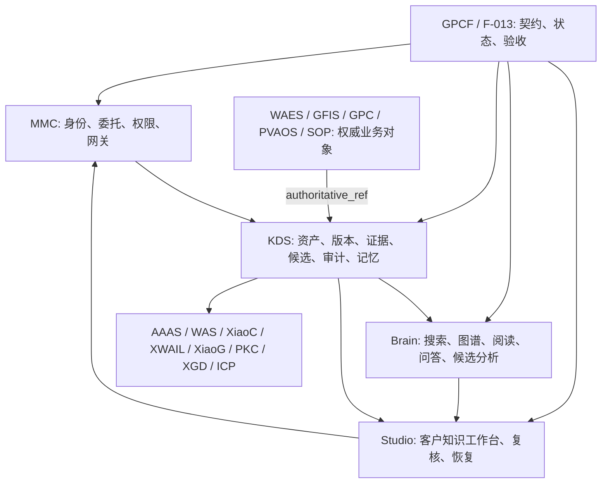

# GlobalCloud 知识工程应用体系实施方案

## 0. 控制身份

```yaml
engineering_domain: GKE-001
engineering_name: GlobalCloud Knowledge Engineering
program_coordinator_thread: 019f0697-c8ce-7110-8ac8-9a7dbc6ba2a5
canonical_and_acceptance_thread: 019fc228-2403-7123-9cae-fb9028850b84
canonical_feature: F-013
canonical_contract_revision: v0.1
canonical_manifest_sha256: 76ac8d37d61e8904edd8383c246bcadbe5bec0197a50d4bb90085f6d2308e9bf
application_program_roadmap_sha256: 688dd8e28ebdae660e34f97d60a65af5db6a051d09a224fcaf1a614ce0d171ab
openspec_program_binding: governance/openspec/gke001-program-binding.yaml
codegraph_domain_binding: governance/codegraph/gke001-engineering-domain-binding.yaml
control_plane: GPCF
authorization_plane: MMC
knowledge_source_of_truth: KDS
analysis_plane: Brain
customer_workbench: Studio
business_authority: WAES / GFIS / GPC / PVAOS / SOP and object owners
status_ceiling_without_human_acceptance: partial
completion: not_complete
```

本方案继承 `01-architecture/GlobalCloud 项目群总体方案.md`、`GlobalCloud 项目群实施方案.md` 和 `03-data-ai-knowledge/GlobalCloud项目群知识工程规范.md`。它负责把知识工程上位规范转化为可投入受控客户测试的产品、接口、运行、证据和调度路线，不替代 F-013 canonical 契约或各项目权威事实边界。

## 1. 长期目标

建立覆盖企业资料、会议、证据、知识关系、决策、候选、审计和长期记忆的统一知识工作应用体系：

```text
权威业务对象
→ 资料和录音进入 KDS
→ 版本、哈希、解析、转写和证据定位
→ Brain 搜索、图谱、问答和候选分析
→ Studio 展示、任务处理和人工复核
→ KDS 保存确认结果、审计、失效和长期记忆
→ 业务系统仅在 owner 独立授权后改变业务状态
```

长期成功标准：

- 客户可以在 Studio 内围绕项目、订单、会议、客户、供应商、资产和生产对象完成知识工作。
- 所有答案、候选和人工决策可以追溯到具体资产版本和证据定位。
- KDS 是知识事实唯一主存；Studio、Brain 和业务系统不建立平行知识主账。
- Brain 只生成候选，不自动确认关系、长期记忆或业务动作。
- 项目群 18 个项目以统一 `knowledge_object_ref` 和 `authoritative_ref` 接入，不复制主数据。
- 客户试点、受控使用、生产就绪和客户验收具有不同门禁，不以 mock 或文档互相替代。

## 2. 项目群应用结构



| 项目层 | 项目 | 实施责任 |
|---|---|---|
| 控制与信任 | GPCF、MMC | canonical、委托、状态、准入和验收 |
| 知识运行 | KDS、Brain、Studio | 事实主存、分析、客户工作台 |
| 权威业务 | WAES、GFIS、GPC、PVAOS、SOP | 项目、订单、生产、资产和流程事实 |
| 能力消费 | AAAS、WAS、XiaoC、XWAIL、XiaoG、PKC、XGD、ICP | 使用受控投影，不形成第二主账 |

## 3. 客户应用能力

Studio 的知识工作应用由八个任务模块组成：

| 模块 | 客户任务 | 权威来源 |
|---|---|---|
| 项目上下文 | 登录、角色、tenant/org、权威项目选择 | MMC + 业务系统 |
| 资料接入 | 上传、幂等、状态、取消、失败恢复 | MMC + KDS |
| 知识资产 | 资产列表、版本、哈希、解析运行 | KDS |
| 证据阅读 | 页码、时间戳、段落、表格和 lineage | KDS |
| 搜索与图谱 | ACL 范围内的 search、graph、page-content | Brain + KDS |
| WikiPreview 与 Chat | 选择证据、问答、引用和授权上下文 | Brain |
| 人工复核 | 批准、拒绝、退回候选 | Studio + KDS |
| 审计恢复 | 重复、403/404、409、429、5xx、retry 和回滚 | MMC + KDS |

## 4. 分级交付

### 4.1 Release 0：客户只读试用

```text
真实角色登录
→ 选择 tenant/org 匹配的权威测试项目
→ 浏览预置授权 KDS 测试资料
→ Search → WikiPreview → Chat
→ 查看引用、权限拒绝和审计
```

退出门：真实浏览器、真实认证、真实授权 KDS 只读链路通过；不得以静态 token、fixture 或 mock 代替。

目标分类：`real_verified / customer_readonly_pilot_ready`。

### 4.2 Release 1：受控资料接入

首批只开放 UTF-8 text/markdown 和单文件不超过 1 MiB：

```text
intake → complete-upload → immutable version/hash
→ extraction/evidence → duplicate handling → failed/retry
```

退出门：MMC 委托、KDS ACL、审计、outbox、失败恢复和 Studio 浏览器任务闭环通过。

目标分类：`real_verified / customer_intake_pilot_ready`。

### 4.3 Release 2：证据与候选复核

增加 PDF/OCR、会议转写、候选行动、风险、关系和人工复核。Brain 只能写 `candidate`，确认仍由 Studio 用户和 KDS 审计闭环完成。

### 4.4 Release 3：长期记忆与业务协同

只允许已确认候选进入长期记忆，并具有引用、作用域、有效期、失效和 supersede 规则。任何项目、订单或生产状态改变继续由业务对象 owner 独立授权。

## 5. 实施波次

| 波次 | 工作包 | 可并行范围 | 退出门 |
|---|---|---|---|
| A8 | 当前 handoff、锁、临时会话和网络证据治理收口 | Brain governance 与 Studio cleanup 并行 | F-013 独立复核 |
| A9 | KDS Stage B 准入和 MMC 只读授权 | KDS 与 MMC 契约准备并行 | ACL、audit、lineage、migration dry-run、rollback |
| A10 | Studio 真实只读接入和 Brain 基线修复 | Studio UI 与 Brain typecheck 分批并行 | Release 0 E2E |
| A11 | MMC intake/complete-upload/retry 准入 | KDS write contract 与 Studio 状态 UI 并行 | 授权、限流、失败透传和负载边界 |
| A12 | Studio 资料工作台 | 按前后端、QA、安全分批 | Release 1 E2E |
| A13 | Brain candidate 与 Studio 复核 | candidate API 和复核 UI 并行 | 人工确认、审计和 no-business-write |
| A14 | 客户试点 | 用户任务、监控和培训并行 | 人工批准 customer_test_ready |
| A15+ | PDF/OCR、录音、长期记忆和 18 项目扩展 | 每个 Feature 独立编排 | 项目级 real_verified |

真实依赖顺序固定为：

```text
GPCF canonical
→ KDS/MMC 技术准入
→ Studio 客户任务接入
→ Brain 真实只读 E2E
→ 候选与人工复核
→ 客户试点
→ 受控生产申请
```

局部基线修复、测试、UI、契约和非重叠仓库实现可以并行，不得把后续真实 E2E 扩大为全线冻结。

## 6. 跨项目接入模式

每个项目只提供权威引用和受控投影：

```yaml
gke_project_binding:
  engineering_domain: GKE-001
  project: required
  feature_ref: required
  authoritative_business_source: required
  authoritative_object_types: required
  knowledge_source_of_truth: KDS
  canonical_contract_source: GPCF
  authorization_source: MMC
  owner: required
  read_operations: required
  write_operations: explicitly_authorized_only
  rollback: required
  evidence_ref: required
  status_ceiling: partial
```

项目未实现知识能力时记录 `not_applicable_for_current_feature`，不得移出 GKE-001 工程域。

## 7. 调度协议

唯一总体调度器为 `019f0697-c8ce-7110-8ac8-9a7dbc6ba2a5`。F-013 会话负责 canonical 与独立验收，不直接承担跨仓产品实现。

每个派工必须包含：

```yaml
coordination_envelope:
  program: GKE-001
  coordinator_thread_id: required
  target_thread_id: required
  change_id: required
  feature_ref: required
  owner: required
  repository: required
  baseline: required
  file_allowlist: required
  forbidden_scope: required
  dependency_entry_gate: required
  acceptance_commands: required
  handoff_contract: required
  authorization: required
  rollback: required
  unresolved_risks: required
  status_ceiling: partial
```

协同规则：

- 每个实现 lane 必须走 OpsX Full Cycle，每批最多 12 个产品/测试文件。
- 只允许最多三个互不重叠的实现 lane 并行。
- 每批实现完成后先形成标准 handoff，再由 F-013/Harness 独立复核。
- 临时锁仅用于执行，不得进入 handoff、stage 或 commit。
- 共享工作树的并发变化视为外部事实，不得擅自回滚或混入本批。
- 任一局部门禁失败只阻塞对应能力，除非影响 canonical、身份边界、KDS 事实完整性或生产安全。

## 8. 客户测试验收

最低真实验收流：

```text
super_admin@受控租户登录 Studio
→ 选择 tenant/org 匹配的权威测试项目
→ 浏览或上传授权测试资料
→ KDS 生成资产、版本、哈希和审计
→ 查看可定位证据
→ Brain Search → WikiPreview → Chat 并展示引用
→ 重复上传获得幂等结果
→ 无权限角色获得无泄漏拒绝
→ 模拟失败并完成 retry
→ 确认业务状态未被自动改变
```

硬门：

- KDS、MMC、Studio、Brain 的测试、类型检查、构建、OpenSpec 严格校验、Harness 验收和差异检查均通过。
- ACL 在读取、搜索、详情和计数前执行。
- 回答可追溯到 `asset/version/extraction/block`。
- 403/404 不泄露对象存在性，日志不泄露原始资料、路径或凭据。
- 网络记录证明 Studio 未绕过 MMC，Brain 未使用未授权写操作。
- mock、fixture、静态 token 和文档不得计为真实客户链路。

## 9. 运行、监控和回滚

试点范围限制为受控测试租户、测试组织、少量权威测试项目和授权资料。所有调用携带 `correlation_id`、`delegation_ref`、tenant/org、project scope 和幂等键。

最低观测指标：认证失败、ACL 拒绝、intake 成功率、extraction 失败率、search 延迟、Chat 引用覆盖率、retry 次数、outbox backlog 和人工复核积压。

回滚包括关闭功能开关、撤销 MMC delegated operation、停止解析 worker、停用测试项目绑定和清理 disposable fixture。KDS 不可变历史只允许失效、隔离或 supersede，不做无审计物理删除。

## 10. 状态与授权

```text
当前工程：active / partial / not_complete
Release 0：real_verified / customer_readonly_pilot_ready
Release 1：real_verified / customer_intake_pilot_ready
客户试点：customer_test_ready，必须人工批准
正式生产：production_ready，必须单独授权
客户验收：customer_accepted，必须有客户签收证据
```

未经人工确认，不授权真实生产 KDS 写入、长期记忆、关系确认、业务状态改变、部署、发布或状态提升。

## 11. 受控产物

- 上位规范：`03-data-ai-knowledge/GlobalCloud项目群知识工程规范.md`
- canonical 子方案：`03-data-ai-knowledge/GlobalCloud知识资产模型体系综合方案.md`
- 本实施方案：`03-data-ai-knowledge/GlobalCloud知识工程应用体系实施方案.md`
- 机器路线图：`features/active/F-013-knowledge-asset-model-system/artifacts/gke-001-application-program-roadmap-v1.yaml`
- 长期调度提示词：`02-governance/loop/GKE-001长期实施调度提示词.md`
- OpenSpec Program 绑定：`governance/openspec/gke001-program-binding.yaml`
- OpenSpec 变更：`openspec/changes/integrate-gke001-openspec-codegraph/`
- CodeGraph 工程域绑定：`governance/codegraph/gke001-engineering-domain-binding.yaml`
- CodeGraph 仓库注册表：`governance/codegraph/repo-codegraph-registry.yaml`
- 状态控制：`02-governance/loop/LOOP_CONTROL_BOARD.md`
- 会话总账：`02-governance/loop/LOOP_SESSION_REGISTRY.md`

以上产物定义方向和调度边界，不证明任何系统已经完成真实运行、集成、客户测试或生产交付。

GKE-001 在 CodeGraph 中表示为跨仓工程域，不新增虚构仓库。项目群受治理范围为 18 个项目，当前仓库级 CodeGraph 索引仍为注册表中的 14 个真实仓库；两项计数必须分别校验。每个 GKE-001 OpenSpec 变更必须声明 Release、Feature、目标仓、CodeGraph 影响、授权和回滚，并由目标仓 OpsX 与 F-013/Harness 独立证据闭环。
