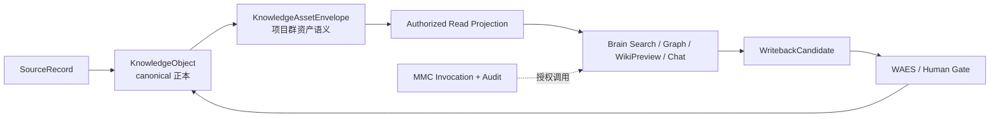

# GlobalCloud 知识资产概念模型白皮书

## 摘要

GlobalCloud 知识资产概念模型以“**一个知识正本、一个资产身份、多个受控投影**”为核心。KDS 保存 canonical `KnowledgeObject` 与其 `KnowledgeAssetEnvelope`；GPCF 定义模型和兼容规则；Brain 消费授权读模型；MMC 负责模型调用与授权审计；WAES 与人工确认控制敏感、跨组织、公开和写回边界。

本白皮书完成概念层、语义层、治理层和机器契约层的设计收口。它不声明数据库迁移、真实资料写入、跨仓运行集成、真实授权 E2E、生产部署或客户验收已经完成。项目群状态继续保持 `active / partial / not_complete`。

## 1. 目标与适用范围

### 1.1 目标

模型解决五个问题：

1. 知识内容的 canonical 正本在哪里。
2. 同一资产如何表达空间、组织、业务和研发上下文。
3. 敏感资产如何在不复制主账的情况下跨空间使用。
4. AI 分类、人工确认、授权和写回如何分离。
5. 搜索、图谱、WikiPreview 和 Chat 如何获得一致、可追溯的授权上下文。

### 1.2 范围内

- `KnowledgeObject` 与 `KnowledgeAssetEnvelope` 的概念和关系。
- 身份、空间、上下文、分类、治理、来源、关系、标签和时间语义。
- 七类访问空间、十五类知识资产和三种投影模式。
- 词表版本、授权证据、lineage、生命周期和质量规则。
- GPCF、KDS、Brain、Studio、MMC、WAES 的职责边界。

### 1.3 范围外

- 业务系统主数据替代。
- KDS 数据库结构和迁移执行。
- Brain 页面实现和真实浏览器验收。
- MMC 生产策略配置和凭据管理。
- 真实资料批量导入、生产部署和状态提升。

## 2. 设计原则

| 原则 | 设计约束 |
|---|---|
| 单一正本 | 一个知识事实只由一个 canonical `KnowledgeObject` 承载正文和事实身份 |
| 资产封装 | `KnowledgeAssetEnvelope` 只增加项目群语义，不复制 canonical 正文 |
| 身份稳定 | 资产、对象、空间、策略、证据和 lineage 使用稳定 URI 引用 |
| 维度正交 | 空间、知识域、业务项目、研发项目、组织、流程和标签分别建模 |
| 最小授权 | 默认只读；跨组织、伙伴、公开和写回必须有独立证据 |
| 投影而非复制 | 跨空间默认引用或脱敏；批准副本必须是独立派生对象 |
| 全链可追溯 | 每个资产都能回溯 source、evidence、lineage 和授权证据 |
| 人机分工 | AI 可以建议分类，不能自行生成授权、验收或生产状态 |
| 兼容演进 | 新字段以 Envelope 增量提供，不改变既有 KnowledgeObject 身份 |

## 3. 总体概念架构



| 层 | 核心对象 | 权威所有者 | 关键约束 |
|---|---|---|---|
| 来源层 | `SourceRecord` | 来源系统、KDS | 保留原始引用，不伪造来源 |
| 正本层 | `KnowledgeObject` | KDS | 唯一事实身份和正文主记录 |
| 资产层 | `KnowledgeAssetEnvelope` | GPCF 定义、KDS 保存 | 只保存多维语义与治理引用 |
| 投影层 | `AuthorizedReadProjection` | KDS | 权限裁剪、版本和原因可解释 |
| 消费层 | Search、Graph、WikiPreview、Chat | Brain | 不持有第二知识主账 |
| 推理层 | Prompt、Readback、Candidate | Brain、MMC | 每次调用独立授权并审计 |
| 写回层 | `WritebackCandidate` | WAES、业务 owner | 人工确认后才能写回 |

## 4. 核心对象模型

### 4.1 KnowledgeObject

`KnowledgeObject` 是 KDS 中的 canonical 知识正本，负责：

- 唯一对象身份和 URI。
- 对象类型、正文或结构化内容。
- tenant、来源、证据和 lineage。
- 确认状态、可信度和 RAG 准入。
- 版本、派生关系和审计关联。

Envelope 不得重复这些字段的事实内容。

### 4.2 KnowledgeAssetEnvelope

Envelope 是对 canonical 对象的项目群资产化封装，包含九个聚合：

| 聚合 | 关键字段 | 语义 |
|---|---|---|
| Identity | `assetId`、`tenantId`、`knowledgeObjectRef` | 资产身份与正本绑定 |
| AccessScope | `primarySpace`、`projections` | 主空间和受控跨空间使用 |
| Contexts | 11 类 `*Refs` | 业务、研发、组织、流程和产品上下文 |
| Classification | type、confidentiality、lifecycle、language | 主分类和密级 |
| Governance | owner、stewards、vocabulary、authorization、write mode | 治理责任和授权边界 |
| Provenance | source、evidence、lineage | 可追溯性 |
| Relations | relation type、target、direction | 资产间语义关系 |
| Tags | controlled、free | 受控发现与辅助发现 |
| Timestamps | created、updated | 创建和变更时间 |

### 4.3 标识符规范

| 标识 | 形式 | 示例 |
|---|---|---|
| 资产 | `ka://...` | `ka://example/meeting-minutes-001` |
| 租户 | `tenant://...` | `tenant://example` |
| canonical 对象 | `ko://...` 或受控 HTTPS URI | `ko://example/meeting-minutes-001` |
| 空间 | `space://...` | `space://team/globalcloud-product` |
| 策略 | `policy://...` | `policy://example/team-default` |
| 证据/批准 | 受控 URI scheme | `approval://example/share-001` |
| lineage | `lineage://...` | `lineage://example/redaction-001` |

裸字符串不能作为跨系统身份。`tenantId` 使用稳定的 `tenant://` URI，不承载显示名称。

## 5. 正交维度

模型定义 11 个上下文维度：

1. platform group
2. system
3. engineering project
4. business portfolio
5. business project
6. organization
7. workstream
8. knowledge domain
9. geography
10. product
11. process

业务项目与研发项目不得合并为通用 `project` 字段；访问空间与知识域不得互相替代；自由标签不得用于授权、密级或状态提升。

## 6. 空间与密级模型

### 6.1 七类空间

| space | 主要用途 | 最低治理要求 |
|---|---|---|
| private | 单一主体私有知识 | 主体 ACL |
| personal | 个人工作空间 | tenant 和个人身份绑定 |
| family | 家庭或小型稳定群组 | 明确成员集合 |
| team | 项目或组织协作 | team ACL 与 owner |
| partner | 合作方共享 | ACL、外部账号检查、批准证据 |
| public | 可公开发布 | 发布策略、批准证据、public 密级 |
| ops | 受限运营知识 | 受限可见性和审计 |

### 6.2 密级

密级为：`public`、`internal`、`restricted`、`confidential`、`secret`。

强制规则：

- `primarySpace=public` 时，`confidentiality` 必须为 `public`。
- 非公开资产如需进入 public，应先生成受控脱敏投影或独立 `approved_copy`，并由派生对象自己的 Envelope 声明 public 密级。
- 标签、模型判断或 Schema 通过不能自动降低密级。

## 7. 投影模型

| 模式 | 是否生成新正本 | 要求 | 典型用途 |
|---|---:|---|---|
| `reference_only` | 否 | 目标空间与策略引用 | 同正文、不同入口 |
| `redacted_projection` | 否 | projection lineage | 对同一正本做字段/片段裁剪 |
| `approved_copy` | 是，派生对象 | lineage、批准证据、派生对象引用 | 可独立发布或长期交付的批准副本 |

语义不变量：

- 投影目标不能等于 primary space。
- 同一 Envelope 不能对相同目标空间重复投影。
- `approved_copy` 不能复用 canonical 对象身份。
- 派生对象必须保持 tenant、source 和 projection lineage，并处于 `human_confirmed`。

## 8. 分类、词表与标签

### 8.1 资产类型

v0.1 包含十五类资产：source、meeting minutes、decision、action item、requirement、design、policy、SOP、report、evidence、fact candidate、knowledge page、code change、test evidence、incident。

每种资产类型映射到一个默认 OKF object type 和一组兼容 object types。映射只用于兼容校验，不改变 canonical 对象类型。

### 8.2 词表版本

Envelope 必须声明精确的 `globalcloud.knowledge_asset@v0.1`。受控标签的 `scheme/code` 必须在该版本的 `controlled_concepts` 中解析成功。

自由标签只用于检索和临时聚类，最多 20 个，每个不超过 64 个字符。

## 9. 关系模型

关系采用有向、入向或双向边，当前支持：

- source derived from
- minutes records decision
- decision creates action item
- action item implemented by
- implementation verified by
- asset related to
- asset supersedes
- asset projects to space

关系不得指向自身。关系只表达语义引用，不嵌入目标正文，也不代替 lineage。

## 10. 生命周期与状态机

资产生命周期为：

```text
draft -> active -> reviewing -> superseded -> archived
```

允许根据治理决定从 `reviewing` 返回 `active`；`rejected` 属于元数据确认结果，不是资产生命周期。

时间约束：

- `createdAt` 和 `updatedAt` 必须为带时区的 RFC 3339 时间。
- `updatedAt` 不得早于 `createdAt`。
- 生命周期转换和授权变化必须产生可关联的审计证据。

## 11. 治理与授权

### 11.1 三个独立状态轴

| 状态轴 | 值 | 含义 |
|---|---|---|
| metadata status | unclassified / machine suggested / human required / human confirmed / rejected | 分类确认状态 |
| authorization boundary | read only / human required / WAES gated / authorized | 当前授权边界 |
| write mode | no write / sandbox / authorized write | 数据写入能力 |

三个状态轴不得合并。`authorized_write` 必须同时满足：

- metadata status 为 human confirmed；
- authorization boundary 为 authorized；
- 存在非空 authorization evidence；
- 外部授权仍处于有效期内。

### 11.2 职责

| 系统 | 负责 | 不负责 |
|---|---|---|
| GPCF | 模型、Schema、词表、版本和兼容治理 | 不保存业务正文 |
| KDS | canonical 对象、Envelope、ACL、lineage、投影和审计 | 不替代业务主数据系统 |
| Studio | 开发/测试资料入口和受控 fixture 生命周期 | 不绕过 KDS 授权 |
| Brain | 授权搜索、图谱、WikiPreview、Chat 上下文 | 不建立第二知识主账 |
| MMC | 模型调用、路由、委托与审计 | 不拥有知识资产模型 |
| WAES | 敏感、公开、写回和状态提升门禁 | 不替代业务 owner |

## 12. 授权读模型

KDS 向消费者提供的读模型至少包含：

- 资产身份、标题或摘要。
- classification、contexts 和 vocabulary version。
- 可见 source/evidence/lineage 引用。
- 权限裁剪结果和裁剪原因。
- 数据版本、生成时间和有效期。

读模型必须区分：无内容、无权限、未同步、待人工确认和依赖不可用。Brain 不得把这些状态统一展示为空结果。

## 13. 质量与可观测性

建议质量指标：

| 指标 | 定义 |
|---|---|
| canonical linkage completeness | Envelope 可解析到 canonical 对象的比例 |
| provenance completeness | source/evidence/lineage 均非空的比例 |
| vocabulary resolution rate | 受控代码成功解析的比例 |
| authorization explanation rate | 授权结果具有原因和证据的比例 |
| projection integrity | 无重复、无回投、lineage 完整的投影比例 |
| stale classification rate | 超过复核周期未确认的分类比例 |
| orphan relation rate | 目标不可解析的关系比例 |

质量指标不自动触发 `accepted`、`integrated` 或 `production_ready`。

## 14. 兼容、迁移与回滚

1. 以 sidecar Envelope 关联既有 KnowledgeObject，不修改既有对象 ID。
2. 先 dry-run 分类和抽样复核，再进入受控空间。
3. 词表使用兼容版本和 alias，不原地重定义已发布 code。
4. Envelope 不可用时，Brain 回退到既有 KDS 只读行为并显示降级状态。
5. 权限或映射异常时撤销投影与索引，不删除 canonical 来源和对象。
6. `approved_copy` 回滚只撤销派生对象可见性，不篡改原对象历史。

## 15. 机器契约

本模型由以下产物共同定义：

- `okf/knowledge-object.schema.json`
- `okf/knowledge-asset-envelope.schema.json`
- `okf/knowledge-asset-vocabulary.yaml`
- `okf/knowledge-asset-contract-manifest.yaml`
- canonical、Envelope 和 approved-copy 示例
- `tools/kds-sync/validate_knowledge_asset_model_system.py`

JSON Schema 负责结构、枚举、URI、授权写入和 public 主空间密级约束；语义 validator 负责时间顺序、自关联、重复/回投投影、受控词表解析和跨对象 linkage。

## 16. 验收边界

### 16.1 已完成的模型设计验收

- 概念、聚合、关系、生命周期、空间、密级和授权边界已定义。
- Schema、词表、示例和 manifest 可确定性校验。
- canonical、Envelope 与 approved copy linkage 可回放。
- 结构负例和跨字段语义负例可重放。
- 文档进入受控台账和 KDS 开发空间本地镜像。

### 16.2 尚未完成的工程验收

- KDS 数据迁移、ACL 和查询投影运行态验收。
- Studio 权威 fixture 生命周期。
- Brain 真实授权用户流和浏览器证据。
- MMC 运行策略与委托证据。
- authenticated Search -> WikiPreview -> Chat E2E。
- 生产部署、客户验收和状态提升。

结论：**模型设计完成不等于运行集成完成**。在上述工程证据闭合前，整体状态保持 `active / partial / not_complete`。
