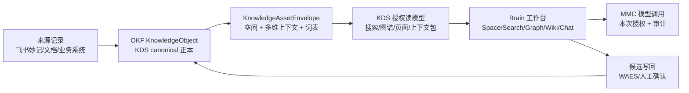

# GlobalCloud 知识资产模型体系综合方案

## 上位工程

本方案是项目群一级工程 `GlobalCloud Knowledge Engineering`（`GKE-001`）下的 canonical 知识资产模型子方案，继承 `03-data-ai-knowledge/GlobalCloud项目群知识工程规范.md`。本方案负责 `KnowledgeObject / KnowledgeAssetEnvelope` 模型、词表、Schema、fixtures、manifest、哈希、投影和兼容规则，不替代 KDS 事实能力、Studio 用户任务闭环、Brain 分析候选、MMC 身份授权或业务系统主数据治理。

当前状态上限为 `active / partial / not_complete`。概念模型设计和 GPCF canonical 机器契约已经受控收口；这不表示 KDS 阶段 A 已验收、Studio 已接入稳定 API、真实资料已写入或项目群知识工程闭环完成。

## 1. 定位与结论

GlobalCloud 知识资产模型采用“一个知识正本、多个正交维度、多个受控投影”的体系：

1. GPCF 定义项目群术语、Schema、词表、职责和兼容规则。
2. KDS 保存 canonical `KnowledgeObject`、`KnowledgeAssetEnvelope`、ACL、来源、证据、关系和 lineage。
3. Brain 按用户当前 Space 和权限消费 KDS 读模型，提供搜索、图谱、WikiPreview 和 Chat 授权交互。
4. MMC 只承担模型调用、路由和授权审计，不拥有知识资产主模型。
5. WAES 与人工确认控制跨组织、公开、敏感和写回状态，不由标签、Schema 校验或 AI 自动授权。

本方案建立项目群级模型和机器契约；配套白皮书为 `03-data-ai-knowledge/GlobalCloud知识资产概念模型白皮书.md`。模型设计完成不表示 KDS 数据迁移、Brain 页面、真实 API、真实权限或生产部署已经完成。

## 2. 设计原则

| 原则 | 约束 |
|---|---|
| 一个正本 | 同一知识资产只有一个 KDS canonical `KnowledgeObject`；跨空间默认引用或脱敏投影 |
| 维度正交 | 空间、知识域、业务项目、研发项目、组织、流程和标签不得复用为同一个字段 |
| 词表优先 | 权限、密级、状态和项目归属使用受控字段；自由标签只辅助发现 |
| 来源可追溯 | 所有资产保留 source、evidence、lineage 和关系引用 |
| 人机分工 | AI 可建议分类，低置信、跨组织、伙伴、公开和写回必须人工确认 |
| 读写分离 | Brain 默认只读；写回形成候选并经过授权，不从问答结果直接写入 KDS/MMC 或业务系统 |
| 渐进兼容 | 扩展现有 OKF，不替换 `knowledge-object.schema.json`，旧对象可逐步补充 Envelope |

## 3. 分层模型



| 层 | 对象 | 主责 | 说明 |
|---|---|---|---|
| L0 来源层 | SourceRecord、原文件、会议转写 | 来源系统、KDS | 保留不可替代的原始引用 |
| L1 知识正本层 | OKF `KnowledgeObject` | KDS | 对象类型、知识域、生命周期、可信度、RAG 准入和证据 |
| L2 项目群资产层 | `KnowledgeAssetEnvelope` | GPCF 定义，KDS 保存 | 空间、业务/研发上下文、受控分类、治理责任和跨空间投影 |
| L3 消费投影层 | SearchResult、GraphNode、WikiPage、ChatContext | KDS/Brain | 面向角色和任务的授权读模型，不成为第二主账 |
| L4 推理与行动层 | Prompt、Readback、WritebackCandidate | Brain/MMC/WAES | 每次授权、模型调用、结果回读和候选写回 |

机器产物：

- `okf/knowledge-object.schema.json`：现有知识对象正本契约。
- `03-data-ai-knowledge/GlobalCloud知识资产概念模型白皮书.md`：概念、聚合、关系、生命周期、治理与验收边界的受控说明。
- `okf/knowledge-object.example.json`：与 Envelope 配对的 canonical KnowledgeObject 无真实数据示例。
- `okf/knowledge-object-approved-copy.example.json`：具有独立 identity、原始来源和批准投影 lineage 的无真实数据派生对象示例。
- `okf/knowledge-asset-envelope.schema.json`：项目群多维资产封装契约。
- `okf/knowledge-asset-vocabulary.yaml`：空间、系统、资产类型和关系受控词表。
- `okf/knowledge-asset-envelope.example.json`：飞书会议纪要的无真实数据示例。
- `okf/knowledge-asset-contract-manifest.yaml`：GPCF canonical 版本、依赖、哈希和消费边界清单。
- `tools/kds-sync/validate_knowledge_asset_model_system.py`：只读项目群契约校验器。

## 4. 正交维度模型

| 维度 | 回答的问题 | 典型字段 | 是否可多值 |
|---|---|---|---|
| Access Space | 谁从哪个入口可见、可做什么 | `primarySpace`、`projections`、`aclPolicyRef` | 一个主空间，多个受控投影 |
| Knowledge Domain | 采用什么知识治理规则 | OKF `domain` | 正本单值 |
| Platform Group | 属于哪个研发/平台项目群 | `platformGroupRefs` | 可多值，默认 GlobalCloud |
| Engineering Project | 哪个系统、仓库或产品负责实现 | `engineeringProjectRefs`、`systemRefs` | 可多值 |
| Business Portfolio | 属于哪个业务项目群或业务组合 | `businessPortfolioRefs` | 可多值 |
| Business Project | 服务哪个客户、交付或运营项目 | `businessProjectRefs` | 可多值 |
| Organization | 由哪些组织拥有、参与或协作 | `organizationRefs` | 可多值 |
| Domain/Process | 属于哪个业务域、流程和工作流 | `domainRefs`、`processRefs`、`workstreamRefs` | 可多值 |
| Geography/Product | 涉及什么地区和产品 | `geographyRefs`、`productRefs` | 可多值 |
| Classification | 是什么类型、密级和生命周期 | `assetType`、`confidentiality`、`lifecycleStage` | 主分类单值 |
| Tags | 如何辅助发现和临时聚类 | `controlled`、`free` | 可多值 |

这组维度形成空间矩阵，但不预先为每个项目创建固定列。不同项目可选用不同上下文维度，核心身份、空间、分类、治理和来源字段保持稳定。

## 5. KnowledgeAssetEnvelope 核心字段

| 字段组 | 必填内容 | 规则 |
|---|---|---|
| 身份 | `schemaVersion`、`assetId`、`tenantId`、`knowledgeObjectRef` | `knowledgeObjectRef` 必须指向 KDS 正本 |
| 空间 | `primarySpace`、`projections` | 跨空间默认 `reference_only` 或 `redacted_projection` |
| 上下文 | `platformGroupRefs`、`systemRefs` 及可选多维 refs | 研发项目与业务项目必须分开 |
| 分类 | `assetType`、`confidentiality`、`lifecycleStage`、`language` | 受控代码由版本化词表管理 |
| 治理 | owner、steward、词表版本、元数据状态、授权边界、写模式、授权证据 | `authorized_write` 必须具备人工确认、已授权边界和外部授权证据 |
| 来源 | source、evidence、lineage | 三类引用均不可为空，与 OKF 正本保持一致并可回读 |
| 关系 | relation type、target、direction | 决策、任务、实现和验证形成可遍历链路 |
| 标签 | controlled、free | 自由标签最多 20 个，不写入敏感凭据 |

v0.1 机器契约同时执行以下硬约束：`assetType` 和 `relationType` 必须来自受控词表；15 种 Envelope `assetType` 均声明默认和兼容的 OKF `KnowledgeObject.objectType`；七空间的 OKF domain 映射必须与 domain policy 一致；配对示例必须保持 canonical 引用、tenant、默认对象类型、主空间/知识域及 source/evidence/lineage 一致；三种跨空间模式必须分别满足引用、脱敏或批准派生边界；11 个上下文引用字段分别固定自己的 URI 命名空间，跨维度放置引用会被拒绝；`partner` Space 必须携带 ACL 策略和批准证据；`public` Space 必须携带发布策略和批准证据；Envelope 不接受正文、通用 `projectRefs` 等会形成第二主账或折叠业务/研发项目维度的额外字段。确定性 validator 对这些边界执行正例与负例回放。

## 6. Brain/KDS 七空间与 OKF 知识域映射

空间是交互与 ACL 上下文，知识域是治理语义。两者不能使用同一枚举直接替代。

| Space | 默认 OKF 处理 | 关键规则 |
|---|---|---|
| `private` | `private` | 单用户拥有，默认不进入共享 RAG |
| `personal` | `workspace` | 个人工作区，可保存个人整理结果，不代表私人密级 |
| `family` | `collection_only` | 仅作为家庭集合/ACL；知识域按内容确定，不新增独立 OKF domain |
| `team` | `project` 或 `org` | 根据 owner 和业务上下文确定，不由 Space 自动选择 |
| `partner` | `supply_chain` | 必须有外部账号 ACL、脱敏和跨组织确认 |
| `public` | `public` | 必须有发布策略和发布批准，不因放入空间自动公开 |
| `ops` | 内容 domain + `ops` 受控标签 | 运维入口不是知识域，默认 restricted，不等同于 governance |

确定性 validator 固定复核上述七项映射，并与 `okf/domain-policy.yaml` 的兼容映射对齐。`private/personal/team/partner/public` 的主空间必须与 canonical KnowledgeObject domain 兼容；`family/ops` 仅是集合或入口标记，保留 canonical 内容 domain，不自动创造新 domain。配对示例以 `team -> project` 为正例，并以 `team -> public` 错配作为负例拒绝。

跨空间规则：

1. `reference_only`：只增加目标空间的授权引用，正文仍读取同一正本。
2. `redacted_projection`：生成可追溯的脱敏投影，保留 lineage 和策略引用。
3. `approved_copy`：确需独立生命周期时创建派生对象，并明确来源、批准和 supersedes 关系。

机器契约要求：`reference_only` 和 `redacted_projection` 不得声明派生 KnowledgeObject；`redacted_projection` 必须携带 `projectionLineageRefs`；`approved_copy` 必须同时携带 `projectionLineageRefs`、`approvalEvidenceRefs` 和 `derivedKnowledgeObjectRef`，且派生引用不得复用原 canonical `knowledgeObjectRef`。派生对象必须由该引用解析，保持同一 tenant 与 source，保留投影 lineage，并处于 `human_confirmed`。validator 对三种模式各保留正例，并拒绝缺 lineage、缺批准、缺派生对象、复用 canonical 引用、未解析派生对象、tenant/source/lineage 不一致或未人工确认的输入。

## 7. 项目群与业务项目不冲突的命名规则

| 概念 | 字段 | 示例 |
|---|---|---|
| 研发项目群 | `platformGroupRefs` | `platform-group://globalcloud` |
| 研发系统/项目 | `engineeringProjectRefs`、`systemRefs` | Brain、KDS、GPCF |
| 业务项目群 | `businessPortfolioRefs` | 绿色供应链运营组合 |
| 业务项目 | `businessProjectRefs` | 某客户交付、某区域运营试点 |
| 组织 | `organizationRefs` | 内部团队、客户、伙伴 |

UI 展示必须使用完整标签，例如“研发项目：Brain”和“业务项目：武汉城市圈运营”，不得只显示“项目”。API、Schema 和词表使用不同字段，避免开发项目群与业务项目群名称碰撞。

## 8. 标签与词表治理

标签不是主模型，而是模型的补充索引。

| 类型 | 用途 | 是否可驱动权限/状态 |
|---|---|---|
| 核心结构字段 | 身份、空间、项目、组织、密级、owner、lineage | 是，但必须经过对应策略 |
| 受控标签 | 业务域、流程、主题、工作流、专题集合 | 只能参与检索和规则输入，不能单独授权 |
| 自由标签 | 临时发现、个人记忆、短期专题 | 否 |
| AI 建议标签 | 自动分类候选 | 否，确认前状态为 `machine_suggested` |

词表变更采用版本号和兼容映射：新增值可向后兼容；重命名保留 alias；删除值先标记 deprecated；涉及权限、密级或公开规则的变更必须人工确认。

### 8.1 Envelope 与 OKF 对象类型兼容

Envelope `assetType` 描述项目群消费语义；OKF `objectType` 描述 canonical 正本类型。新对象采用默认映射，旧对象只要位于兼容集合即可补充 Envelope，不改 canonical ID。

| Envelope `assetType` | 默认 OKF `objectType` | 兼容类型 |
|---|---|---|
| `source` | `source` | `source` |
| `meeting_minutes` | `event` | `event`、`source`、`view` |
| `decision` | `decision` | `decision` |
| `action_item` | `claim` | `claim`、`event` |
| `requirement` | `claim` | `claim` |
| `design` | `view` | `view` |
| `policy` | `policy` | `policy` |
| `sop` | `sop_candidate` | `sop_candidate`、`policy` |
| `report` | `view` | `view`、`evidence` |
| `evidence` | `evidence` | `evidence` |
| `fact_candidate` | `fact_candidate` | `fact_candidate` |
| `knowledge_page` | `view` | `view` |
| `code_change` | `event` | `event`、`evidence` |
| `test_evidence` | `evidence` | `evidence` |
| `incident` | `event` | `event`、`fact` |

`meeting_minutes` 默认映射为 `event`，因为会议纪要资产描述一次会议事件；飞书原始转写继续通过 `sourceRefs` 指向来源记录。兼容 `source/view` 仅用于不改 ID 地接入既有对象，不改变新对象默认值。

## 9. 飞书妙记会议纪要资产化流程

### 9.1 处理链

```text
飞书妙记原文
  -> KDS SourceRecord
  -> 会议 KnowledgeObject
  -> KnowledgeAssetEnvelope 多维分类
  -> 决策 / ActionItem / 事实候选子对象
  -> source/evidence/lineage/关系连接
  -> Brain 授权读模型
```

### 9.2 空间归属判断

按以下优先级生成机器建议：

1. 明确的会议组织者、空间来源和 ACL。
2. 业务项目、研发项目、客户/伙伴和参会组织引用。
3. 文档密级、外部参与者、分享范围和保留策略。
4. 标题、摘要、实体和行动项的语义分类。

机器建议不能仅凭会议标题决定空间。以下情况进入 `human_required`：多个候选主空间置信接近、存在外部参与者、拟投影到 partner/public、包含敏感信息、缺 owner 或缺 ACL。

### 9.3 会议拆分规则

- 会议原文保留为 SourceRecord，不被摘要覆盖。
- 会议纪要形成 `meeting_minutes` 资产。
- 明确决策形成 `decision` 子对象，并通过 `minutes_records_decision` 关联。
- 行动项形成 `action_item` 子对象，并关联负责人、期限和来源片段。
- 未确认事实只形成 `fact_candidate`，不得写成业务事实。
- 同一会议可关联多个业务项目和研发项目，但只有一个主空间；其他空间使用投影。

## 10. Brain 中的用户工作方式

1. 用户进入 Brain 后先选择 Space，系统显示当前空间、当前对象和权限状态。
2. KDS 搜索和图谱按 `primarySpace + projections + ACL` 返回可见资产，并支持按业务项目、研发项目、组织、流程和资产类型切片。
3. WikiPreview 显示来源、owner、空间、项目、密级、更新时间、关系和可用上下文，不展示无权限正文。
4. 进入 Chat 时，Brain 只打包用户已确认的 KDS 页面/片段和 envelope 摘要。
5. 用户勾选“本次 prompt 授权”后调用 MMC；授权不跨 prompt 继承。
6. LLM readback 返回引用、回答和不确定项。未经授权不写 KDS，不生成伪成功。
7. 用户可继续核对 KDS、重新选择上下文或创建写回候选；写回候选经过 WAES/人工确认。

## 11. 项目职责矩阵

| 项目 | 主责 | 禁止越权 |
|---|---|---|
| GPCF | 模型、词表、版本、项目群边界、方案传导和门禁 | 不保存业务正文，不替代 KDS 主账 |
| KDS | canonical 对象、Envelope、ACL、索引、关系、lineage 和授权读模型 | 不把 AI 推断自动晋升为事实或授权 |
| Brain | Space 选择、检索、图谱、WikiPreview、Chat 上下文和恢复体验 | 不建立第二套资产主模型，不直接生产写回 |
| MMC | 模型目录、路由、调用授权、用量和审计 | 不拥有知识资产、空间或业务项目定义 |
| WAES | 外部分享、敏感信息、状态提升和写回门禁 | 不替代业务 owner 和客户验收 |
| GFIS/GPC/PVAOS 等 | 提供业务事实、主键和运行证据 | 不以文档或 AI 摘要替代 source-of-record |
| PKC/XiaoC/XGD/XiaoG | 个人协同、智能体、验证和通知 | 只消费授权上下文，不绕过 KDS/WAES |

## 12. 接口与读模型建议

后续 KDS 契约应提供以下只读能力，具体路径由 KDS OpenSpec 确认：

| 能力 | 最小输入 | 最小输出 |
|---|---|---|
| Space 资产检索 | tenant、spaceRef、user、filters | assetId、标题、classification、contexts、权限摘要 |
| 资产详情 | assetId、user、spaceRef | KnowledgeObject、Envelope、可见来源和关系 |
| 图谱邻接 | assetId、relationTypes、depth、user | 授权后的节点、边和裁剪说明 |
| Chat 上下文包 | assetIds/fragmentRefs、user、prompt authorization | 有序片段、引用、权限快照、过期时间 |
| 分类建议 | sourceRef、candidate dimensions | 建议值、置信度、原因、required confirmation |
| 写回候选 | source result、target、diff、authorization refs | candidateId、状态、阻塞和下一步 |

任何读模型都必须返回权限裁剪说明和词表版本，使 Brain 能区分“无内容”“无权限”“数据未同步”和“分类待确认”。

## 13. 实施阶段

| 阶段 | 交付 | 状态上限 | 验证 |
|---|---|---|---|
| P0 模型基线 | 本方案、白皮书、Envelope Schema、词表、示例 | `controlled/partial` | JSON/YAML 解析、Schema 与语义负例、文档门禁 |
| P1 KDS 主存适配 | Envelope 存储、旧对象映射、词表版本、ACL 和查询投影 | `ready_for_review` | 迁移 dry-run、负例权限、lineage、回滚 |
| P2 Brain 消费 | Space 过滤、维度筛选、WikiPreview、Chat 上下文确认 | `ready_for_review` | Vitest、Browser user-flow、真实权限样本 |
| P3 项目群接入 | 业务系统主键、跨项目读模型、WAES 写回候选 | `authorization_boundary` | 契约测试、真实 source record、人工确认 |
| P4 运营治理 | 词表 Steward、质量指标、漂移和审计 | 人工裁决 | 抽样复核、SLA、审计记录、回退演练 |

## 14. 验收标准

### 14.1 模型验收

- Schema 与示例均可解析，示例通过 JSON Schema 校验。
- canonical manifest 中 Schema、词表、canonical/Envelope 配对示例和 OKF 依赖哈希均与源文件一致。
- 配对示例通过各自 Schema，且 `knowledgeObjectRef`、tenant、默认对象类型与 source/evidence/lineage 一致。
- 七空间均有明确映射和跨空间策略，配对示例的主空间与 canonical 知识域兼容。
- 研发项目群与业务项目群使用不同字段。
- 受控标签和自由标签边界明确。
- 每个资产可回溯到 KnowledgeObject、来源、证据和 lineage。

### 14.2 KDS 验收

- 旧 KnowledgeObject 可在不改 ID 的情况下补 Envelope。
- partner/public/敏感资产负例不会返回无权限正文。
- 跨空间投影不会产生无 lineage 的重复正本。
- `approved_copy` 具有独立派生对象引用、批准证据和回指原对象的 projection lineage；派生对象通过 OKF Schema，保持同 tenant/source 并已人工确认。
- 分类置信不足时进入人工确认队列。

### 14.3 Brain 用户流验收

- 用户 5 秒内可识别当前 Space、对象、权限状态和下一步。
- 用户可按业务项目与研发项目分别筛选会议纪要。
- 从搜索/图谱/WikiPreview 到 Chat 的上下文可确认、可撤销。
- 每次 prompt 必须单独授权，成功后授权自动重置。
- 无权限、无上下文、分类待确认、发送失败均可恢复。

## 15. 迁移与回滚

1. 先以 sidecar Envelope 关联现有 KnowledgeObject，不修改现有对象 ID。
2. 对飞书妙记等高价值来源先做 dry-run 分类和人工抽样，不批量写正式空间。
3. 词表新增采用兼容版本；字段或代码变更保留 alias 和迁移映射。
4. Brain 在 Envelope 不可用时回退到现有 KDS 只读行为，并显式显示“多维分类不可用”。
5. 若权限或映射异常，撤销投影和索引，不删除 canonical SourceRecord/KnowledgeObject。

## 16. 当前边界

```yaml
model_contract: controlled_v0.1
feature: F-013
completion_status: not_complete
runtime_integration: not_verified
kds_write: not_authorized
deployment: not_authorized
accepted: false
integrated: false
production_ready: false
customer_accepted: false
```

其中 `model_contract` 表示工程合同版本为已受控的 `v0.1`，不表示运行集成完成；本方案与白皮书的文档状态为 `controlled/v1.0`。

## 17. 概念模型 v1.0 语义收口

### 17.1 身份与词表

- `assetId` 使用 `ka://` URI。
- `knowledgeObjectRef` 使用 `ko://` 或受控 HTTPS URI。
- 空间、策略、证据和 lineage 使用带 scheme 的稳定引用。
- `vocabularyVersion` 必须精确为 `globalcloud.knowledge_asset@v0.1`。
- controlled tag 的 `scheme/code` 必须在该版本词表中解析成功。

### 17.2 空间与密级

- `primarySpace=public` 时，`confidentiality` 必须为 `public`。
- 非公开资产进入公开空间时，必须使用带批准证据和 lineage 的脱敏投影或独立 `approved_copy`。
- Schema、标签或 AI 分类不能降低密级，也不能生成授权。

### 17.3 时间、关系与投影

- `updatedAt` 不得早于 `createdAt`。
- 资产关系不得指向自身。
- 投影不得回投 primary space，也不得对同一目标空间重复定义。
- `approved_copy` 必须使用不同于 canonical 的派生对象身份。

这些跨字段不变量由 `tools/kds-sync/validate_knowledge_asset_model_system.py` 与 JSON Schema 共同验证；KDS 运行态仍须在 P1 阶段实现相同的 fail-closed 约束。

KDS `adopt-knowledge-asset-envelope` OpenSpec 已完成规划；下一实施入口是在获得明确授权和隔离干净基线后执行 apply，验证 Envelope 存储、七空间 ACL 映射和飞书妙记 dry-run。Brain 仅在 KDS 读模型稳定后建立消费侧 change，不并行发明第二套字段。
