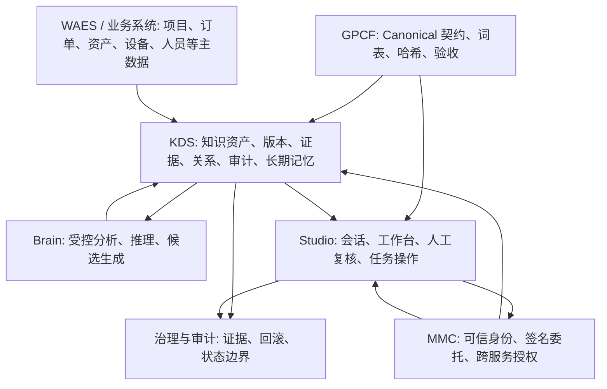

# GlobalCloud 项目群知识工程规范

## 0. 工程控制身份

```text
工程名称：GlobalCloud Knowledge Engineering
工程编号：GKE-001
控制面：GPCF
知识事实主存：KDS
接入与治理：MMC
分析能力：Brain
用户工作台：Studio
业务主数据：WAES / GFIS / GPC / PVAOS 等
工程状态：active
跨仓状态：partial
完成状态：not_complete
```

`GKE-001` 是项目群一级工程和后续知识工程工作的共同上位规范。这里的“知识事实主存”只指知识资产、版本、证据、候选、确认、关系、审计和长期记忆；项目、订单、生产、客户、供应商和资产等业务事实仍由对应权威业务系统持有。

本规范受 `01-architecture/GlobalCloud 项目群总体方案.md` 和 `GlobalCloud 项目群实施方案.md` 双总控约束。文档状态 `controlled` 仅表示规范已受控，不表示跨仓实现、真实运行、项目群集成或客户验收完成。

## 1. 总体目标

知识工程不是“文档上传功能”，而是让企业资料、会议、证据、关系、决策和长期记忆形成一条可追溯业务链：

```text
业务对象 / 项目 / 订单 / 生产
→ 资料与录音进入 KDS
→ 解析、转写与证据定位
→ Brain 生成分析候选
→ Studio 展示与人工确认
→ KDS 保存确认结果、关系、审计与长期记忆
→ Studio 支持检索、会话、执行与恢复
```

任何系统不得自行形成平行的资料、证据、审计或长期记忆主账。

## 2. 七层架构



| 层 | 唯一职责 | 禁止事项 |
|---|---|---|
| GPCF | 定义 canonical 模型、词表、契约、哈希与验收规则 | 不保存业务事实，不实现 KDS 运行时 |
| MMC | 可信身份、签名委托、服务间权限 | 不保存知识资产正本 |
| KDS | 知识资产、版本、证据、候选、确认、审计、长期记忆 | 不擅自改变业务状态 |
| Brain | 在授权范围分析资料并生成候选 | 不持久化业务事实，不直接确认或写业务对象 |
| Studio | 用户任务、会话、资料接入、复核、反馈、恢复 | 不形成本地知识主账 |
| WAES/GFIS/GPC/PVAOS 等 | 项目、订单、生产等权威业务事实 | 不以知识分析替代业务主数据治理 |
| 治理与审计 | 固化证据、回滚、授权和状态边界 | 不替代人工确认或业务 owner 裁决 |

## 3. 统一对象模型

所有知识工程对象必须围绕 `KnowledgeObject` 与 `KnowledgeAsset` 建立：

```text
BusinessObject
  ├─ Project / Order / Meeting / Production / Customer / Supplier / Asset
  └─ authoritative_ref

KnowledgeObject
  ├─ knowledge_object_ref
  ├─ canonical source and domain
  └─ projection lineage

KnowledgeAsset
  ├─ asset_id / version / sha256
  ├─ source file or recording
  ├─ extraction / transcription result
  ├─ evidence locator
  ├─ analysis candidate
  └─ audit timeline
```

强制规则：

- `knowledge_object_ref` 是知识对象稳定身份。
- 原始资料、版本、哈希、证据、候选、确认和审计只由 KDS 持久化。
- 项目、订单、生产等业务主数据仍由对应权威业务系统持有。
- 任何 AI 结果在确认前都只能是 `candidate`。
- 任何关系必须包含 `target_object_ref`；不能只根据名称自动创建企业对象。
- 现有 OKF `KnowledgeObject` 保持 canonical；`KnowledgeAssetEnvelope` 或后续 `KnowledgeAsset` 投影不得形成第二知识主账。

## 4. 统一生命周期

```text
received
→ validated
→ stored
→ parsing / transcribing
→ analyzed
→ review_required
→ approved | rejected | superseded | failed
```

| 状态 | KDS | Studio | Brain |
|---|---|---|---|
| `stored` | 保存不可变资料版本 | 显示处理中 | 不产生事实 |
| `analyzed` | 保存分析候选与证据定位 | 展示待复核内容 | 生成候选 |
| `review_required` | 等待人工裁决 | 提供唯一主要操作 | 不得自动确认 |
| `approved` | 保存确认记录与审计 | 显示结果 | 可引用已确认内容 |
| `failed` | 保留原始资料与失败记录 | 提供重试/恢复路径 | 不伪造结果 |

## 5. Studio、KDS、GPCF 协同规范

### 5.1 KDS 实施会话

负责实现事实能力：

```text
对象存储
→ 版本与哈希
→ 解析 / OCR / 转写任务
→ 分析候选
→ ACL
→ 检索、计数和详情过滤
→ 审计、outbox、回滚
→ API 与迁移 dry-run
```

### 5.2 GPCF F-013 会话

负责定义与独立验收：

```text
canonical Schema
→ 词表与示例
→ manifest 与 SHA-256
→ 投影语义
→ 兼容规则
→ KDS 镜像准入
→ 独立验证
```

F-013 是 `GKE-001` 的 canonical 契约与独立验收工作包，不是知识工程全部实现，也不拥有 KDS 运行时。

### 5.3 Studio 会话

负责用户任务闭环：

```text
绑定业务对象
→ 上传或选择资料
→ 查看 KDS 处理状态
→ 浏览证据与候选
→ 人工确认、拒绝或退回
→ 将已确认上下文用于会话
→ 查看审计和失败恢复
```

Studio 的本地 `hermes_local_draft` 只能作为临时交互草案，不得变成 KDS 的替代品。后续必须被 KDS intake adapter 收敛。

## 6. 跨仓交接协议

每个阶段性交接必须包含：

```yaml
knowledge_engineering_handoff:
  contract_version: v0.1
  canonical_manifest_sha256: required
  implementation_change: required
  source_of_truth: KDS
  changed_files: required
  api_contract: required
  authorization_boundary: required
  migration_dry_run: required
  acl_tests: required
  audit_tests: required
  rollback_boundary: required
  unresolved_risks: required
  status_ceiling: partial
```

交接顺序固定：

```text
GPCF 冻结契约
→ KDS 实现并测试
→ GPCF 独立验收
→ Studio 接入已验收 API
→ Studio 浏览器任务验证
→ 人工确认后才进入真实对象写入
```

交接字段完整只表示材料可审查；缺少实现、测试、独立验收或人工确认时，状态仍不得超过 `partial / not_complete`。

## 7. 权限与写入规范

| 操作 | 默认状态 | 必要条件 |
|---|---|---|
| 搜索、摘要、详情读取 | 允许受控只读 | MMC 委托、KDS ACL、范围过滤 |
| 上传资料 | 专项授权 | 项目写权限、幂等键、审计 |
| 转写与解析 | 专项授权 | 可用服务配置、任务审计、失败恢复 |
| 分析候选写回 | 专项授权 | Brain 受限委托、证据定位校验 |
| 确认关系、行动、风险 | 专项授权 | 人工确认、对象权限、审计 |
| 长期记忆写入 | 专项授权 | 已确认候选、引用、失效规则 |
| 业务状态改变 | 禁止自动执行 | 业务对象 owner 的独立授权 |

## 8. 项目群验收门

每个能力必须区分：

```text
real_verified
real_partial
simulated_only
blocked
not_implemented
not_authorized
```

不得将 fixture、mock、组件测试或文档存在计为真实闭环。

最低真实验收流：

```text
真实角色登录 Studio
→ 绑定有权限的项目
→ 上传真实授权资料或录音
→ KDS 生成版本和审计
→ 查看带页码/时间戳的证据
→ Brain 候选进入待复核
→ 人工确认一项候选
→ KDS 审计可追溯
→ 项目、订单、生产状态未被自动改变
```

## 9. 当前执行约束

- KDS 阶段 A 未完成验证与交接前，Studio 不新增本地资料主链或本地音频转写主链。
- GPCF 的 canonical manifest、Schema、词表与 fixtures 是跨仓唯一契约源。
- KDS 交接经 GPCF 验收前，不得被 Studio 视为稳定生产 API。
- Brain 在 KDS ACL、outbox、候选回写契约稳定前，不接入正式业务写入。
- 未经专项授权，不执行真实 KDS 写入、长期记忆写入、关系确认、部署或状态提升。

## 10. 现有工作纳入关系

| 现有工作 | 纳入 `GKE-001` 的位置 | 当前状态边界 |
|---|---|---|
| F-013 知识资产模型体系 | canonical 契约、manifest、词表、fixtures、KDS 准入与独立验收工作包 | `active / partial / not_complete` |
| KDS 阶段 A / knowledge intake | 对象、版本、解析、ACL、候选、审计、迁移与 API 实现工作包 | 未完成 GPCF 独立验收 |
| Studio 知识工作台 | 资料接入、证据浏览、候选复核、失败恢复与会话使用工作包 | 不得形成 `hermes_local_draft` 平行主链 |
| Brain 分析能力 | 受限分析和候选生成工作包 | 不得持久化业务事实或自动确认 |
| MMC | 身份、委托和跨服务授权工作包 | 不得保存知识资产正本 |
| WAES / GFIS / GPC / PVAOS 等 | 业务对象权威引用与独立写入授权 | 业务状态不得由知识工程自动改变 |
| GCKF / Knowledge Fabric no-write 主线 | GKE-001 下的受控知识治理主线；D185 接管目标会话，DKS-054 至 DKS-060 作为已合流前置基础 | D190 四项恢复触发器为 `0/4`，`nextExecutableRounds=0`，不得创建 D191 |
| DKS-054 至 DKS-060 | 分布式知识系统执行包、授权信封、接收目录、人工确认扫描、P0 治理契约和三助手 no-write 基线 | `merged_precondition_controlled`，不计为业务完成、真实 KDS 写入或恢复授权 |
| 绿色供应链角色视图 KDS 实体产物 | KDS 权限视图与角色知识投影候选 | `controlled_candidate`，不构成真实 KDS API 写入或 GCKF D190 恢复触发器 |

### 10.1 GCKF no-write 主线绑定

```yaml
gke_project_binding:
  engineering_domain: GKE-001
  project: GCKF / Knowledge Fabric
  feature_ref: F-013
  source_session: 019eede2-75a3-7943-9a77-a210a40a569b
  merged_precondition_session: 019ed328-556e-7f83-a9b2-ace87c16acdb
  merged_precondition_rounds: GPCF-KDS-DKS-054..GPCF-KDS-DKS-060
  merged_precondition_status: merged_precondition_controlled
  authoritative_business_source: GFIS / GPC / WAES object owners
  knowledge_source_of_truth: KDS
  canonical_contract_source: GPCF
  authorization_source: MMC / WAES / human confirmation
  owner: GPCF / KDS
  write_boundary: local_evidence_no_write
  takeover_evidence_ref: GPCF-GCKF-P0-D185-001
  stop_evidence_ref: GPCF-GCKF-P0-D190-001
  required_resume_triggers: 4
  satisfied_resume_triggers: 0
  next_executable_rounds: 0
  resume_allowed: false
  mainline_status_ceiling: review_ready_with_hold
  engineering_status_ceiling: partial
```

该绑定只把既有 no-write 主线纳入 GKE-001，不重跑 DKS 历史轮次，不改写 D185/D190，不形成新的 GCKF 执行轮次。仅当 `controlled_repair_owner_response`、`signed_response_package`、`waes_review_note`、`human_confirmation_record` 四项证据全部到达并通过 arrival scan refresh，才允许重新计算后续可执行轮次。

## 11. LOOP 工程体系绑定

`GKE-001` 是 GlobalCloud 项目群一级工程域，必须全量进入 LOOP 工程体系，不得以专项文档、单仓实现或临时会话替代受控工程闭环。

| LOOP 层级 | `GKE-001` 绑定 | 强制产物 |
|---|---|---|
| Program | 项目群知识工程方向、唯一事实边界和状态上限 | 本规范、项目群总体方案与实施方案传导 |
| Project | 18 个项目分别维护知识工程关联范围、权威事实和依赖边界 | 项目状态、风险、关联任务与 handoff |
| Feature | 以 `F-xxx` 承载可验收交付；当前 canonical 工作包为 `F-013` | `feature.yaml`、`journal.md`、`evidence/`、`artifacts/` |
| Loop | Governance Loop 管契约、授权、状态和验收；Delivery Loop 管实现、测试、dry-run 和用户任务增量 | 单轮输入、判断、动作、输出、检查、反馈 |
| Evidence | 只记录可回放结果，不以文档存在替代运行事实 | validator、ACL、审计、迁移 dry-run、浏览器任务证据 |
| Handoff | 跨仓按固定顺序交接并由接收方独立复核 | `knowledge_engineering_handoff` |

强制规则：

- 所有涉及资料、证据、候选、关系、审计、长期记忆或知识投影的项目任务，必须声明 `engineering_domain: GKE-001`。
- 所有相关 LOOP 轮次必须登记 owner、关联项目、Feature、事实主存、授权边界、状态上限和回滚方式。
- Delivery Loop 可以推进本地实现、fixture、controlled sample、dry-run 和 validator，但不得释放真实写入、真实业务验证或状态提升。
- Governance Loop 负责 canonical 冻结、KDS 准入、MMC 授权、独立验收和人工确认；证据不完整时结论只能为 `partial` 或 `not_complete`。
- 同一知识工程能力跨多个项目时，必须有一个 GPCF 主控 Feature 和一个明确的实现 owner；不得建立并行知识主账或重复确认链。

## 12. 全项目关联矩阵

以下 18 个项目全部纳入 `GKE-001`。项目没有当前知识资产实现，不代表可以脱离该工程域；应以 `not_applicable_for_current_feature` 记录当前 Feature 适用性，而不是删除治理关系。

| 项目 | 知识工程职责 | 权威事实或协同边界 |
|---|---|---|
| AAAS | 智能体能力与知识消费约束 | 只消费获授权上下文，不持久化知识事实正本 |
| Brain | 受控分析、推理与候选生成 | 不直接确认候选，不写业务主数据 |
| WAS | 工作流与知识任务编排 | 编排状态不替代 KDS 资产生命周期 |
| XiaoC | 客户侧知识交互与上下文消费 | 不建立本地长期记忆主账 |
| WAES | 项目、订单、资产等业务对象引用和最终业务授权 | 业务主数据与业务状态保持权威 |
| GPC | 项目控制对象与知识关联 | 项目事实保持在 GPC 权威边界内 |
| Studio | 上传、检索、会话、复核、恢复和用户任务闭环 | 不形成平行资料、证据或长期记忆主账 |
| GPCF | canonical 契约、词表、manifest、哈希、状态和独立验收 | 不保存知识事实，不实现 KDS 运行时 |
| XWAIL | 智能工作流和知识上下文消费 | 只能使用受控投影与已确认结果 |
| GFIS | 工厂、生产和运行事实引用 | 知识分析不得改变生产主数据或运行状态 |
| MMC | 身份、委托、签名和跨服务授权 | 不保存知识资产正本 |
| KDS | 资产、版本、证据、候选、确认、审计和长期记忆唯一主存 | 不擅自改变业务状态 |
| XiaoG | 治理助手的知识检索与受控建议 | 不自动确认关系或执行真实写入 |
| PVAOS | 价值、资产和运营对象引用 | 权威业务事实仍由对象 owner 持有 |
| SOP | 标准作业知识、版本和证据关联 | SOP 发布与运行确认保持独立授权 |
| PKC | 产品知识分类、目录和受控投影 | 分类投影不成为第二知识主账 |
| XGD | 设计与交付知识引用 | 设计产物进入 KDS 时必须保留版本、哈希和 lineage |
| ICP | 集成控制、接口契约和跨系统可观测性 | 不越权写入 KDS 或业务主数据 |

任何项目接入至少必须声明：

```yaml
gke_project_binding:
  engineering_domain: GKE-001
  project: required
  feature_ref: required
  authoritative_business_source: required
  knowledge_source_of_truth: KDS
  canonical_contract_source: GPCF
  authorization_source: MMC
  owner: required
  write_boundary: required
  evidence_ref: required
  status_ceiling: partial
```

## 13. 统一协同开发协议

跨项目知识工程开发按以下顺序执行：

```text
GPCF 建立或更新 Feature 与 canonical 契约
→ owner 项目声明实现范围、文件锁和依赖
→ OpsX 形成需求、规格、任务和实现证据
→ 实现仓在 Delivery Loop 内开发与自测
→ Harness 独立复核契约、ACL、审计、回滚和状态边界
→ GPCF 汇总项目群 evidence 与 handoff
→ Studio 接入已验收接口并验证真实用户任务
→ 人工确认后才允许真实对象或长期记忆写入
```

协同开发约束：

- 每个跨仓任务必须指定唯一 owner、非重叠文件范围和接收方；禁止多个会话并行修改同一文件。
- 依赖顺序固定为 canonical 契约先行、实现其次、独立验收再次、消费侧接入最后。
- 项目仓只维护本项目实现与证据；GPCF 汇总状态但不复制业务事实，KDS 持久化知识事实但不接管业务主数据。
- handoff 缺字段、validator 未通过、ACL/审计未验证或接收方未复核时，必须返回 `rework_required` 或保持 `partial`。
- fixture、mock、文档、组件测试和候选产物只能证明开发能力，不能证明真实业务闭环。

## 14. 当前项目群状态

```text
engineering_domain = GKE-001
project_scope = 18/18
loop_governance = controlled
canonical_feature = F-013
engineering_status = active
cross_project_status = partial
completion_status = not_complete
real_kds_write_authorized = false
long_term_memory_write_authorized = false
business_state_change_authorized = false
status_promotion_authorized = false
```

本规范从 2026-08-03 起作为 AAAS、Brain、WAS、XiaoC、WAES、GPC、Studio、GPCF、XWAIL、GFIS、MMC、KDS、XiaoG、PVAOS、SOP、PKC、XGD、ICP 全部知识工程关联工作的共同上位规范。跨仓传导和真实实现仍须逐仓形成可回放证据。
