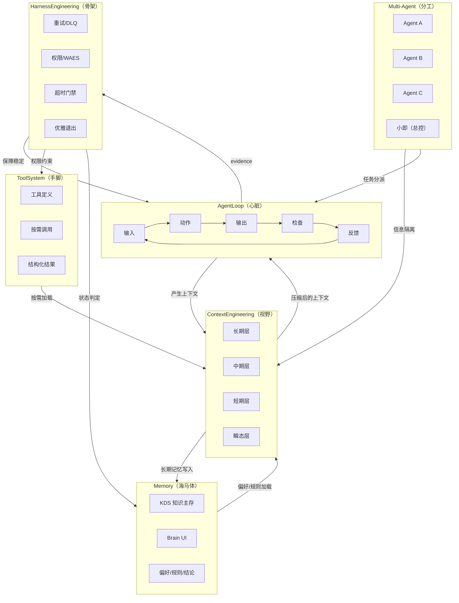

# GPCF Agent 架构六要素 — 顶层设计总纲

日期：2026-06-12
状态：v1.0
定位：GlobalCloud 项目群全部 Agent 相关规范的**理论锚点**。所有下游工程规范（Loop Engineering、角色边界、证据分类、工具治理）均由此衍生。

---

## 1. Agent 开发的本质——六个要素

Agent 开发究其本质，只有六个东西。其余全部是这六者的组合与变形：

| # | 要素 | 一句话定义 | 身体隐喻 |
|---|---|---|---|
| 1 | AgentLoop | 自己想、自己做、看结果、再调整的循环 | 心脏 |
| 2 | ToolSystem | 定义工具、调用工具、拿到结果 | 手脚 |
| 3 | ContextEngineering | 该留的留，该扔的扔 | 视野 |
| 4 | Memory | 记住你是谁——跨会话的长期记忆 | 海马体 |
| 5 | Multi-Agent | 分上下文——不是为了角色扮演，是为了信息隔离 | 分工器官 |
| 6 | HarnessEngineering | 重试、权限、超时、优雅退出 | 骨架 |

---

## 2. 六者如何"环环相扣"——这才是好用的根本原因

孤立地优化任何一个要素都会遇到天花板。六者之间的**相互制衡关系**才是系统可长期运行的基础：

```
AgentLoop 持续运行
    │
    ├──→ 产生大量上下文 ──→ 触发 ContextEngineering 压缩
    │                              │
    │    ToolSystem 按需加载 ──────→ 减少上下文污染
    │    Multi-Agent 信息隔离 ─────→ 降低 Context 压缩压力
    │
    ├──→ HarnessEngineering 保证稳定
    │         │
    │         └──→ Agent 才敢长时间运行 ──→ Memory 才有机会积累
    │
    └──→ Memory 持久化偏好 ──→ 下次启动直接加载 ──→ 减少重复交互轮次
                                            │
                                            └──→ 降低 AgentLoop 的无效上下文
```

关键因果链：

1. **Loop 推动上下文压力 → Context 压缩**。循环越密集，上下文膨胀越快，压缩频率越高。
2. **工具按需 + Agent 隔离 → 降低污染源**。不该加载的工具不进上下文，不该看到的信息不跨 Agent，从源头减少需要压缩的内容。
3. **Harness 稳定 → Memory 可积累**。Agent 不因超时/权限/异常中断，才有跨会话的记忆沉淀。
4. **Memory 持久化 → 下次少浪费轮次**。偏好、知识、上次结论直接加载，不需要重新探索，Loop 效率提升。

**反过来说，只要任意一环断裂，整个系统就会退化：**
- Memory 无 Harness 保障 → 记忆永远积累不起来
- Context 无工具/Agent 隔离 → 压缩跟不上膨胀
- Loop 无 Context 压缩 → 上下文爆炸，Agent 迷失
- Harness 无 Loop 驱动 → 骨架空转，没有负载

---

## 3. 六要素在 GPCF 体系中的落地映射

### 3.1 AgentLoop → 五段式微循环

GPCF 落地：[gpcf-loop-engineering-spec-v1.md](gpcf-loop-engineering-spec-v1.md) 第 3 节

```
输入 → 动作 → 输出 → 检查 → 反馈
```

- "自己想" = 输入段，明确本轮目标和入口条件
- "自己做" = 动作段，代码/文档/配置变更
- "看结果" = 检查段，自查或审计复评
- "再调整" = 反馈段，阻塞项登记 + 下一轮目标

工程化关键：每一段必须产出 evidence。没有 evidence 的"循环"只是聊天。

### 3.2 ToolSystem → Codex 工具与技能治理

GPCF 落地：[GlobalCloud智能体团队Codex工具与技能使用治理规范.md](GlobalCloud智能体团队Codex工具与技能使用治理规范.md)

- 定义工具：Codex 原生工具 + MCP server + 本地脚本
- 调用工具：按需加载，不预载全部
- 拿到结果：结果结构化、可追溯、可复现

工程化关键：工具调用结果必须进入 evidence（command-log、diff），否则审计时无法判定"做了什么"。

### 3.3 ContextEngineering → 上下文分层管理

GPCF 落地：[PROJECT_HARNESS_MANIFEST.md](../PROJECT_HARNESS_MANIFEST.md) 第 4.4 节 + evidence 汇聚后的选择性压缩

上下文四层：
| 层 | 内容 | 生命周期 |
|---|---|---|
| 长期层 | Manifest、状态机、规范 | 持久，除非版本升级 |
| 中期层 | 本轮 loop-state、当前阻塞项 | 跨循环，中循环审计后评估 |
| 短期层 | 本循环的输入/输出/检查 | 循环结束后压缩归档 |
| 瞬态层 | 工具调用中间结果 | 循环结束后丢弃 |

工程化关键：不该留的进瞬态层（用完即弃），该留的进 evidence（长期可追溯）。这样压缩的压力始终可控。

### 3.4 Memory → KDS 知识主存 + LLM Wiki + Brain

GPCF 落地：
- KDS（知识中心）：LLM Wiki canonical source，四空间体系长期记忆
- Brain（智能知识平台）：面向用户的知识 UI（WiIKI）
- 知识主存层：企业级知识库，Agent 的持久化记忆

数据流向：`KDS → Brain`，单向，不回流。Brain 是 UI 层，KDS 是记忆层。

工程化关键：Memory 不是"什么对话都存"，而是**偏好、规则、上次结论的结构化存储**。无结构的对话日志是上下文垃圾。

### 3.5 Multi-Agent → 星型协同 + 角色硬边界

GPCF 落地：[多智能体实施团队与协同方案](../01-architecture/GlobalCloud绿色供应链体系多智能体实施团队与协同方案.md) + [gpcf-role-boundary.md](gpcf-role-boundary.md)

- 信息隔离：一个智能体一个目标，不互相读对方主文档
- 星型协同：只对总控（小即）提交，不横向交叉
- 角色硬约束：执行层产出、验收层判定、集成层收口，各不相扰

工程化关键：Multi-Agent 的核心不是"多角色扮演"，而是**上下文隔离**。每个 Agent 只看到自己需要的信息，既降低单个 Agent 的上下文压力，也防止信息交叉污染。

### 3.6 HarnessEngineering → WAES 治理 + Harness Governance

GPCF 落地：[全链路事件与证据闭环图](../01-architecture/GlobalCloud绿色供应链体系全链路事件与证据闭环图.md) + [gpcf-status-machine.md](gpcf-status-machine.md) + [gpcf-role-boundary.md](gpcf-role-boundary.md)

- 重试：DLQ / Replay 机制
- 权限：WAES 越权控制，SUGG 不得直接写业务事实
- 超时：循环时间阈值（≤30分钟绿色，>60分钟红色）
- 优雅退出：blocked / rework_required 状态，不硬失败

工程化关键：Harness 不是"出了问题再查"，而是**每个循环出口都有门禁**。没有 Harness，Agent 跑得越久越危险。

---

## 4. 六要素之间的数据流



---

## 5. 设计原则（由此总纲推导）

从六要素的相互制衡关系出发，推导出 GPCF 体系的核心设计原则：

### 原则 1：循环必须闭环，不能只循环不收敛

每一次循环必须有 evidence 出口。没有 evidence 的循环 = 没有记忆的思考 = 永远重新开始。

对应规范：五段式微循环的"检查"和"反馈"段不可跳过。

### 原则 2：上下文分层，按生命周期管理

不是"保留一切"或"丢弃一切"，而是**按层管理**。长期层稳定不变，瞬态层用完即弃。

对应规范：Harness Manifest 4.4 节 + evidence 分类体系。

### 原则 3：工具按需加载，Agent 信息隔离

不该加载的工具不进上下文；不该看到的信息不跨 Agent。从源头减少污染。

对应规范：角色边界定义 + 星型协同禁止横向交叉。

### 原则 4：Harness 在前，Loop 在后

不是"先跑起来再看有什么问题"，而是**先把重试、权限、超时、退出路径定义好**，Loop 才敢长时间跑。

对应规范：Harness Governance 必须在循环启动前完成门禁配置。

### 原则 5：Memory 结构化，不存对话存结论

对话日志是垃圾；偏好、规则、上次判定的结构化记录才是资产。

对应规范：KDS canonical source 单向流向 Brain，不回流。

---

## 6. GPCF 体系文档的"总-分"关系

本文档是"总"，以下规范是"分"：

| 要素 | 主要规范文件 |
|---|---|
| AgentLoop | `gpcf-loop-engineering-spec-v1.md` |
| ToolSystem | `GlobalCloud智能体团队Codex工具与技能使用治理规范.md` |
| ContextEngineering | `PROJECT_HARNESS_MANIFEST.md`（4.4 节）+ `gpcf-evidence-taxonomy.md` |
| Memory | KDS/Brain 知识体系文档（`03-data-ai-knowledge/`） |
| Multi-Agent | `多智能体实施团队与协同方案` + `gpcf-role-boundary.md` |
| HarnessEngineering | `全链路事件与证据闭环图` + `gpcf-status-machine.md` + `gpcf-role-boundary.md` |

任何新规范在起草前，应先检查是否与六要素之一的定位一致，是否破坏了环环相扣的制衡关系。

---

## 7. 验证：如果去掉一环会怎样

| 去掉… | 后果 |
|---|---|
| AgentLoop | Agent 退化为一问一答的聊天，没有持续推进能力 |
| ToolSystem | Agent 只能"说"不能"做"，永远处于讨论阶段 |
| ContextEngineering | 上下文无限膨胀，Agent 迷失在历史信息中 |
| Memory | 每次会话重新开始，无法积累经验 |
| Multi-Agent | 单点瓶颈，所有信息混在一起，无法分工 |
| HarnessEngineering | Agent 跑飞无人管，权限失控，异常无恢复 |

**六者齐备且相互制衡，才是可长期运行的 Agent 系统。**

---

## 8. 版本记录

| 日期 | 版本 | 变更 |
|---|---|---|
| 2026-06-12 | v1.0 | 初始发布：六要素定义、环环相扣机制、GPCF 映射、数据流图、设计原则、总-分关系 |
