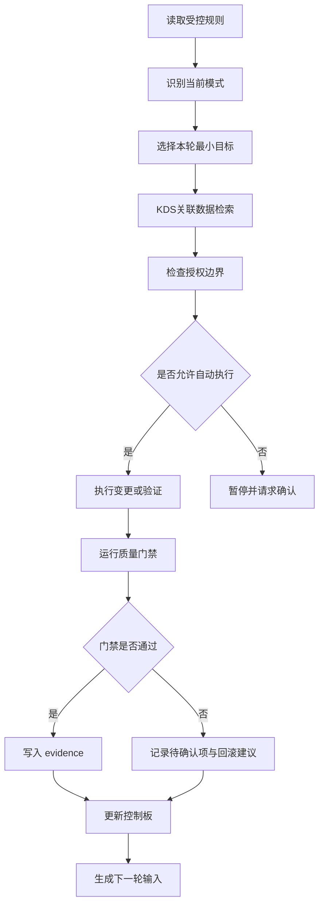

# Loop Execution Rules

## 启动读取顺序

每次 Loop 启动必须先读取：

1. `AGENTS.md`
2. `02-governance/loop/LOOP_CONTROL_BOARD.md`
3. `02-governance/loop/LOOP_AUTONOMY_POLICY.md`
4. 若请求 L3.5/L4/L5，读取对应专项政策：
   - `02-governance/loop/LOOP_L3_5_REAL_API_VERIFICATION.md`
   - `02-governance/loop/LOOP_L4_AUTONOMOUS_OPERATIONS.md`
   - `02-governance/loop/LOOP_L5_FULL_PRODUCTION_AUTONOMY.md`
5. 最近一轮 `docs/harness/loops/loop-round-*.md`
6. `09-status/gpcf-project-status-matrix.md`
7. 当前 Git 状态
8. 涉及真实开发、契约、mock、dry-run 或 evidence 时，读取 `03-data-ai-knowledge/GlobalCloud Loop开发KDS关联数据检索机制.md`

## 标准流程

## 每轮 Definition of Done

| 项 | 要求 |
|---|---|
| 输入 | 明确触发来源、输入文档、影响范围 |
| 授权 | 明确本轮允许动作和禁止动作 |
| KDS 检索 | 涉及真实开发、契约、mock、dry-run 或 evidence 时，必须形成 `kds_retrieval` 清单 |
| 专项模式 | L3.5/L4/L5 必须记录显式授权字段；L5 必须记录强授权口令摘要 |
| 执行 | 只做最小目标，不扩大范围 |
| 验证 | 至少运行相关 validator、文档门禁或质量命令 |
| evidence | 更新 evidence 清单或登记未更新原因 |
| L4 评分 | L4 模式必须按 100 分评分，输出扣分原因、是否计为 L4 实质轮、项目群累计评分和下一轮补分目标 |
| 控制板 | 更新 `LOOP_CONTROL_BOARD.md` 或登记未更新原因 |
| 下一轮 | 生成下一轮候选任务 |
| 连续运行模式 | 若 L3/L3.5/L4/L5 session active 且未触发停止条件，必须继续下一轮；阶段性汇报不是停止条件 |

## KDS 关联数据检索

涉及真实项目仓代码、配置、测试、契约、mock、dry-run 或 evidence 的 Loop 实质轮次，必须先执行 KDS 关联数据检索。

检索规则来源：

- `03-data-ai-knowledge/GlobalCloud Loop开发KDS关联数据检索机制.md`

每轮至少输出：

| 字段 | 要求 |
|---|---|
| retrieval_mode | local_mirror / kds_api_readonly / kds_api_dry_run |
| query_terms | 本轮业务节点和对象相关检索词 |
| source_documents | doc_id、source_path、kds_path、status、relevance |
| retrieved_objects | 对象、字段、owner project |
| retrieved_statuses | 状态、允许流转、禁止流转 |
| retrieved_sop | SOP 或流程规则 |
| retrieved_evidence_rules | evidence 类型和必填字段 |
| development_data_needs | 本轮开发需要的数据结构和来源 |
| mock_data_needs | mock/dry-run 数据口径和边界值 |
| unresolved_questions | KDS 未回答或存在冲突的问题 |

硬规则：

- KDS 提供受控语义、字段口径、SOP、案例和 evidence 回指，不替代业务事实。
- KDS 检索缺失关键口径时，不得臆造字段、状态或验收结论。
- 每轮 evidence 必须包含 `kds_retrieval`，或说明为何本轮不适用。
- KDS TOKEN 不得写入文档、日志或 evidence。

## 连续运行模式执行规则

L3、L3.5、L4、L5 启动后，每轮收口必须先判断停止条件，再决定是否继续。默认判定为继续。

| 判定项 | 规则 |
|---|---|
| 默认动作 | 未触发停止条件时自动进入下一轮 |
| 阶段性汇报 | 只作为进度/evidence，不得作为停止理由 |
| 完成单轮 | 不构成停止条件 |
| 完成两轮 | 不构成停止条件 |
| 任务完成 | 若队列仍有任务，继续下一轮 |
| L3.5 接口验证完成 | 若授权范围内仍有待验证接口或回滚核查未完成，继续下一轮 |
| L4 批次完成 | 若任务队列仍不为空，继续下一轮 |
| L5 修复完成 | 若监控窗口、回滚核查或复盘未完成，继续下一轮 |
| 队列为空 | 生成候选任务并请求确认，停止类型为 `task_queue_empty` |

连续运行模式停止时必须输出：

| 字段 | 允许值/要求 |
|---|---|
| 模式 | L3 / L3.5 / L4 / L5 |
| 停止类型 | hard_stop / user_stop / budget_exhausted / time_exhausted / task_queue_empty / authorization_boundary / production_safety |
| 停止证据 | 对应命令、门禁、用户指令或任务队列证据 |
| 是否符合停止规则 | yes / no |
| 已完成轮次 | `n/上限` |
| 已用时间 | `x/时间上限` |
| 下一步 | 继续、降级、等待确认或退出连续运行模式 |

## 本地门禁命令

| 门禁 | 命令 |
|---|---|
| 文档控制 | `python3 tools/kds-sync/document_control.py` |
| 文档污染 | `python3 tools/kds-sync/check_document_pollution.py` |
| KDS 冲突 | `python3 tools/kds-sync/kds_conflict_guard.py` |
| KDS TOKEN | `python3 tools/kds-sync/validate_kds_token.py` |
| Loop 文档 | `python3 tools/kds-sync/loop_document_gate.py` |
| Git 格式 | `git diff --check -- .` |
| Loop 运行 | `python3 .codex/skills/globalcloud-loop-orchestrator/scripts/loop_operational_gates.py .` |
| Loop 编排 | `python3 .codex/skills/globalcloud-loop-orchestrator/scripts/loop_orchestrator.py` |

## L4 评分门禁

L4 模式每轮必须执行 100 分评分。评分源头为 `01-architecture/GlobalCloud项目群最小闭环L4实施方案.md`，轮次记录使用 `templates/LOOP_ROUND_TEMPLATE.md` 的 `L4 100 分评分` 段。

| 分数 | 状态 | 收口要求 |
|---:|---|---|
| 90-100 | L4 Ready | 可计为高质量 L4 实质轮 |
| 80-89 | L4 Conditional | 可计为 L4 实质轮，但必须登记改进项、阻塞项和下一轮补分目标 |
| 70-79 | L3 Repair | 不得计为 L4 实质轮，必须降级为 L3 补齐轮 |
| 60-69 | Blocked | 本轮停止，修复关键缺口后再继续 |
| 0-59 | Invalid | 本轮无效，不得进入下一轮 L4 |

L4 每轮评分必须覆盖：

- 职责边界准确性。
- KDS 关联数据检索质量。
- 真实仓实质变更。
- 测试与验证。
- Evidence 完整性。
- 最小闭环贡献度。
- Git 与工作区可审计性。
- 下一轮可执行性。

低于 80 分时，`counted_as_l4_substantive_round` 必须为 `false`。低于 70 分时，下一轮必须优先生成 L3 补齐任务。低于 60 分时，连续运行必须暂停并登记阻塞证据。

## 收口规则

- 门禁通过：更新 evidence、控制板、下一轮建议。
- 门禁失败但可局部修复：只修本轮相关问题并复跑。
- 门禁失败且触及授权边界：暂停并请求确认。
- 出现文档债务：登记原因、影响文档、owner、due_loop 和状态上限。
- L3/L3.5/L4/L5 session active 时，收口后仍未触发停止条件的，必须继续下一轮，不得把阶段性汇报当作停止。
