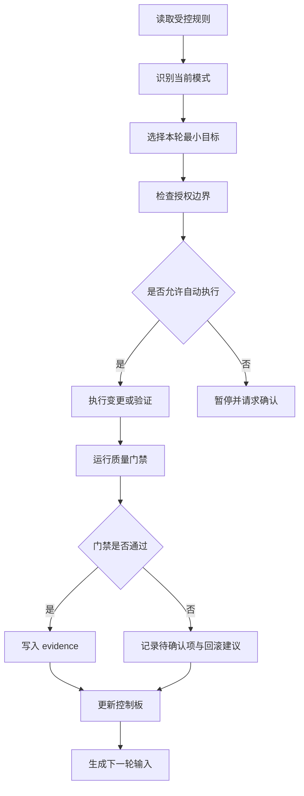

# Loop Execution Rules

## 启动读取顺序

每次 Loop 启动必须先读取：

1. `AGENTS.md`
2. `02-governance/loop/LOOP_CONTROL_BOARD.md`
3. `02-governance/loop/LOOP_AUTONOMY_POLICY.md`
4. 若请求 L3.5/L4/L5，读取对应专项政策：
   - `02-governance/loop/LOOP_L3_5_REAL_API_VERIFICATION.md`
   - `02-governance/loop/LOOP_L4_AUTONOMOUS_OPERATIONS.md`
   - `02-governance/loop/LOOP_L5_FULL_PRODUCTION_AUTONOMY.md`
5. 最近一轮 `docs/harness/loops/loop-round-*.md`
6. `09-status/gpcf-project-status-matrix.md`
7. 当前 Git 状态

## 标准流程

## 每轮 Definition of Done

| 项 | 要求 |
|---|---|
| 输入 | 明确触发来源、输入文档、影响范围 |
| 授权 | 明确本轮允许动作和禁止动作 |
| 专项模式 | L3.5/L4/L5 必须记录显式授权字段；L5 必须记录强授权口令摘要 |
| 执行 | 只做最小目标，不扩大范围 |
| 验证 | 至少运行相关 validator、文档门禁或质量命令 |
| evidence | 更新 evidence 清单或登记未更新原因 |
| 控制板 | 更新 `LOOP_CONTROL_BOARD.md` 或登记未更新原因 |
| 下一轮 | 生成下一轮候选任务 |
| 连续运行模式 | 若 L3/L3.5/L4/L5 session active 且未触发停止条件，必须继续下一轮；阶段性汇报不是停止条件 |

## 连续运行模式执行规则

L3、L3.5、L4、L5 启动后，每轮收口必须先判断停止条件，再决定是否继续。默认判定为继续。

| 判定项 | 规则 |
|---|---|
| 默认动作 | 未触发停止条件时自动进入下一轮 |
| 阶段性汇报 | 只作为进度/evidence，不得作为停止理由 |
| 完成单轮 | 不构成停止条件 |
| 完成两轮 | 不构成停止条件 |
| 任务完成 | 若队列仍有任务，继续下一轮 |
| L3.5 接口验证完成 | 若授权范围内仍有待验证接口或回滚核查未完成，继续下一轮 |
| L4 批次完成 | 若任务队列仍不为空，继续下一轮 |
| L5 修复完成 | 若监控窗口、回滚核查或复盘未完成，继续下一轮 |
| 队列为空 | 生成候选任务并请求确认，停止类型为 `task_queue_empty` |

连续运行模式停止时必须输出：

| 字段 | 允许值/要求 |
|---|---|
| 模式 | L3 / L3.5 / L4 / L5 |
| 停止类型 | hard_stop / user_stop / budget_exhausted / time_exhausted / task_queue_empty / authorization_boundary / production_safety |
| 停止证据 | 对应命令、门禁、用户指令或任务队列证据 |
| 是否符合停止规则 | yes / no |
| 已完成轮次 | `n/上限` |
| 已用时间 | `x/时间上限` |
| 下一步 | 继续、降级、等待确认或退出连续运行模式 |

## 本地门禁命令

| 门禁 | 命令 |
|---|---|
| 文档控制 | `python3 tools/kds-sync/document_control.py` |
| 文档污染 | `python3 tools/kds-sync/check_document_pollution.py` |
| KDS 冲突 | `python3 tools/kds-sync/kds_conflict_guard.py` |
| KDS TOKEN | `python3 tools/kds-sync/validate_kds_token.py` |
| Loop 文档 | `python3 tools/kds-sync/loop_document_gate.py` |
| Git 格式 | `git diff --check -- .` |
| Loop 运行 | `python3 .codex/skills/globalcloud-loop-orchestrator/scripts/loop_operational_gates.py .` |
| Loop 编排 | `python3 .codex/skills/globalcloud-loop-orchestrator/scripts/loop_orchestrator.py` |

## 收口规则

- 门禁通过：更新 evidence、控制板、下一轮建议。
- 门禁失败但可局部修复：只修本轮相关问题并复跑。
- 门禁失败且触及授权边界：暂停并请求确认。
- 出现文档债务：登记原因、影响文档、owner、due_loop 和状态上限。
- L3/L3.5/L4/L5 session active 时，收口后仍未触发停止条件的，必须继续下一轮，不得把阶段性汇报当作停止。
