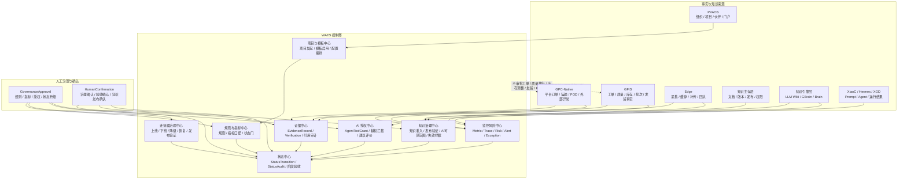

# GlobalCloud 绿色供应链体系 WAES 控制塔与治理门禁图

日期：2026-06-07  
状态：专项架构图 v1  
口径：只展开 `WAES` 的控制塔、治理门禁、证据、状态、知识治理和 AI 授权边界。

## 1. WAES 控制塔与治理门禁图

## 2. 门禁清单

1. 项目模板启用门  
2. 规则生效门  
3. 指标口径生效门  
4. 证据确证门  
5. 状态升级门  
6. SOP 发布与版本门  
7. 连接器上线/下线治理门  
8. 知识准入与知识发布门  
9. AI 授权与工具权限门  
10. 阶段验收结论门  

## 3. 边界说明

`WAES` 负责治理、证据、状态、知识准入、AI 授权和控制塔，不负责具体事务审批。  
工单、质量、库存、发货、签收、维修验收等事务动作，仍必须在 `GFIS` 或 `GPC-Native` 内部闭环。
