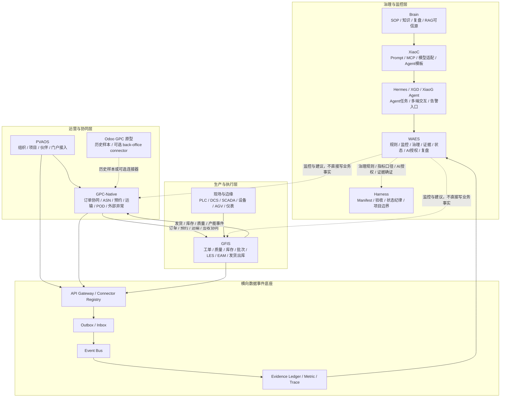
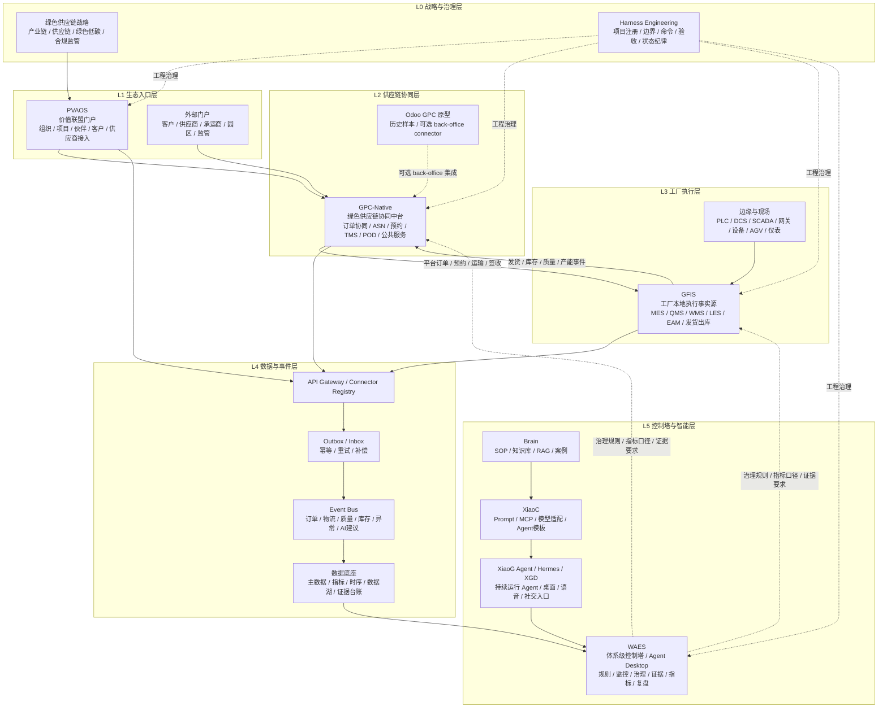

# GlobalCloud 绿色供应链体系层次化结构与优化提示词

日期：2026-06-07  
状态：体系级更名与架构升级稿  
命名决策：原“GlobalCloud 智慧工厂”作为总称不再使用，升级为 **GlobalCloud 绿色供应链体系**。  
保留口径：“智慧工厂”不删除，降级为体系内的 **工厂执行与本地运行子域**。

## 1. 更名后的体系定位

**GlobalCloud 绿色供应链体系** 不是单一工厂信息化系统，也不是单一 GPC/GFIS/WAES 项目，而是面向绿色产业链、供应链协同、工厂执行、物流交付、质量追溯、能源安环、数据智能和 AI Agent 治理的一整套层次化业务与技术体系。

更名后的核心变化：

| 原口径 | 新口径 | 调整原因 |
|---|---|---|
| GlobalCloud 智慧工厂 | GlobalCloud 绿色供应链体系 | 总范围从单厂/工厂扩展到产业链、供应链、物流、客户、供应商、园区和监管协同 |
| 智慧工厂项目群 | 绿色供应链体系项目群 | 项目群不只服务工厂，还服务外部协同、控制塔、门户、知识、Agent 和治理 |
| GPC 公共服务平台 | GPC-Native 绿色供应链协同中台 | 不再基于 Odoo 二开，聚焦外部协同、TMS、POD、公共服务 |
| GFIS 工厂信息化系统 | 工厂执行与本地运行核心 | 继续作为单厂事实源，承载 MES/QMS/WMS/LES/EAM |
| WAES 控制塔 | 治理与监控中枢、证据平面 | 聚合 GFIS/GPC-Native/PVAOS/Brain/Agent 证据，审批规则和治理事项，不审批具体事务，不写业务主账 |

当前补充口径：平台主架构以 `GPC-Native` 为绿色供应链平台主线，宪法内容通过 `WAES` 的规则、证据、状态和授权体系进入。

## 2. 三层主架构

面向业务和管理表达，GlobalCloud 绿色供应链体系采用三层主架构：

1. **治理与监控层**：负责规则、监控、治理、证据、状态、AI 授权和复盘。
2. **运营与协同层**：负责生态入口、外部协同、订单、供应商、客户、运输和交付协同。
3. **生产与执行层**：负责工厂内部生产、质量、库存、批次、设备、厂内物流和发货出库。

数据、事件、连接器和证据链作为横向底座贯穿三层，不作为单独业务层对外表达。



三层边界：

| 层级 | 主责 | 代表系统 | 不做什么 |
|---|---|---|---|
| 治理与监控层 | 规则、监控、治理、证据、状态、AI 授权、复盘 | WAES / Harness / Brain / XiaoC / Hermes / XGD | 不审批具体事务，不写业务主账 |
| 运营与协同层 | 生态接入、订单协同、外部物流、客户/供应商/承运商协同 | PVAOS / GPC-Native | 不做工厂生产执行，不做库存和质量主账 |
| 生产与执行层 | 生产、质量、库存、批次、厂内物流、设备、发货出库 | GFIS / Edge | 不做跨企业公共协同，不做体系治理裁决 |

Edge 口径：

- Edge 是现场与 GFIS 之间的边缘接入层，不是独立业务主系统。
- Edge 覆盖 PLC、DCS、SCADA、工业网关、OPC UA、Modbus、MQTT、AGV、扫码枪、工位屏、传感器和本地缓存。
- Edge 负责现场数据采集、协议转换、断网续传、设备状态上报和有限的低延迟执行回执。
- Edge 不决定工单、质量、库存、发货、签收和治理状态；业务事实必须进入 GFIS 或 GPC-Native 后形成正式记录。

## 2.1 四流优化口径

在三层主架构之上，体系设计统一采用四条横向流进行校验和落地：

| 四流 | 主责 | 作用 | 约束 |
|---|---|---|---|
| 治理流 | WAES / Harness | 项目发起、模板启用、规则、指标、证据、状态、连接器治理、AI 授权 | 约束业务流，不替代业务流 |
| 业务流 | PVAOS / GPC-Native / GFIS / Edge | 组织接入、订单协同、工厂执行、现场接入 | 业务事实必须由主责系统产生 |
| 数据流 | Connector Registry / API Gateway / Event Bus / Evidence Ledger | API、事件、Outbox/Inbox、证据、指标、Trace、DLQ、重放 | 不共享业务数据库，不改变事实归属 |
| AI 服务流 | Brain / XiaoC / Hermes / XGD / WAES | 知识、Prompt、Agent、建议、摘要、预警、复盘 | 受 WAES 授权，不能直接写业务主账 |

四流专项基线：

1. 连接器合同：[GlobalCloud绿色供应链体系连接器合同.md](/Users/lujunxiang/Documents/GlobalCloud智慧工厂/GlobalCloud绿色供应链体系连接器合同.md)。
2. SOP 模板库：[GlobalCloud绿色供应链体系SOP模板库.md](/Users/lujunxiang/Documents/GlobalCloud智慧工厂/GlobalCloud绿色供应链体系SOP模板库.md)。
3. AI 服务模型：[GlobalCloud绿色供应链体系AI服务模型.md](/Users/lujunxiang/Documents/GlobalCloud智慧工厂/GlobalCloud绿色供应链体系AI服务模型.md)。
4. 数据治理模型：[GlobalCloud绿色供应链体系数据治理模型.md](/Users/lujunxiang/Documents/GlobalCloud智慧工厂/GlobalCloud绿色供应链体系数据治理模型.md)。
5. 多厂协同模型：[GlobalCloud绿色供应链体系多厂协同模型.md](/Users/lujunxiang/Documents/GlobalCloud智慧工厂/GlobalCloud绿色供应链体系多厂协同模型.md)。
6. Edge 接入与安全模型：[GlobalCloud绿色供应链体系Edge接入与安全模型.md](/Users/lujunxiang/Documents/GlobalCloud智慧工厂/GlobalCloud绿色供应链体系Edge接入与安全模型.md)。

## 3. L0-L5 内部实施结构



## 4. L0-L5 分层说明

### L0 战略与治理层

职责：

- 定义绿色供应链体系目标、边界、阶段、验收和风险。
- 管理项目群治理、工程边界、命令入口、证据、状态标签和人工确认点。

关键产物：

- 总 Manifest。
- 阶段验收矩阵。
- 项目群控制表。
- GPC-Native ADR。
- L1-L5 AI 授权边界。

### L1 生态入口层

职责：

- 管理组织、项目、伙伴、供应商、客户、承运商、园区和监管接入。
- 提供外部协作入口，不承载工厂生产执行事实。

主责项目：

- PVAOS。
- 后续 GPC-Native 外部门户模块。

### L2 供应链协同层

职责：

- 平台订单协同。
- 供应商 ASN 和到货预约。
- 车辆、承运商、月台、在途、签收、POD。
- 客户/供应商/承运商外部异常闭环。
- 绿色供应链公共服务。

主责项目：

- GPC-Native。

边界：

- 不做生产工单。
- 不做库存主账。
- 不做质量放行主账。
- 不直接写 GFIS 工厂事实。
- Odoo GPC 只作为历史样本或可选 back-office connector。

### L3 工厂执行层

职责：

- 订单确认。
- 工单、BOM、生产报工。
- 质量检验、隔离、放行。
- 仓储、批次、库存。
- LES 线边配送、补料、工序转运。
- 设备点检、维修、EAM。
- 发货出库事实。

主责项目：

- GFIS。

边界：

- GFIS 是单厂事实源。
- GFIS 不负责跨企业公共服务。
- GFIS 发货出库后，将运输协同交给 GPC-Native。

### L4 数据与事件层

职责：

- 统一对象 ID。
- API 网关。
- 连接器注册。
- Outbox/Inbox。
- 事件总线。
- 主数据、指标、时序、证据、数据湖。

关键原则：

- 不共享业务数据库。
- 写业务事实的事件只能由主责系统产生。
- AI 建议事件不能冒充业务事实事件。
- 每个事件必须有来源系统、来源记录、风险等级、traceId 和幂等键。

### L5 控制塔与智能层

职责：

- WAES 做体系级控制塔、治理规则、证据平面、状态审计和 Agent Desktop。
- Brain 提供知识、SOP、RAG 和复盘。
- XiaoC 提供 Prompt、MCP、模型适配和 Agent 模板。
- XiaoG Agent/Hermes/XGD 提供持续运行 Agent、多端交互和语音/社交入口。

边界：

- L1 查询/报表可自动。
- L2 预警可自动提醒。
- L3 建议需人工确认。
- L4 治理规则、AI 授权、证据确证和状态升级需审批授权。
- L5 安全关键控制 AI 不得接管。

## 4. 子域结构

| 子域 | 主责系统 | 说明 |
|---|---|---|
| 生态接入域 | PVAOS / GPC-Native Portal | 组织、项目、伙伴、客户、供应商、承运商入口 |
| 供应链协同域 | GPC-Native | 订单协同、ASN、预约、TMS、POD、外部异常 |
| 工厂执行域 | GFIS | 生产、质量、库存、厂内物流、设备、发货出库 |
| 数据事件域 | WAES + Connector + Event Bus | 对象、事件、指标、证据、追踪 |
| 知识与 SOP 域 | Brain | SOP、案例、复盘、RAG 准入 |
| Prompt 与模型域 | XiaoC | Agent prompt、MCP、模型配置、评估 |
| Agent 交互域 | Hermes / XGD | 后台任务、桌面、语音、社交、异常提醒 |
| 工程治理域 | Harness 控制台 | Manifest、验收、状态、命令、证据 |

## 5. 优化提示词

### Prompt A：体系级重命名与架构统一

```text
请将当前“GlobalCloud 智慧工厂”设计统一升级为“GlobalCloud 绿色供应链体系”。

要求：
1. 不删除“智慧工厂”，而是将其降级为“工厂执行与本地运行子域”。
2. 总体系必须采用三层主架构：治理与监控层、运营与协同层、生产与执行层。
3. GPC 主线必须是 GPC-Native 轻量绿色供应链协同中台。
4. 现有 Odoo GPC 必须降级为历史原型、流程样本和可选 back-office connector。
5. GFIS 必须是单厂本地执行事实源。
6. WAES 必须是治理与监控中枢、规则审批和证据平面，不参与具体事务审批，不得成为业务主账。
7. L0-L5 只作为内部实施映射，不作为对外主表达。
8. 输出一份层次化体系结构文档，包含三层主架构、L0-L5 映射、子域、主责系统、边界、事件流和验收口径。

输出中文，避免泛泛描述，必须能直接进入后续对象目录和事件合同设计。
```

### Prompt B：绿色供应链体系对象目录

```text
请为 GlobalCloud 绿色供应链体系建立统一对象目录。

必须按以下层次分类：
治理与监控层
运营与协同层
生产与执行层
L1 生态入口对象
L2 供应链协同对象
L3 工厂执行对象
L4 数据事件对象
L5 控制塔与 AI 对象
L0 工程治理对象

每个对象必须输出：
1. 对象中文名。
2. 对象英文名。
3. ID 前缀。
4. 所属层级。
5. 主责系统。
6. 协同系统。
7. 是否主数据。
8. 是否业务事实。
9. 是否允许 AI 写入。
10. 关键字段。
11. 关键状态。
12. 关联对象。

必须明确：
- GFIS 负责工厂执行事实。
- GPC-Native 负责外部协同事实。
- WAES 负责治理规则、证据、指标、AI 授权和状态审计。
- WAES 不负责工单、质量、库存、发货、签收等具体事务审批，只引用 GFIS/GPC-Native 的业务确认结果。
- Brain 负责知识事实。
- AI 建议不是业务事实。
```

### Prompt C：GPC-Native 供应链协同中台深化

```text
请深化 GPC-Native 轻量绿色供应链协同中台方案。

设计范围：
- 平台订单协同。
- 供应商 ASN。
- 到货预约。
- 车辆、承运商、月台。
- TMS 在途跟踪。
- POD 签收回单。
- 客户/供应商/承运商异常闭环。
- 与 GFIS、WAES、PVAOS 的事件/API 集成。

必须排除：
- 不做生产工单。
- 不做库存主账。
- 不做质量放行主账。
- 不直接写 GFIS 工厂事实。
- 不继续 Odoo core 二开。

输出：
1. 产品边界。
2. 一期功能。
3. 领域对象。
4. 状态机。
5. API 草案。
6. 事件主题。
7. 数据表草案。
8. 权限模型。
9. 与 GFIS 的发货/签收闭环。
10. 与 WAES 的证据/治理闭环。
11. 一期验收矩阵。
```

### Prompt D：GFIS 工厂执行子域深化

```text
请将“智慧工厂”降级为 GlobalCloud 绿色供应链体系中的“工厂执行与本地运行子域”，并深化 GFIS 的设计。

GFIS 主责：
- 工厂订单确认。
- BOM、工单、作业卡、报工。
- QMS 质量检验、隔离、放行。
- WMS 仓储、批次、库存。
- LES 齐套、备料、线边配送、补料、工序转运。
- EAM 设备点检、维修、备件。
- 发货出库事实。

请输出：
1. GFIS 在绿色供应链体系中的位置。
2. GFIS 与 GPC-Native 的边界。
3. GFIS 与 WAES 的边界。
4. GFIS 与现场 OT/边缘采集的边界。
5. LES 最小模型。
6. 质量与库存可用性规则。
7. 发货出库到 GPC-Native 的事件。
8. 一期验收场景。

要求：
- 不把 GFIS 做成跨企业公共平台。
- 不让 WAES 或 AI 改写 GFIS 主账。
- 不让 GPC-Native 改写生产、质量、库存事实。
```

### Prompt E：体系级事件合同

```text
请为 GlobalCloud 绿色供应链体系设计一期事件合同。

事件生产者：
- GFIS：工厂订单、工单、质量、库存、厂内物流、发货出库。
- GPC-Native：平台订单、ASN、预约、车辆、运输、签收、POD、外部异常。
- WAES：治理规则、证据、指标、状态审计、AI 建议状态和业务审批引用。
- PVAOS：组织、项目、伙伴接入。
- Brain/XiaoC/Hermes/XGD：知识引用、prompt 版本、Agent 建议和执行记录。

每个事件必须包含：
eventId、eventType、eventVersion、sourceSystem、sourceRecordId、occurredAt、publishedAt、actorType、actorId、riskLevel、traceId、correlationId、idempotencyKey、payload、evidenceRefs。

请输出：
1. 事件命名规范。
2. Envelope schema。
3. 事件列表。
4. payload 草案。
5. 生产者和消费者。
6. 幂等、重试、补偿。
7. 禁止 AI 直接发布的业务事实事件。
8. 一期验收事件链。
```

### Prompt F：体系级控制塔与证据平面

```text
请为 GlobalCloud 绿色供应链体系设计 WAES 控制塔与证据平面。

WAES 必须覆盖：
- 生态入口状态。
- 供应链协同状态。
- 工厂执行状态。
- 物流与交付状态。
- 质量与追溯状态。
- 设备、能源、安环状态。
- 异常闭环。
- AI 建议和治理确认。
- Evidence Ledger。

WAES 禁止：
- 不写 GFIS 工厂主账。
- 不写 GPC-Native 外部协同主账。
- 不承办工单、质量、库存、发货、签收等具体事务审批。
- 不把 AI 建议当事实。

输出：
1. 控制塔信息架构。
2. 页面/视图清单。
3. 指标口径。
4. 数据来源。
5. 证据来源。
6. 治理确认队列。
7. 异常闭环。
8. Agent Desktop 工具。
9. 一期验收矩阵。
```

### Prompt G：AI Agent 授权边界优化

```text
请为 GlobalCloud 绿色供应链体系优化 AI Agent 授权边界。

Agent 包括：
- 生产调度 Agent。
- 物流调度 Agent。
- 质量分析 Agent。
- 设备维护 Agent。
- 仓储库存 Agent。
- 能源优化 Agent。
- 安环风险 Agent。
- 经营驾驶舱 Agent。
- 供应链协同 Agent。
- 证据审计 Agent。

请对每个 Agent 输出：
1. 可读取数据。
2. 可自动执行的 L1 查询/报表。
3. 可自动提醒的 L2 预警。
4. 需要人工确认的 L3 建议。
5. 需要治理授权的 L4 变更。
6. 永远禁止的 L5 动作。
7. 输出格式。
8. 证据引用格式。
9. 失败/不确定时的报告方式。

必须强调：
- AI 不接管安全联锁、急停、设备保护和环保排放控制。
- AI 不自动质量放行。
- AI 不自动承诺客户交期。
- AI 不自动确认资金事实。
- AI 不直接改写 GFIS/GPC-Native 主账。
```

### Prompt H：体系级一期验收矩阵

```text
请为 GlobalCloud 绿色供应链体系设计一期验收矩阵。

一期闭环：
生态入口/平台订单
-> GPC-Native 订单协同
-> GFIS 工厂订单确认
-> 齐套检查
-> 工单
-> 备料和线边配送
-> 生产报工
-> 质量检验
-> 成品入库
-> 发货出库
-> GPC-Native 运输和签收
-> WAES 证据台账和异常复盘

请输出：
1. 验收场景。
2. 参与系统。
3. 前置条件。
4. 操作步骤。
5. 期望结果。
6. 证据类型。
7. 来源系统。
8. 确认点，必须区分 GFIS/GPC-Native 事务确认和 WAES/Harness 治理确认。
9. 阻塞条件。
10. 完成判定。

必须覆盖：
- 一张平台订单到客户签收。
- 一批物料从供应商到成品客户追溯。
- 一次缺料风险预警。
- 一次线边配送闭环。
- 一次质量异常闭环。
- 一次运输签收异常闭环。
- 一份 WAES 生产/物流/交付日报。
```

### Prompt I：旧文档口径迁移检查

```text
请检查当前工作区内所有设计文档，确认是否已经完成从“GlobalCloud 智慧工厂”到“GlobalCloud 绿色供应链体系”的口径迁移。

检查目录：
/Users/lujunxiang/Documents/GlobalCloud智慧工厂

检查重点：
1. 是否仍把“智慧工厂”当总体系名称。
2. 是否已经把“智慧工厂”降级为工厂执行子域。
3. 是否仍把 Odoo GPC 当 GPC 主线底座。
4. 是否已经明确 GPC-Native 为目标主线。
5. 是否明确 GFIS 是工厂事实源。
6. 是否明确 WAES 不写业务主账、不审批具体事务。
7. 是否明确三层主架构。
8. 是否明确 AI L1-L5 授权边界。

输出：
- 已完成迁移的文档。
- 仍需修改的文档。
- 建议修改语句。
- 不建议修改的历史文档和原因。
```

## 6. 推荐下一步

更名之后，已先补齐三份体系级设计，不应在缺少连接器合同和运行态联调证据时直接进入大规模代码改造：

1. `GlobalCloud绿色供应链体系对象目录.md`：已建立 L0-L5 对象、主责系统、AI 写入边界和优先级对象。
2. `GlobalCloud绿色供应链体系事件合同.md`：已建立事件信封、GFIS/GPC-Native/WAES/PVAOS/Brain/Agent 一期事件、幂等和补偿规则。
3. `GlobalCloud绿色供应链体系一期验收矩阵.md`：已建立一张平台订单到客户签收、批次追溯、缺料、线边配送、质量异常、运输签收异常、日报、设备异常和 AI 建议拒绝场景。

下一轮建议继续启动：

1. `GlobalCloud绿色供应链体系连接器合同.md`：定义 API Gateway、Connector Registry、Outbox/Inbox、重试、补偿和权限边界。
2. `GPC-Native一期产品与技术蓝图.md`：细化订单协同、ASN、预约、TMS、POD、外部异常和公共服务的一期模型。
3. `GFIS工厂执行子域LES最小模型.md`：细化备料、齐套、线边配送、补料、厂内转运和发货出库边界。
4. `WAES体系级控制塔与EvidenceLedger模型.md`：细化指标、证据、治理确认、异常复盘和 Agent Desktop。
5. `GlobalCloud绿色供应链体系一期Manifest.md`：把对象、事件、验收、证据和项目边界纳入 Harness 治理入口。
