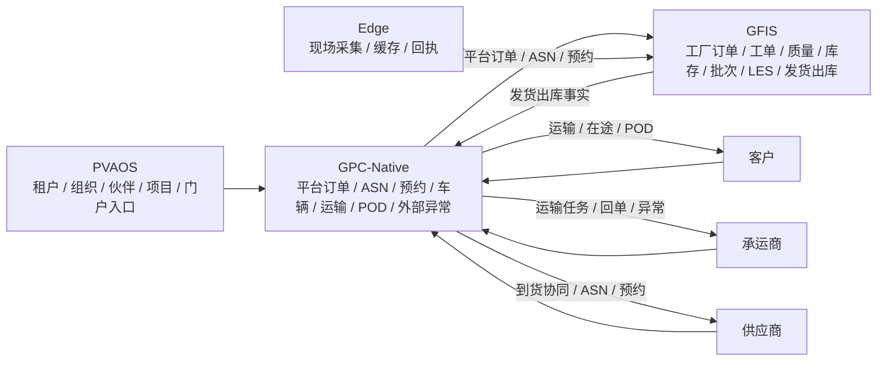

# GlobalCloud 绿色供应链平台业务流架构图

日期：2026-06-07  
状态：平台业务流架构图 v1  
口径：只看业务主链，不展开治理、AI 和数据治理细节。

## 1. 平台业务流总图

## 2. 业务链路拆解

1. `PVAOS` 提供租户、组织、伙伴、项目和门户入口。
2. `GPC-Native` 负责平台订单、ASN、预约、车辆、运输、POD 和外部异常。
3. `GFIS` 负责工厂订单确认、工单、质量、库存、批次、LES 和发货出库事实。
4. `Edge` 只负责现场接入，先进入 `GFIS`，不直接进入平台主账。

## 3. 边界重点

1. `GPC-Native` 不做工单、质量放行、库存主账。
2. `GFIS` 不做厂外运输、POD 和外部协同主账。
3. `PVAOS` 不做生产执行。
4. `Edge` 不做业务审批和业务主账。
