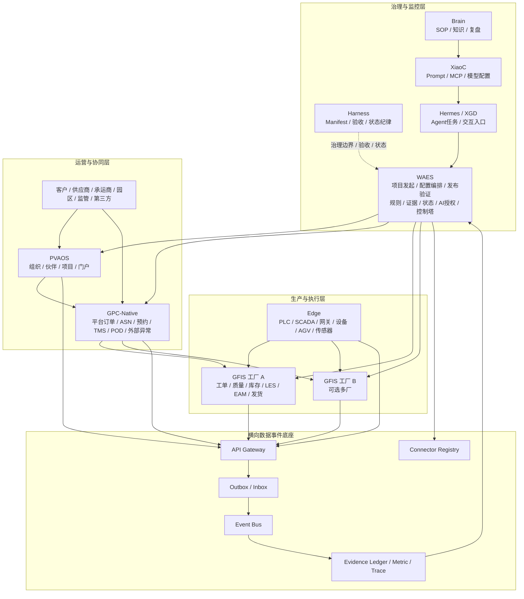
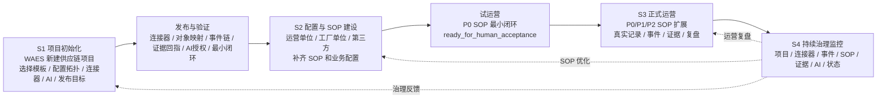

# GlobalCloud 绿色供应链体系全局初始化 SOP 方案

日期：2026-06-07  
状态：体系级阶段架构设计稿 v1  
适用范围：GlobalCloud 绿色供应链体系三层主架构、WAES 发起与治理、供应链项目初始化、配置发布、SOP 建设、试运营、正式运营和持续治理监控。

## 1. 方案总览

本方案把 GlobalCloud 绿色供应链体系从“系统项目群架构”进一步推进为“可初始化、可配置、可发布、可试运营、可治理”的全局 SOP 生命周期。

核心思路：

1. **WAES 发起项目**：WAES 作为治理与监控层入口，发起一个供应链项目，而不是直接创建业务事实。
2. **模板化建立链厂结构**：支持一链一厂、一链多厂、多链多厂、区域供应链平台等模板。
3. **可视化配置平台、工厂、外部对象和连接器**：配置链厂关系、API、对象映射、数据源、事件源、AI 能力、基础 SOP、发布目标。
4. **发布与验证先于试运营**：配置页面存在不等于初始化完成，必须通过连接器、事件、证据、AI 授权和最小闭环验证。
5. **SOP 试运营先跑最小闭环**：先验证 P0 SOP 能执行、能留证、能回指来源记录。
6. **正式运营扩展更多 SOP**：逐步覆盖 P1/P2 场景。
7. **WAES 持续治理与监控**：WAES 监控项目、连接器、事件、SOP、证据、AI 建议和阶段状态，但不审批具体事务。
8. **平台主架构优先**：绿色供应链平台架构以 `GPC-Native` 为业务主线，宪法内容通过 `WAES` 的规则、证据、状态和授权门禁进入，不直接替代平台业务编排。

关键边界：

- WAES 审批或确认的是治理事项：项目模板、规则、指标、AI 授权、Agent 工具权限、证据确证、状态升级、SOP 发布、连接器上线和阶段验收。
- WAES 不审批工单、质量放行、库存调整、发货、签收、维修验收和客户交付承诺。
- 具体业务确认留在 GFIS 或 GPC-Native，WAES 只记录 `BusinessApprovalReference` 和 `EvidenceRecord`。

## 2. 四阶段生命周期架构

| 阶段 | 名称 | 目标 | 主要产物 | 状态上限 |
|---|---|---|---|---|
| S1 | 项目初始化阶段 | 建立供应链项目、链厂模板、连接器、发布目标和基础 SOP | SupplyChainProject、ProjectTemplate、ProjectTopology、ConnectorBinding、DeploymentTarget、ValidationRun | `partial` 或 `ready_for_human_acceptance` |
| S2 | 项目配置与 SOP 建设阶段 | 由运营单位、工厂单位、第三方协同方补齐业务配置和 SOP | SOPDefinition、SOPVersion、RoleResponsibility、ObjectMapping、BusinessConfirmationPoint、GovernanceCheckpoint | `ready_for_human_acceptance` |
| S3 | 正式运营阶段 | 扩展 P0/P1/P2 SOP 闭环，形成真实运营记录、事件、证据、回执和复盘 | SOPExecution、ExceptionCase、BusinessApprovalReference、EvidenceRecord、MetricSnapshot、KnowledgeEntry | `accepted` 或 `complete`，需真实证据和人工验收 |
| S4 | WAES 治理与监控阶段 | 持续监控项目状态、SOP 执行、连接器、事件、证据、AI 建议、风险和阶段验收 | ControlTowerView、GovernancePolicy、EvidenceVerification、StatusAudit、GovernanceApproval、AISuggestion | 按治理对象单独判定 |

S4 不是 S1-S3 之后才开始。WAES 治理与监控从 S1 发起时即存在，贯穿全生命周期；只是 S4 在正式运营后成为常态工作模式。

## 3. 三层主架构与四阶段映射

| 主层 | S1 项目初始化 | S2 配置与 SOP | S3 正式运营 | S4 治理监控 |
|---|---|---|---|---|
| 治理与监控层 | WAES 新建项目、选择模板、配置治理规则、设置发布验证 | WAES 管 SOP 版本、指标口径、AI 授权、证据规则 | WAES 汇总证据、状态、风险、日报、复盘 | WAES 持续监控项目、连接器、事件、SOP、证据、AI |
| 运营与协同层 | PVAOS/GPC-Native 建组织、伙伴、供应商、客户、承运商、平台对象 | GPC-Native 配订单、ASN、预约、TMS、POD、外部异常 SOP | GPC-Native 形成真实订单、运输、签收、异常事实 | GPC-Native 向 WAES 输出事件和业务确认引用 |
| 生产与执行层 | GFIS/Edge 注册工厂、仓库、车间、设备、边缘节点 | GFIS 配工单、质量、库存、LES、EAM、发货 SOP | GFIS 形成生产、质量、库存、批次、设备、发货事实 | GFIS/Edge 向 WAES 输出执行事件、现场事件和证据 |

## 4. WAES 在四个阶段的角色变化

| 阶段 | WAES 角色 | WAES 可以做 | WAES 不做 |
|---|---|---|---|
| S1 项目初始化 | 项目发起器、模板选择器、配置编排器、发布验证器 | 新建供应链项目、选择链厂模板、配置连接器、配置 AI 能力、发起发布验证 | 不创建工单、不创建库存事务、不确认签收 |
| S2 配置与 SOP | SOP 治理器、规则配置器、证据规则定义器 | 管 SOP 版本、指标口径、证据要求、AI 授权等级、Agent 工具权限 | 不审批 SOP 内的具体业务动作 |
| S3 正式运营 | 控制塔、证据平面、复盘台账 | 看板、日报、异常复盘、证据归档、AI 建议治理、状态审计 | 不替代 GFIS/GPC-Native 写业务主账 |
| S4 治理监控 | 持续治理中心 | 连接器健康、事件延迟、SOP 执行率、证据完整性、AI 质量、阶段验收 | 不把监控结论当作业务事实 |

## 5. 供应链项目模板设计

### 5.1 一链一厂模板

适用场景：

- 单一供应链运营单位服务一个核心工厂。
- 适合试点、样板工厂、单厂客户交付链。

基础结构：

```text
SupplyChainProject
-> GPC-Native Platform
-> GFIS Factory
-> Edge Site
-> WAES Control Tower
-> Brain / XiaoC / Hermes / XGD
```

最小闭环：

- 平台订单。
- 工厂订单。
- 齐套检查。
- 工单执行。
- 质量检验。
- 发货出库。
- 运输签收。
- WAES 证据回指。

### 5.2 一链多厂模板

适用场景：

- 一个供应链平台协调多个工厂。
- 适合集团统一订单协同、多工厂产能分配、区域制造网络。

新增要求：

- 多工厂 `Factory` 和 `FactoryCapability`。
- 订单分发规则。
- 工厂间对象映射。
- 统一客户/供应商/承运商主数据。
- 每个工厂独立 GFIS 事实源。

边界：

- GPC-Native 可做订单分发和协同。
- GFIS 只负责本厂执行事实。
- WAES 监控多厂指标，不做多厂业务主账。

### 5.3 多链多厂模板

适用场景：

- 多条产业链、多类产品、多运营单位和多工厂协同。
- 适合园区、集团、多区域运营平台。

新增要求：

- `SupplyChainNetwork`。
- `ChainSegment`。
- 多平台或多租户隔离。
- 跨链指标和治理规则。
- 跨链 SOP 版本管理。

风险：

- 主数据冲突。
- 权限和租户隔离复杂。
- 事件流量和证据量增加。
- AI 建议必须按链、厂、角色和风险等级隔离。

### 5.4 区域供应链平台模板

适用场景：

- 地区、园区、监管、公共服务平台。
- 多企业、多工厂、多承运商、多客户协同。

新增要求：

- 区域门户。
- 监管/园区对象。
- 公共服务目录。
- 碳、能耗、安环、合规指标。
- 对外披露证据规则。

边界：

- PVAOS 负责生态入口。
- GPC-Native 负责公共协同服务。
- WAES 负责治理、指标、证据和风险监控。
- GFIS 不暴露生产主账，只输出授权事件和证据。

## 6. 项目初始化对象模型

建议在现有对象目录基础上新增以下对象：

| 对象 | ID 前缀 | 主责系统 | 说明 |
|---|---|---|---|
| SupplyChainProject | `SCP-*` | WAES / PVAOS | 供应链项目，承载地区、产业链、客户、园区、集团或运营单位维度 |
| ProjectTemplate | `TPL-*` | WAES | 一链一厂、一链多厂、多链多厂、区域平台模板 |
| ProjectTopology | `TOP-*` | WAES | 链、厂、平台、外部对象、连接器的拓扑关系 |
| SupplyChainPlatformInstance | `SPI-*` | GPC-Native / WAES | 一个供应链平台实例 |
| FactoryInstance | `FIN-*` | GFIS / WAES | 一个工厂实例在项目中的注册 |
| ExternalPartyBinding | `EPB-*` | PVAOS / GPC-Native | 外部客户、供应商、承运商、监管、园区或第三方协同对象绑定 |
| ConnectorBinding | `CB-*` | WAES / Connector Registry | 连接器实例与项目、系统、环境的绑定 |
| ApiRoutePolicy | `ARP-*` | Connector Registry / WAES | 链厂间 API 路由、权限、风险等级和限流策略 |
| ObjectMappingProfile | `OMP-*` | WAES / GPC-Native / GFIS | 业务对象映射配置 |
| DataSourceBinding | `DSB-*` | WAES | 数据源、事件源、时序源、证据源绑定 |
| AICapabilityProfile | `AICP-*` | WAES / XiaoC | 项目级 AI 能力、模型、工具、风险等级配置 |
| SOPTemplate | `SOPT-*` | WAES / Brain | 基础 SOP 模板 |
| DeploymentTarget | `DPT-*` | WAES | 服务器、容器、测试环境、演示环境或生产环境目标 |
| ReleasePackage | `RPK-*` | WAES / Harness | 待发布配置包、连接器包、SOP 包或 Agent 包 |
| ValidationRun | `VR-*` | WAES / Harness | 发布后验证运行记录 |

## 7. 可视化配置模型

WAES 的项目初始化界面建议拆成 10 个配置面板：

| 配置面板 | 关键字段 | 输出对象 | 验证要求 |
|---|---|---|---|
| 项目基本信息 | 项目名称、类型、区域、运营单位、模板 | SupplyChainProject | 字段完整、模板合法 |
| 链厂拓扑 | 平台、工厂、外部对象、第三方协同对象 | ProjectTopology | 拓扑无孤点、无循环主责冲突 |
| 供应链平台 | GPC-Native 实例、租户、角色、外部门户 | SupplyChainPlatformInstance | 平台连接器可用 |
| 工厂配置 | GFIS 实例、工厂、车间、仓库、设备、Edge | FactoryInstance | 工厂连接器可用 |
| 外部组织 | 客户、供应商、承运商、监管、园区 | ExternalPartyBinding | PVAOS/GPC-Native 对象一致 |
| API 与业务配置 | API 路由、风险等级、幂等、限流、权限 | ApiRoutePolicy | OpenAPI schema 与鉴权通过 |
| 对象映射 | 订单、物料、批次、发货、POD、组织映射 | ObjectMappingProfile | 关键对象映射不缺失 |
| 数据和事件 | 数据源、事件源、Outbox/Inbox、时序源 | DataSourceBinding | 事件 envelope 合规 |
| AI 能力 | 模型、Agent、工具、Prompt、禁用动作 | AICapabilityProfile | L1-L5 授权边界合规 |
| 发布目标 | 服务器、容器、命名空间、环境变量、密钥引用 | DeploymentTarget | 不暴露密钥，目标连通 |

配置状态建议：

```text
draft -> configured -> validation_pending -> validation_passed -> published -> trial_ready
```

阻塞条件：

- 无主责系统。
- 关键对象无映射。
- 连接器不可用。
- AI 工具越权。
- 发布目标无验证证据。
- 证据无法回指来源记录。

## 8. 发布与验证模型

发布不是部署业务事实，而是发布项目配置、连接器配置、SOP 模板、Agent 能力和治理规则。

发布对象：

1. 项目配置包。
2. 链厂拓扑包。
3. 连接器配置包。
4. 对象映射包。
5. 事件订阅包。
6. SOP 模板包。
7. AI 能力包。
8. 指标和证据规则包。

验证清单：

| 验证项 | 必须证据 | 失败处理 |
|---|---|---|
| 连接器连通性 | 连接器 ping、认证结果、版本信息 | 标记 ConnectorBinding degraded |
| API schema | OpenAPI 校验、鉴权校验 | 阻断发布 |
| 对象映射 | 映射样例、冲突检查 | 进入 pending_mapping |
| 事件链 | event envelope、traceId、幂等键、消费回执 | 进入 dead letter 或 retry |
| 证据回指 | EvidenceRecord 回到来源系统和来源记录 | 阻断验收 |
| AI 授权 | Agent 工具、Prompt、模型、禁用动作测试 | 禁用越权工具 |
| 最小闭环 | 一条模拟订单或样例事件链 | 未通过则只能 partial |

验证状态：

```text
not_started -> running -> pass -> fail -> blocked -> superseded
```

完成口径：

- `validation_passed` 只说明初始化验证通过。
- `trial_ready` 说明可以进入试运营。
- 未有真实运行证据前，不得标记为 `complete`。

## 9. SOP 生命周期模型

SOP 不只是文档，而是可配置、可执行、可验收、可复盘的业务运行规范。

SOP 对象建议：

| 对象 | ID 前缀 | 主责系统 | 说明 |
|---|---|---|---|
| SOPDefinition | `SOP-*` | WAES / Brain | SOP 主定义 |
| SOPVersion | `SOPV-*` | WAES / Brain | SOP 版本 |
| SOPStep | `SOPS-*` | WAES / 主责系统 | SOP 步骤 |
| SOPExecution | `SOPE-*` | GFIS / GPC-Native / WAES | SOP 执行实例 |
| SOPCheckpoint | `SOPC-*` | WAES / GFIS / GPC-Native | 业务确认点或治理确认点 |
| SOPExceptionRule | `SOPER-*` | WAES | SOP 异常升级规则 |
| SOPMetricBinding | `SOPM-*` | WAES | SOP 关联指标 |

SOP 字段必须包含：

1. 主责系统。
2. 主责角色。
3. 输入对象。
4. 输出对象。
5. 触发事件。
6. 执行步骤。
7. 业务确认点。
8. WAES 治理确认点。
9. 证据要求。
10. AI 可参与范围。
11. AI 禁止动作。
12. 异常升级规则。
13. 完成判定。

SOP 状态机：

```text
draft -> baseline -> configured -> trial_running -> trial_passed -> active -> suspended -> retired
```

SOP 版本规则：

- `baseline`：项目初始化阶段由模板带入。
- `configured`：运营单位、工厂单位、第三方协同单位已完成本地化配置。
- `trial_running`：进入试运营。
- `trial_passed`：最小闭环通过。
- `active`：正式运营启用。
- `retired`：被新版本替代。

## 10. 试运营最小闭环模型

试运营目标不是全面上线，而是验证 P0 SOP 能形成最小闭环。

试运营 P0 场景：

| 场景 | 主责系统 | WAES 作用 | 完成条件 |
|---|---|---|---|
| 订单到交付 | GPC-Native / GFIS | 证据链、指标、风险、日报 | 订单、工单、质检、发货、运输、POD 均有来源记录 |
| 批次追溯 | GFIS / GPC-Native | 追溯视图和证据回指 | 供应商、ASN、批次、工单、成品、客户可串联 |
| 缺料预警 | GFIS / WAES / Agent | 风险识别、AI 建议治理、证据归档 | AI 未自动创建任务，GFIS 完成补料确认 |
| 质量异常 | GFIS / Brain / WAES | CAPA 草案、复盘证据、知识候选 | GFIS 完成处置，Brain 形成复盘候选 |
| 运输签收异常 | GPC-Native / WAES | 异常看板、证据归档、业务审批引用 | GPC-Native 完成争议处理，WAES 只引用结果 |

试运营状态上限：

- 通过配置验证：`partial`。
- P0 SOP 最小闭环均有证据：`ready_for_human_acceptance`。
- 未经业务负责人验收、无真实运行态证据，不得 `complete`。

## 11. 正式运营 SOP 扩展模型

正式运营在试运营通过后启动。目标是扩大 SOP 覆盖范围、增加真实业务量、沉淀复盘知识和治理指标。

扩展节奏：

| 优先级 | SOP 范围 | 目标 |
|---|---|---|
| P0 | 订单到交付、批次追溯、缺料、质量异常、运输签收异常 | 证明主链路可运行 |
| P1 | 设备异常、线边配送、日报、供应商异常、客户异常 | 提升执行稳定性和协同效率 |
| P2 | 能源、安环、多工厂协同、区域经营分析、预测优化 | 扩展绿色低碳、区域治理和智能优化 |

正式运营要求：

1. 每个 SOP 有真实执行记录。
2. 每个关键动作有事件。
3. 每个结论有证据。
4. 每个业务确认能回到 GFIS/GPC-Native。
5. 每个治理确认能回到 WAES/Harness。
6. 每个异常有复盘。
7. AI 建议和实际执行结果可对比。

## 12. WAES 治理与监控模型

WAES 的治理对象分为 10 类：

| 治理对象 | WAES 行为 | 不做什么 |
|---|---|---|
| 项目模板启用 | 审核模板适配性、主责边界、默认 SOP | 不替业务单位决定订单策略 |
| 规则生效 | 管治理规则、风险规则、证据规则 | 不改 GFIS/GPC-Native 主账 |
| 指标口径 | 定义指标、计算周期、数据来源 | 不伪造指标来源 |
| AI 授权等级 | 设置 Agent 可读、可建议、可调用工具范围 | 不让 AI 直接写业务事实 |
| Agent 工具权限 | 开启或禁用工具 | 不绕过业务系统确认 |
| 证据确证 | 确认 EvidenceRecord 是否可用于验收/审计 | 不把截图当作业务事实 |
| 状态升级 | partial、ready、accepted、complete 的治理判断 | 不把配置完成当完成 |
| SOP 发布或版本变更 | 管 SOP 版本、影响范围、回滚策略 | 不审批 SOP 内具体事务 |
| 连接器上线/下线 | 管连接器状态和风险 | 不直接改外部系统数据 |
| 阶段验收结论 | 管验收矩阵、证据、人工确认 | 不跳过业务负责人验收 |

WAES 监控指标：

- 项目初始化完成率。
- 连接器健康率。
- 事件消费成功率。
- dead letter 数量。
- SOP 试运营通过率。
- SOP 正式执行闭环率。
- 证据完整率。
- AI 建议采纳率。
- AI 越权拦截次数。
- 异常关闭周期。
- P0/P1/P2 场景覆盖率。
- 状态审计新鲜度。

## 13. 新增对象建议

在现有对象目录基础上，建议新增三组对象。

项目初始化对象：

1. `SupplyChainProject`
2. `ProjectTemplate`
3. `ProjectTopology`
4. `SupplyChainPlatformInstance`
5. `FactoryInstance`
6. `ExternalPartyBinding`

配置与发布对象：

1. `ConnectorBinding`
2. `ApiRoutePolicy`
3. `ObjectMappingProfile`
4. `DataSourceBinding`
5. `AICapabilityProfile`
6. `DeploymentTarget`
7. `ReleasePackage`
8. `ValidationRun`

SOP 对象：

1. `SOPDefinition`
2. `SOPVersion`
3. `SOPStep`
4. `SOPExecution`
5. `SOPCheckpoint`
6. `SOPExceptionRule`
7. `SOPMetricBinding`

## 14. 新增事件建议

项目初始化事件：

```text
waes.supply_chain_project.created
waes.project_template.selected
waes.project_topology.configured
waes.connector_binding.configured
waes.object_mapping_profile.configured
waes.ai_capability_profile.configured
waes.deployment_target.configured
```

发布与验证事件：

```text
waes.release_package.created
waes.release_package.published
waes.validation_run.started
waes.validation_run.passed
waes.validation_run.failed
waes.validation_run.blocked
```

SOP 生命周期事件：

```text
waes.sop_definition.created
waes.sop_version.published
waes.sop_version.activated
waes.sop_execution.started
waes.sop_execution.completed
waes.sop_execution.failed
waes.sop_checkpoint.verified
```

治理监控事件：

```text
waes.governance_policy.activated
waes.evidence.verification_requested
waes.evidence.verified
waes.status_upgrade.requested
waes.status_upgrade.approved
waes.status_upgrade.rejected
```

业务引用事件：

```text
waes.business_approval.referenced
waes.business_execution.referenced
```

禁止事项：

- 不新增 `waes.work_order.approved`。
- 不新增 `waes.quality_released`。
- 不新增 `waes.inventory_adjusted`。
- 不新增 `waes.shipment_signed`。
- 不新增 `waes.maintenance_verified`。

## 15. 与一期验收矩阵的扩展关系

现有 A1-A9 验收矩阵继续作为试运营 P0/P1 基线。本方案新增阶段验收维度：

| 验收编号 | 场景 | 对应阶段 | 与 A1-A9 的关系 |
|---|---|---|---|
| I1 | WAES 新建供应链项目 | S1 | A1-A9 前置 |
| I2 | 选择一链一厂或一链多厂模板 | S1 | 决定 A1-A9 的拓扑范围 |
| I3 | 配置 GFIS/GPC-Native/PVAOS/Edge 连接器 | S1 | A1-A9 的集成前置 |
| I4 | 发布配置包并通过验证 | S1 | A1-A9 的运行前置 |
| S1 | 发布基础 SOP 模板 | S2 | 为 A1-A9 提供 SOP 版本 |
| S2 | SOP 试运营最小闭环 | S2 | 直接执行 A1-A6 |
| O1 | 正式运营 P0 SOP 闭环 | S3 | A1-A6 真实运行态证据 |
| O2 | 正式运营 P1 SOP 闭环 | S3 | A7-A9 扩展 |
| G1 | WAES 持续治理监控 | S4 | 所有验收场景的状态审计和证据复核 |

新增完成判定：

- 初始化完成：配置发布并通过 `ValidationRun`，但不能代表业务闭环完成。
- 试运营完成：P0 SOP 最小闭环具备证据，可进入 `ready_for_human_acceptance`。
- 正式运营完成：P0/P1/P2 按范围有真实运行证据和业务负责人验收。
- 治理完成：某一阶段治理检查完成，不等于项目整体完成。

## 16. 系统边界表

| 系统 | 主责 | 可写事实 | 向 WAES 输出 | 不做什么 |
|---|---|---|---|---|
| WAES | 项目发起、配置编排、发布验证、治理、监控、证据、状态、AI 授权 | 治理规则、证据确证、状态审计、项目配置、SOP 版本 | 控制塔、治理事件、证据、指标、AI 建议状态 | 不写工单、质量、库存、发货、签收、维修验收 |
| GPC-Native | 供应链平台与外部协同 | 平台订单、ASN、预约、运输、POD、外部异常 | 订单、运输、签收、异常、业务确认引用 | 不做生产工单、库存主账、质量放行 |
| GFIS | 工厂执行 | 工厂订单、工单、质量、库存、批次、LES、EAM、发货出库 | 工单、质量、库存、批次、设备、发货、业务确认引用 | 不做跨企业公共协同，不做 WAES 治理裁决 |
| PVAOS | 生态入口 | 租户、组织、项目、伙伴、门户账号 | 组织、项目、伙伴、角色上下文 | 不承载生产执行 |
| Edge | 现场与边缘接入 | 设备信号、边缘节点状态、缓存回放 | 现场信号、设备报警、节点状态 | 不形成工单、质量、库存、发货主账 |
| Brain | 知识和 SOP 可信源 | 知识候选、SOP 草案、复盘候选 | SOP、案例、复盘、知识引用 | 不替代当前业务记录 |
| XiaoC | Prompt、MCP、模型适配 | Prompt 模板、模型配置、评估样例 | AI 能力配置、Prompt 版本 | 不直接执行业务动作 |
| Hermes/XGD | Agent 运行与交互入口 | AgentTask、建议草案、日报草案 | Agent 任务、AI 建议、交互记录 | 不绕过 WAES 治理和业务系统确认 |

## 17. AI 授权边界

| 等级 | 允许范围 | 系统落点 | 示例 |
|---|---|---|---|
| L1 查询/报表 | 自动查询、摘要、报表 | WAES / Hermes / XGD | 查询订单、库存、工单、设备状态 |
| L2 预警提醒 | 自动识别风险并提醒 | WAES / XGD | 缺料、延期、质检逾期、设备离线 |
| L3 建议草案 | 生成建议，需业务系统确认 | Hermes / XiaoC / Brain / GFIS / GPC-Native | 补料建议、CAPA 草案、运输异常建议 |
| L4 治理授权 | 规则、证据、AI 工具、状态升级需治理确认 | WAES / Harness | SOP 发布、AI 工具启用、证据确证、状态升级 |
| L5 禁止接管 | AI 永不接管 | OT / GFIS / Edge | 急停、安全联锁、质量放行、库存扣减、签收确认 |

## 18. 证据与状态判定规则

证据类型：

| 证据 | 来源 | 用途 |
|---|---|---|
| BusinessRecord | GFIS / GPC-Native / PVAOS | 证明业务事实 |
| DomainEvent | 主责系统 / Event Bus | 证明事实已发布 |
| BusinessApprovalReference | GFIS / GPC-Native | 证明具体事务已由业务系统确认 |
| EvidenceRecord | WAES | 证明证据已捕获 |
| EvidenceVerification | WAES / Harness | 证明证据可用于验收或审计 |
| ValidationRun | WAES / Harness | 证明配置发布后验证结果 |
| StatusAudit | Harness / WAES | 证明状态判断依据 |
| KnowledgeEntry | Brain | 证明 SOP/复盘进入知识候选或可信源 |

状态判定：

| 状态 | 可用于 | 判定条件 |
|---|---|---|
| `not_started` | 项目、SOP、验证 | 只有定义，无配置 |
| `in_progress` | 项目初始化、SOP 配置 | 配置或验证正在进行 |
| `partial` | 初始化或试运营 | 有配置或部分验证，但关键闭环缺失 |
| `blocked` | 任意阶段 | 外部系统、连接器、权限、证据或人工确认阻塞 |
| `ready_for_human_acceptance` | 试运营 | 非人工门已满足，等待业务负责人验收 |
| `accepted` | 正式运营阶段验收 | 业务负责人接受阶段结果 |
| `complete` | 明确范围内的阶段或 SOP | 有真实运行证据、业务确认、治理确认和人工验收 |

禁止判定：

- 配置完成不能判定为业务完成。
- 发布成功不能判定为 SOP 完成。
- AI 日报不能判定为真实运营证据。
- WAES 看板正常不能判定 GFIS/GPC-Native 业务闭环完成。

## 19. Mermaid 总架构图



## 20. Mermaid 四阶段流程图



## 21. P0/P1/P2 落地优先级

P0 必须先做：

1. WAES 新建项目和模板选择。
2. 一链一厂模板。
3. GPC-Native/GFIS/PVAOS/Edge 连接器绑定。
4. 对象映射：订单、工厂订单、物料、批次、发货、Shipment、POD。
5. 事件链：订单到交付。
6. 基础 SOP：订单到交付、批次追溯、缺料、质量异常、运输签收异常。
7. 验证运行和证据回指。

P1 第二批：

1. 一链多厂模板。
2. 线边配送 SOP。
3. 设备异常 SOP。
4. 供应商异常 SOP。
5. 客户异常 SOP。
6. WAES 日报和周报。
7. AI 建议质量评估。

P2 后续扩展：

1. 多链多厂模板。
2. 区域供应链平台。
3. 能源 EMS。
4. 安环 HSE。
5. 多工厂协同。
6. 区域经营分析。
7. 预测优化。
8. 绿色低碳与监管报送。

## 22. 当前已形成基线、设计建议、待确认事项和阻塞项

### 22.1 当前已形成基线

1. 三层主架构已确定。
2. WAES 不审批具体事务的边界已确定。
3. GPC-Native 替代 Odoo core 二开作为主线已确定。
4. GFIS 是工厂执行事实源已确定。
5. Edge 是现场与 GFIS 之间的边缘接入层已确定。
6. 对象目录、事件合同、一期验收矩阵已具备基础版本。

### 22.2 本方案设计建议

1. 将 WAES 的项目初始化能力作为绿色供应链体系的入口。
2. 新增供应链项目模板、拓扑、连接器绑定、发布目标和验证运行对象。
3. 把 SOP 从文档升级为可配置、可版本化、可执行、可验收的对象体系。
4. 把试运营定义为 P0 SOP 最小闭环验证阶段。
5. 把正式运营定义为 P0/P1/P2 SOP 扩展和真实证据沉淀阶段。
6. 把 WAES 持续治理监控定义为贯穿全生命周期的常态能力。
7. 按四流综合架构补齐连接器合同、SOP 模板库、AI 服务模型、数据治理模型、多厂协同模型和 Edge 接入安全模型。
8. 将发布验证从“连接器连通”扩展为 schema、数据质量、DLQ、重放、AI 越权拦截和租户隔离验证。

### 22.3 待确认事项

1. WAES 是否作为唯一项目初始化入口，还是允许 PVAOS 发起后交给 WAES 治理。
2. 一链一厂、一链多厂、多链多厂模板的默认字段和默认 SOP。
3. GPC-Native 和 GFIS 的部署目标是否由 WAES 直接编排，还是只生成配置包交给运维执行。
4. 发布到指定服务器或容器时，是否允许 WAES 调用实际部署命令。
5. 不同地区、集团、园区的租户隔离和权限模型。
6. SOP 版本发布是否需要 Harness 与业务负责人双确认。
7. AI 工具权限的默认关闭列表。
8. Edge 数据进入 GFIS 的协议和最小设备清单。

### 22.4 阻塞项

1. GPC-Native 一期产品与技术蓝图尚未形成独立文档。
2. GFIS LES 最小模型尚未形成独立文档。
3. WAES Evidence Ledger 与控制塔模型尚未形成独立文档。
4. 发布与验证命令的安全边界尚未确认。
5. 当前仍缺真实运行态联调证据，因此不能标记体系完成。
6. 连接器合同、SOP 模板库、AI 服务模型、数据治理模型、多厂协同模型和 Edge 接入安全模型已形成设计基线，但尚未进入真实系统实施和验收。

## 23. 下一步文档建议

建议按顺序继续细化：

1. `GPC-Native一期产品与技术蓝图.md`
2. `GFIS工厂执行子域LES最小模型.md`
3. `WAES体系级控制塔与EvidenceLedger模型.md`
4. `WAES项目初始化与发布验证模型.md`
5. `GlobalCloud绿色供应链体系项目初始化对象扩展.md`
6. `GlobalCloud绿色供应链体系四阶段验收矩阵.md`
